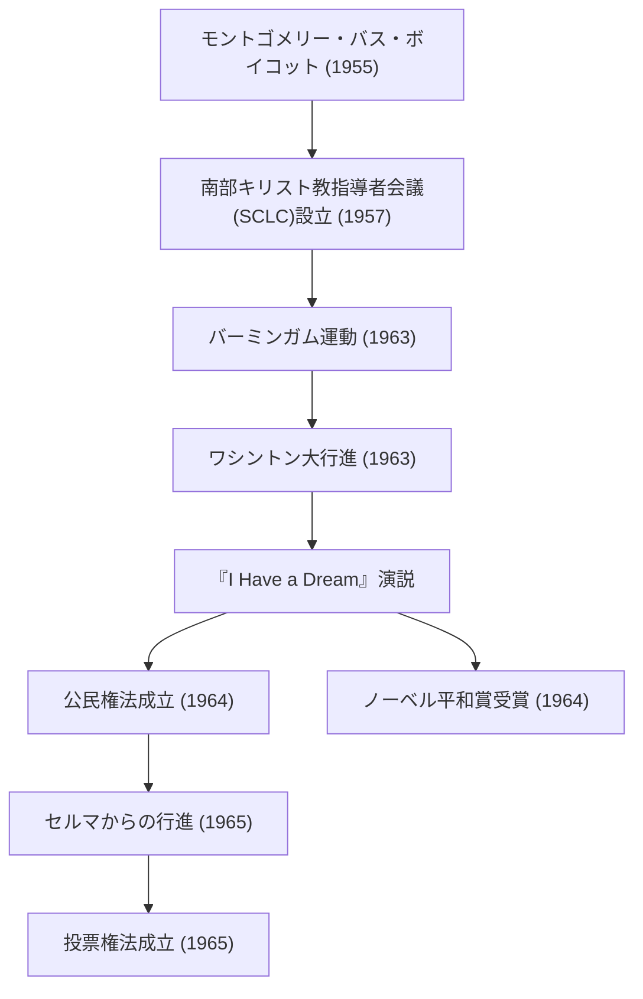

マーティン・ルーサー・キング・ジュニア（Martin Luther King Jr.、1929年1月15日 - 1968年4月4日）は、アメリカ合衆国のプロテスタントバプテスト派の牧師であり、アフリカ系アメリカ人公民権運動の最も著名な指導者です。彼の「非暴力直接行動」という哲学は、アメリカ社会の人種隔離政策を打ち破る原動力となり、現代の数多くの人権運動に多大な影響を与え続けています。

## 生涯の歩み：理不尽な差別に抗う声

ジョージア州アトランタで生まれたキング牧師は、幼少期から南部特有のジム・クロウ法（人種隔離法）による理不尽な差別を経験しました。モアハウス大学、クロザー神学校、そしてボストン大学で学び、神学の博士号を取得。その過程で、マハトマ・ガンディーの非暴力抵抗主義やヘンリー・デイヴィッド・ソローの市民的不服従の思想に深く感銘を受けます。

彼の運動家としてのキャリアは、1955年の「モントゴメリー・バス・ボイコット事件」から本格化します。ローザ・パークスという一人の黒人女性がバスの白人専用席を譲ることを拒否して逮捕された事件をきっかけに、キング牧師はボイコット運動を指導しました。381日間に及ぶこの抗議活動は、最高裁判所によるバス車内の隔離違憲判決という歴史的勝利をもたらし、彼を全米に知られる公民権運動のリーダーへと押し上げました。

## 哲学と行動：「私には夢がある」

キング牧師の運動の根底には、キリスト教の愛とガンディーの非暴力主義を融合させた確固たる哲学がありました。彼は、暴力による報復は憎しみの連鎖を生むだけであり、愛と平和的手段によってのみ、真の正義と和解（愛する共同体：Beloved Community）を築くことができると説きました。

1963年8月28日、首都ワシントンD.C.で開催された「ワシントン大行進」には、約25万人の参加者が集結しました。リンカーン記念堂の前でキング牧師が行った「I Have a Dream（私には夢がある）」という演説は、アメリカ史に残る名演説として語り継がれています。「私の4人の幼い子どもたちが、肌の色ではなく、人格の中身によって評価される国に住むという夢」——この力強い言葉は、人種の壁を越えて世界中の人々の心を打ち、翌1964年の公民権法（Civil Rights Act of 1964）成立、さらに1965年の投票権法（Voting Rights Act of 1965）成立へと繋がる決定的な推進力となりました。

1964年、彼はその非暴力による平和的運動の功績が認められ、当時史上最年少の35歳でノーベル平和賞を受賞します。

## 功績の軌跡（Mermaid図解）

以下の図は、キング牧師の主な公民権運動の軌跡とその影響を示しています。

## 後世への影響：未完の夢を引き継ぐ

公民権運動における法的な勝利の後も、キング牧師の闘いは終わりませんでした。彼は人種差別に加え、貧困問題やベトナム戦争の反戦運動にも声を上げ、より広範な人権と経済的正義を求めるようになりました。しかし、1968年4月4日、遊説先のテネシー州メンフィスで暗殺され、39歳の若さでこの世を去ります。

彼の死は世界に大きな衝撃と深い悲しみをもたらしましたが、その精神が死ぬことはありませんでした。今日、アメリカでは毎年1月の第3月曜日が「マーティン・ルーサー・キング・ジュニア・デー」として国民の祝日となっており、彼の功績を称え、奉仕活動を行う日として定着しています。

キング牧師が命を懸けて追い求めた「愛と非暴力」のメッセージは、Black Lives Matter運動をはじめとする現代の社会正義を求める運動の中にも脈々と息づいています。彼の残した言葉と行動の軌跡は、暗闇の中で希望の光を探す私たちに対して、正しいことのために立ち上がる勇気と、対話と理解を通じた変革の可能性を永遠に示し続けています。
