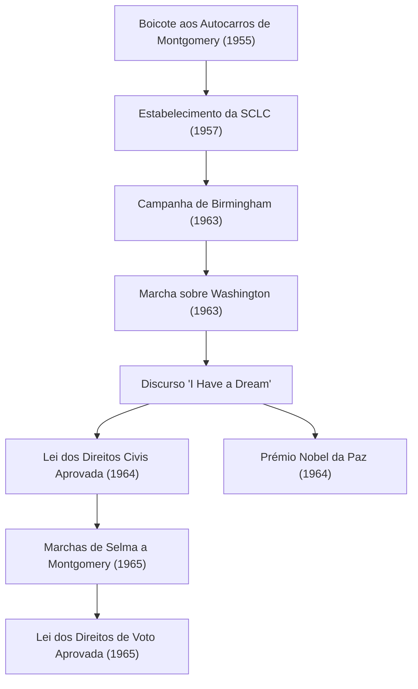

Martin Luther King Jr. (15 de janeiro de 1929 - 4 de abril de 1968) foi um ministro batista protestante americano e o líder mais proeminente do movimento dos direitos civis dos afro-americanos. A sua filosofia de "ação direta não violenta" serviu como a força motriz para quebrar as políticas de segregação racial na sociedade americana, continuando a influenciar profundamente numerosos movimentos de direitos humanos atualmente.

## A Jornada da Vida: Uma Voz Contra a Discriminação Irracional

Nascido em Atlanta, Geórgia, o Dr. King experienciou desde cedo a discriminação irracional das leis de Jim Crow (leis de segregação racial) no Sul. Ele estudou no Morehouse College, no Crozer Theological Seminary e na Universidade de Boston, onde obteve um doutoramento em teologia. Durante este processo, ele foi profundamente inspirado pelo princípio de resistência não violenta de Mahatma Gandhi e pela filosofia de desobediência civil de Henry David Thoreau.

A sua carreira como ativista começou verdadeiramente com o "Boicote aos Autocarros de Montgomery" em 1955. Desencadeado pela prisão de Rosa Parks, uma mulher negra que se recusou a ceder o seu lugar na secção branca de um autocarro, o Dr. King liderou o movimento de boicote. O protesto de 381 dias resultou numa vitória histórica quando o Supremo Tribunal decidiu que a segregação nos autocarros era inconstitucional, impulsionando-o para a proeminência nacional como líder do movimento dos direitos civis.

## Filosofia e Ação: "I Have a Dream" (Eu Tenho um Sonho)

No cerne do movimento do Dr. King estava uma filosofia inabalável que fundia o amor cristão com a não-violência de Gandhi. Ele pregava que a retaliação violenta apenas gera um ciclo de ódio, e que a verdadeira justiça e reconciliação (a "Comunidade Amada") só podem ser construídas através do amor e de meios pacíficos.

A 28 de agosto de 1963, aproximadamente 250.000 pessoas reuniram-se para a "Marcha sobre Washington" em Washington, D.C. O discurso "I Have a Dream" que o Dr. King proferiu em frente ao Lincoln Memorial é lembrado como um dos maiores discursos da história americana. "Eu tenho um sonho de que os meus quatro filhos viverão um dia numa nação onde não serão julgados pela cor da sua pele, mas pelo conteúdo do seu caráter" — estas palavras poderosas transcenderam barreiras raciais, tocaram corações em todo o mundo e serviram como a força motriz decisiva para a aprovação da Lei dos Direitos Civis de 1964 e da Lei dos Direitos de Voto de 1965.

Em 1964, reconhecido pelas suas conquistas em campanhas pacíficas e não violentas, ele tornou-se a pessoa mais jovem na altura a receber o Prémio Nobel da Paz aos 35 anos.

## Trajetória de Conquistas (Diagrama Mermaid)

O diagrama seguinte ilustra a trajetória e o impacto dos principais esforços de direitos civis do Dr. King.

## Legado: Prosseguir com um Sonho Inacabado

Mesmo após as vitórias legais do movimento dos direitos civis, a luta do Dr. King não terminou. Além da discriminação racial, ele levantou a sua voz contra a pobreza e a Guerra do Vietname, buscando direitos humanos e justiça económica mais amplos. No entanto, a 4 de abril de 1968, foi assassinado em Memphis, Tennessee, falecendo com a jovem idade de 39 anos.

A sua morte trouxe um enorme choque e profunda tristeza ao mundo, mas o seu espírito não morreu. Hoje, a terceira segunda-feira de janeiro é um feriado nacional nos Estados Unidos conhecido como "Dia de Martin Luther King Jr.", estabelecido como um dia de serviço para homenagear o seu legado.

A mensagem de "amor e não-violência" que o Dr. King procurou com a sua vida continua a viver nos movimentos modernos de justiça social, incluindo o movimento Black Lives Matter. A trajetória das suas palavras e ações mostra para sempre a nós, que procuramos um raio de esperança na escuridão, a coragem de defender o que é certo e a possibilidade de transformação através do diálogo e da compreensão.
