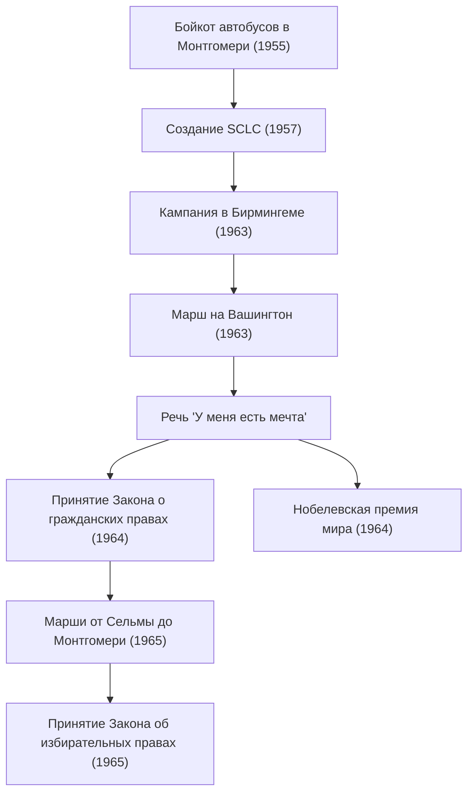

Мартин Лютер Кинг-младший (15 января 1929 — 4 апреля 1968) был американским протестантским баптистским пастором и самым выдающимся лидером движения за гражданские права афроамериканцев. Его философия «ненасильственного прямого действия» стала движущей силой в разрушении политики расовой сегрегации в американском обществе и продолжает оказывать глубокое влияние на многочисленные правозащитные движения сегодня.

## Жизненный путь: Голос против необоснованной дискриминации

Родившийся в Атланте, штат Джорджия, доктор Кинг с юных лет сталкивался с необоснованной дискриминацией из-за законов Джима Кроу (законов о расовой сегрегации) на Юге. Он учился в колледже Морхаус, Крозерской теологической семинарии и Бостонском университете, где получил докторскую степень по теологии. В этот период он был глубоко вдохновлен принципом ненасильственного сопротивления Махатмы Ганди и философией гражданского неповиновения Генри Дэвида Торо.

Его карьера активиста по-настоящему началась с «Ходьбы в Монтгомери» (бойкота автобусных линий) в 1955 году. После ареста Розы Паркс, чернокожей женщины, отказавшейся уступить свое место в автобусе белому пассажиру, доктор Кинг возглавил движение бойкота. Этот протест, длившийся 381 день, завершился исторической победой, когда Верховный суд признал сегрегацию в автобусах неконституционной, что сделало Кинга лидером движения за гражданские права национального масштаба.

## Философия и действия: «У меня есть мечта»

В основе движения доктора Кинга лежала непоколебимая философия, объединявшая христианскую любовь и ненасилие Ганди. Он проповедовал, что насильственное возмездие лишь порождает цикл ненависти, и что истинная справедливость и примирение («Возлюбленное сообщество») могут быть построены только через любовь и мирные средства.

28 августа 1963 года около 250 000 человек собрались в Вашингтоне, округ Колумбия, на «Марш на Вашингтон». Речь «У меня есть мечта», которую доктор Кинг произнес перед Мемориалом Линкольна, вошла в историю как одна из величайших речей Америки. «Я мечтаю, что однажды четверо моих детей будут жить в нации, где о них будут судить не по цвету их кожи, а по их характеру» — эти сильные слова преодолели расовые барьеры, тронули сердца людей по всему миру и стали решающей движущей силой для принятия Закона о гражданских правах 1964 года и Закона об избирательных правах 1965 года.

В 1964 году за свои достижения в мирных, ненасильственных кампаниях он стал самым молодым на тот момент лауреатом Нобелевской премии мира в возрасте 35 лет.

## Траектория достижений (Диаграмма Mermaid)

Следующая диаграмма иллюстрирует траекторию и влияние основных усилий доктора Кинга в области гражданских прав.

## Наследие: Продолжение незавершенной мечты

Даже после юридических побед движения за гражданские права борьба доктора Кинга не закончилась. Помимо расовой дискриминации, он возвысил свой голос против бедности и войны во Вьетнаме, стремясь к более широким правам человека и экономической справедливости. Однако 4 апреля 1968 года он был убит в Мемфисе, штат Теннесси, уйдя из жизни в молодом возрасте 39 лет.

Его смерть вызвала в мире огромное потрясение и глубокую скорбь, но его дух не умер. Сегодня третий понедельник января является национальным праздником в США — «Днем Мартина Лютера Кинга-младшего», учрежденным как день служения в честь его наследия.

Послание «любви и ненасилия», к которому доктор Кинг стремился всю свою жизнь, продолжает жить в современных движениях за социальную справедливость, включая движение Black Lives Matter. Траектория его слов и действий навсегда показывает нам, ищущим луч надежды во тьме, мужество отстаивать то, что правильно, и возможность преобразований через диалог и понимание.
