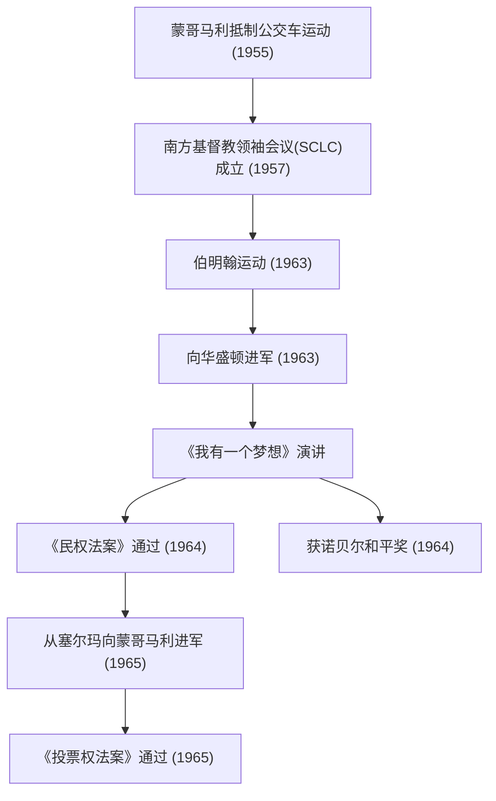

马丁·路德·金（Martin Luther King Jr.，1929年1月15日 - 1968年4月4日）是美国新教浸信会牧师，也是非裔美国人民权运动最著名的领袖。他的“非暴力直接行动”哲学成为打破美国社会种族隔离政策的驱动力，并继续对当今众多人权运动产生深远影响。

## 生平轨迹：反对无理歧视的呼声

金牧师出生于佐治亚州亚特兰大，从小就经历了南部特有的吉姆·克劳法（种族隔离法）带来的无理歧视。他曾就读于莫尔豪斯学院、克罗泽神学院和波士顿大学，并获得了神学博士学位。在此过程中，他深受圣雄甘地的非暴力抵抗主义和亨利·大卫·梭罗的公民不服从思想的启发。

他作为活动家的职业生涯始于1955年的“蒙哥马利抵制公交车运动”。一名名叫罗莎·帕克斯的黑人妇女因拒绝在公交车上给白人让座而被捕，以此为契机，金牧师领导了抵制运动。这场长达381天的抗议活动最终取得了历史性的胜利——最高法院裁定公交车上的种族隔离违宪，这也使他一跃成为全美知名的民权运动领袖。

## 哲学与行动：“我有一个梦想”

金牧师运动的核心是融合了基督教之爱和甘地非暴力主义的坚定哲学。他教导说，暴力的报复只会产生仇恨的循环，只有通过爱与和平的手段才能建立真正的正义与和解（“挚爱的社区”）。

1963年8月28日，约25万人聚集在首都华盛顿特区，参加了“向华盛顿进军”。金牧师在林肯纪念堂前发表的《我有一个梦想》演讲被誉为美国历史上最伟大的演讲之一。“我梦想有一天，我的四个孩子将在一个不是以他们的肤色，而是以他们的品格优劣来评价他们的国度里生活”——这句充满力量的话语跨越了种族的界限，打动了全世界人民的心，并成为推动1964年《民权法案》和1965年《投票权法案》通过的决定性力量。

1964年，为了表彰他通过和平、非暴力运动所取得的成就，他获得了诺贝尔和平奖，成为当时最年轻的获奖者（35岁）。

## 成就轨迹 (Mermaid图解)

下图展示了金牧师主要民权运动的轨迹及其影响。

## 后世影响：传承未竟的梦想

即使在民权运动取得法律上的胜利之后，金牧师的斗争也没有结束。除了种族歧视，他还发声反对贫困和越南战争，寻求更广泛的人权和经济正义。然而，1968年4月4日，他在田纳西州孟菲斯被暗杀，年仅39岁。

他的逝世给世界带来了巨大的震惊和深深的悲痛，但他的精神并没有消亡。今天，美国将每年1月的第三个星期一定为“马丁·路德·金纪念日”，以此作为全国性的节日来纪念他的功绩并开展志愿服务活动。

金牧师用生命追求的“爱与非暴力”信息，在包括“黑人的命也是命”(Black Lives Matter)在内的现代社会正义运动中依然生生不息。他留下的言行轨迹，将永远为在黑暗中寻找希望之光的我们，指明为正义挺身而出的勇气以及通过对话与理解实现变革的可能性。
