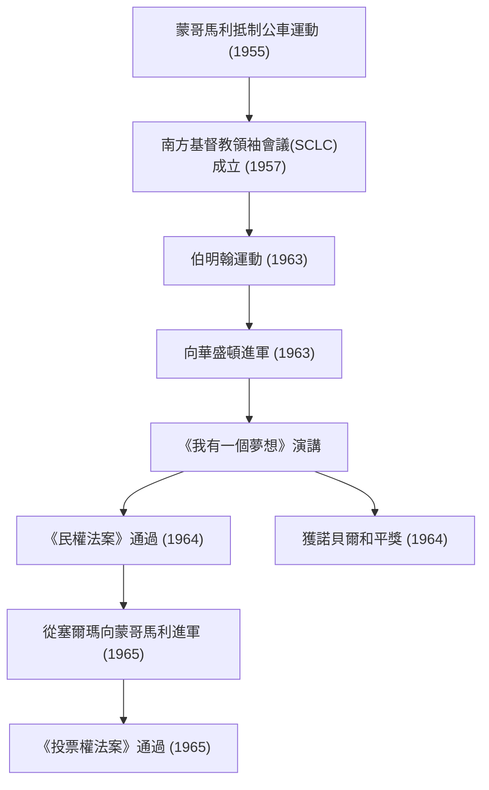

馬丁·路德·金（Martin Luther King Jr.，1929年1月15日 - 1968年4月4日）是美國新教浸信會牧師，也是非裔美國人民權運動最著名的領袖。他的「非暴力直接行動」哲學成為打破美國社會種族隔離政策的驅動力，並繼續對當今眾多人權運動產生深遠影響。

## 生平軌跡：反對無理歧視的呼聲

金牧師出生於喬治亞州亞特蘭大，從小就經歷了南部特有的吉姆·克勞法（種族隔離法）帶來的無理歧視。他曾就讀於莫爾豪斯學院、克羅澤神學院和波士頓大學，並獲得了神學博士學位。在此過程中，他深受聖雄甘地的非暴力抵抗主義和亨利·大衛·梭羅的公民不服從思想的啟發。

他作為活動家的職業生涯始於1955年的「蒙哥馬利抵制公車運動」。一名名叫羅莎·帕克斯的黑人婦女因拒絕在公車上給白人讓座而被捕，以此為契機，金牧師領導了抵制運動。這場長達381天的抗議活動最終取得了歷史性的勝利——最高法院裁定公車上的種族隔離違憲，這也使他一躍成為全美知名的民權運動領袖。

## 哲學與行動：「我有一個夢想」

金牧師運動的核心是融合了基督教之愛和甘地非暴力主義的堅定哲學。他教導說，暴力的報復只會產生仇恨的循環，只有透過愛與和平的手段才能建立真正的正義與和解（「摯愛的社區」）。

1963年8月28日，約25萬人聚集在首都華盛頓特區，參加了「向華盛頓進軍」。金牧師在林肯紀念堂前發表的《我有一個夢想》演講被譽為美國歷史上最偉大的演講之一。「我夢想有一天，我的四個孩子將在一個不是以他們的膚色，而是以他們的品格優劣來評價他們的國度裡生活」——這句充滿力量的話語跨越了種族的界線，打動了全世界人民的心，並成為推動1964年《民權法案》和1965年《投票權法案》通過的決定性力量。

1964年，為了表彰他透過和平、非暴力運動所取得的成就，他獲得了諾貝爾和平獎，成為當時最年輕的獲獎者（35歲）。

## 成就軌跡 (Mermaid圖解)

下圖展示了金牧師主要民權運動的軌跡及其影響。

## 後世影響：傳承未竟的夢想

即使在民權運動取得法律上的勝利之後，金牧師的鬥爭也沒有結束。除了種族歧視，他還發聲反對貧困和越南戰爭，尋求更廣泛的人權和經濟正義。然而，1968年4月4日，他在田納西州孟菲斯被暗殺，年僅39歲。

他的逝世給世界帶來了巨大的震驚和深深的悲痛，但他的精神並沒有消亡。今天，美國將每年1月的第三個星期一定為「馬丁·路德·金紀念日」，以此作為全國性的節日來紀念他的功績並開展志願服務活動。

金牧師用生命追求的「愛與非暴力」訊息，在包括「黑人的命也是命」(Black Lives Matter)在內的現代社會正義運動中依然生生不息。他留下的言行軌跡，將永遠為在黑暗中尋找希望之光的我們，指明為正義挺身而出的勇氣以及透過對話與理解實現變革的可能性。
