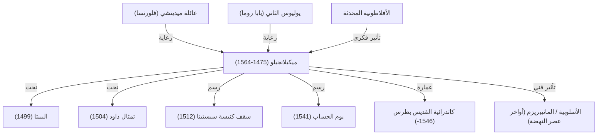

يُعد ميكيلانجيلو بوناروتي (1475 - 1564) أحد العمالقة الثلاثة لعصر النهضة إلى جانب ليوناردو دا فينشي ورافائيل. وبصفته نحاتاً، ورساماً، ومعمارياً، وشاعراً، ترك أثراً عميقاً لا يُمحى في تاريخ الفن الغربي. نسلط الضوء في هذا المقال على مسيرة حياته، وفلسفته الفنية الخاصة، وكيف أبدع روائعه الخالدة وتأثيره الممتد عبر الأجيال.

## بزوغ الموهبة واللقاء بآل ميديتشي

وُلد ميكيلانجيلو عام 1475 في بلدة كابريزي بإقليم توسكانا. ومنذ نعومة أظفاره رضع من زوجة نحات حجر، ونشأ على حب وثيق للرخام والحجر، حتى قال لاحقاً: «لقد رضعت شغفي بالنحت مع حليب مرضعتي».

سرعان ما لمعت موهبته في سن مبكرة، ولفتت أنظار لورينزو دي ميديتشي («العظيم»)، حاكم فلورنسا وأبرز رعاتها. وتحت رعاية عائلة ميديتشي، اطّلع ميكيلانجيلو على المنحوتات الإغريقية والرومانية القديمة، واحتك بإنسانيي الأكاديمية الأفلاطونية، مما ساهم في صياغة رؤيته الفنية بعمق. وكانت هذه التجربة منبع الروحانية العميقة والبحث المستمر عن الجمال المثالي في أعماله اللاحقة.

## ولادة الروائع: البييتا وتمثال داود

انتقل ميكيلانجيلو في شبابه إلى روما، حيث أنجز في سن الرابعة والعشرين أولى روائعه الكبرى: منحوتة «البييتا» (Pietà). تُجسد المنحوتة السيدة مريم العذراء وهي تحتضن جسد المسيح، مبرزة طيات رداء ناعمة لا تكاد تصدق أنها نُحتت من رخام صلب وبارد، لتشع حزناً عميقاً وجلالاً مقدساً. وقد رسخ هذا العمل مكانته وشهرته على نحو لا يتزعزع.

وبعد عودته إلى فلورنسا، نحت «تمثال داود» من كتلة رخامية ضخمة. تمثل المنحوتة داود في لحظة الترقب والتوتر قبل مواجهة جالوت، وقوبلت بحفاوة بالغة كرمز لاستقلال جمهورية فلورنسا وقوتها. ويُعد هذا التمثال، بفضل فهمه التشريحي الخارق لجسد الإنسان وطاقته الحيوية المتدفقة من الداخل، قمة من قمم فن النحت عبر التاريخ.

## التكليف البابوي وسقف كنيسة سيستينا

رغم اعتزاز ميكيلانجيلو بنفسه كـ«نحات» في المقام الأول، إلا أن موهبته الفذة دفعت حكام عصره إلى إلزامه بالعمل في الرسم والعمارة أيضاً. وكان أبرز مثال على ذلك تكليف البابا يوليوس الثاني له برسم سقف كنيسة سيستينا.

قبل ميكيلانجيلو التكليف على مضض، لكنه حين بدأ العمل لم يقبل بأي تهاون؛ فنصب السقالات، وأمضى نحو أربع سنوات مستلقياً على ظهره يرسم لوحات جدارية هائلة مستوحاة من «سفر التكوين». وقد تحول هذا السقف، الذي ارتقى بجمال الجسد البشري وديناميكيته إلى أقصى الحدود، إلى علامة فارقة في تاريخ فن الرسم. ومع لوحة «يوم الحساب» التي رُسمت لاحقاً على جدار مذبح الكنيسة ذاتها، يظل هذا العمل شاهداً حياً على عظمة موهبته التصويرية.

## الفلسفة الفنية: «تحرير الحياة الكامنة في الرخام»

ارتكز فن ميكيلانجيلو على فلسفة فريدة مفادها أن «التمثال موجود بالفعل داخل كتلة الرخام، وما عمل النحات إلا إزالة الأجزاء الزائدة لتحريره». وتأثرت هذه الرؤية تأثراً كبيراً بالأفلاطونية المحدثة، معبرة عن واجبه المقدس في استخراج «المثال» (الصورة المثالية) الكامنة داخل المادة.

وتجسد أعماله المتأخرة، مثل سلسلة «العبيد غير المكتملين»، شخصيات بشرية تبدو وكأنها تتلوى محاولة الانعتاق من قبضة الحجر، مصورة الصراع بين المادة والروح، أو عذاب النفس التواقة للتحرر من سجن الجسد الفاني.

## التأثير على الأجيال اللاحقة والإرث الخالد

مارست قدرته التعبيرية الفائقة، ولا سيما الوقفات الملتوية والتجسيد العضلي المبالغ فيه (وهو ما مهد لظهور الأسلوبية أو «المانييريزم»)، تأثيراً طاغياً على فناني عصره والعصور اللاحقة. ولا يمكن فهم تطور الفن الغربي نحو التعبير العاطفي والدرامي وكسر التناغم الكلاسيكي لعصر النهضة دون ميكيلانجيلو.

واصل ميكيلانجيلو العمل بالمطرقة والإزميل حتى وفاته عن عمر يناهز 88 عاماً، فكانت حياته تجسيداً للشغف الإبداعي الذي لا ينضب. وكما قال في أواخر عمره: «ما زلت أتعلم»، ظل باحثاً دؤوباً عن الكمال والرفعة. وتستمر أعماله عبر العصور في مخاطبة وجداننا المعاصر، مذكرة بالإمكانات اللانهائية للإنسان وسمو روحه.

## إنجازات ميكيلانجيلو والروابط التأثيرية

