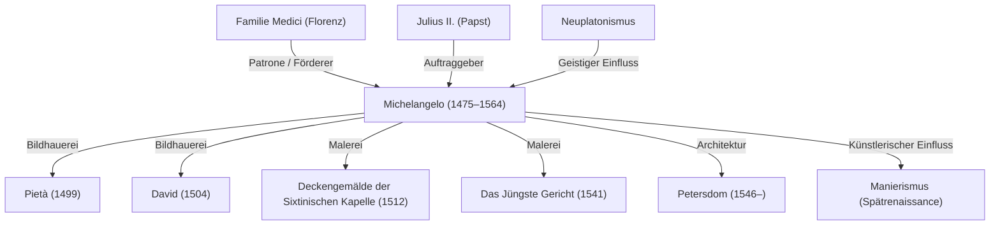

Michelangelo Buonarroti (1475–1564) gilt neben Leonardo da Vinci und Raffael als einer der drei großen Meister der Hochrenaissance. Als Bildhauer, Maler, Baumeister und Dichter hinterließ er unauslöschliche Spuren in der westlichen Kunstgeschichte. Dieser Artikel beleuchtet seinen Lebensweg, seine philosophische Herangehensweise an die Kunst sowie seinen nachhaltigen Einfluss auf die Nachwelt und zeigt, wie seine weltberühmten Meisterwerke entstanden sind.

## Entfaltung des Talents und die Begegnung mit den Medici

Michelangelo wurde 1475 in Caprese in der Toskana geboren. Da er in seiner Kindheit von der Frau eines Steinmetzes gestillt und aufgezogen wurde, pflegte er später zu sagen, sein Talent zur Bildhauerei habe er mit der Muttermilch seiner Amme aufgesaugt. So entwickelte er schon früh eine innige Verbundenheit mit dem Werkstoff Stein.

Sein außergewöhnliches Talent trat früh zutage und erregte die Aufmerksamkeit von Lorenzo de' Medici (Il Magnifico), dem einflussreichen Stadtherrn von Florenz. Unter dem Patronat der Familie Medici kam er mit antiken griechischen und römischen Skulpturen in Berührung und tauschte sich mit den Humanisten der Platonischen Akademie aus. Diese prägenden Jahre formten sein Kunstverständnis nachhaltig und führten zu der tiefen Spiritualität und dem Streben nach idealer Schönheit, die seine Werke kennzeichnen.

## Die Entstehung der Meisterwerke: Pietà und David

Bereits in jungen Jahren ging Michelangelo nach Rom, wo er im Alter von 24 Jahren sein erstes großes Meisterwerk, die *Pietà*, vollendete. Die Darstellung der Jungfrau Maria, die den Leichnam Christi in den Armen hält, fasziniert durch den fließenden Faltenwurf ihres Gewandes, der dem kalten Marmor eine beispiellose Zartheit verleiht, sowie durch tiefe Trauer und erhabene Schönheit. Dieses Werk begründete seinen unvergänglichen Ruhm.

Nach seiner Rückkehr nach Florenz schuf er aus einem gewaltigen Marmorblock die weltberühmte Monumentalstatue des *David*. Michelangelos Darstellung des David im Moment höchster Anspannung unmittelbar vor dem Kampf gegen den Riesen Goliath wurde von den Zeitgenossen als Symbol für Unabhängigkeit und Stärke der Republik Florenz begeistert gefeiert. Mit der meisterhaften Beherrschung der menschlichen Anatomie und der greifbaren inneren Spannkraft gilt dieses Werk als einer der absoluten Höhepunkte der Bildhauerkunst.

## Im Dienste der Päpste und die Sixtinische Kapelle

Michelangelo verstand sich selbst zeitlebens in erster Linie als Bildhauer. Doch aufgrund seines unvergleichlichen Talents drängten ihn die Mächtigen seiner Zeit immer wieder dazu, auch Gemälde und Architekturprojekte zu übernehmen. Das berühmteste Beispiel hierfür war der Auftrag von Papst Julius II., das Deckengewölbe der Sixtinischen Kapelle auszumalen.

Zunächst nahm er den Auftrag nur widerwillig an. Als die Arbeit jedoch begann, duldete er keinerlei Kompromisse. Auf Baugerüsten über Kopf stehend und liegend schuf er in rund vierjähriger unermüdlicher Arbeit das gigantische Deckenfresko zur biblischen Genesis. Dieses Meisterwerk, das die Schönheit und Ausdruckskraft des menschlichen Körpers auf ein nie zuvor gesehenes Niveau hob, wurde zu einem Meilenstein der Malerei. Zusammen mit dem Jahrzehnte später entstandenen Wandfresko des *Jüngsten Gerichts* an der Altarwand bezeugt es bis heute seine künstlerische Genialität.

## Kunstphilosophie: „Das im Marmor schlummernde Leben befreien“

Im Herzen von Michelangelos Kunstverständnis stand die Überzeugung, dass jede Gestalt bereits vollkommen im Marmorblock ruhe und die einzige Aufgabe des Bildhauers darin bestehe, das überflüssige Gestein wegzumeißeln und die Figur zu befreien. Dieser Gedanke war stark vom Neuplatonismus geprägt und spiegelte seine Überzeugung wider, dass es seine göttliche Bestimmung sei, die im materiellen Stein gefangene Idee (die vollkommene Form) sichtbar zu machen.

Werke aus seiner späten Schaffensperiode wie die Skulpturenreihe der *Unvollendeten Sklaven* (Non finito) zeigen menschliche Körper, die sich mühsam aus dem rohen Steinblock emporzuringen scheinen. Sie versinnbildlichen den dramatischen Kampf zwischen Materie und Geist sowie die Sehnsucht der Seele, dem irdischen Gefängnis des Körpers zu entfliehen.

## Einfluss auf die Nachwelt und unvergängliches Erbe

Michelangelos überwältigende Ausdruckskraft – insbesondere seine kühnen Körperdrehungen und die kraftvoll akzentuierte Muskulatur als Wegbereiter des Manierismus – übte einen immensen Einfluss auf zeitgenössische und spätere Generationen von Künstlern aus. Der Wandel der europäischen Kunst weg von der harmonischen Ausgewogenheit der Hochrenaissance hin zu einem hochemotionalen, dramatischen Ausdruck ist ohne Michelangelos Werk undenkbar.

Bis zu seinem Tod im Alter von 88 Jahren führte er unermüdlich den Meißel; sein gesamtes Leben war von einem unstillbaren Drang zum schöpferischen Schaffen beseelt. Getreu seinem berühmten Ausspruch im hohen Alter – „Ancora imparo“ (Ich lerne noch immer) – blieb er stets ein Suchender nach Perfektion. Seine Schöpfungen künden noch heute über Epochen hinweg von den grenzenlosen Möglichkeiten des menschlichen Geistes und wahrer seelischer Größe.

## Michelangelos Werke und Wirkungsbeziehungen

