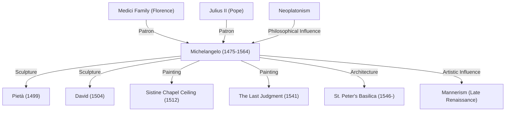

Michelangelo Buonarroti (1475–1564), widely celebrated alongside Leonardo da Vinci and Raphael as one of the three titans of the High Renaissance, left an indelible mark on Western art history as a sculptor, painter, architect, and poet. This article explores his remarkable life, his enduring legacy, the creation of his greatest masterpieces, and the unique artistic philosophy that guided his visionary work.

## Blooming Talent and the Medici Circle

Michelangelo was born in 1475 in Caprese, Tuscany. Nursed in infancy by a stonecutter's wife, he developed a profound affinity for marble early on, later remarking that he drank in his love for chiseling stone alongside his wet nurse’s milk.

His exceptional talent blossomed early and caught the eye of Lorenzo de' Medici ("il Magnifico"), the de facto ruler of Florence. Under Medici patronage, Michelangelo immersed himself in classical Greek and Roman antiquities and engaged with humanist scholars at the Platonic Academy. These formative experiences shaped his artistic vision, instilling a lifelong pursuit of ideal beauty and profound spirituality.

## The Birth of Masterpieces: The Pietà and David

Venturing to Rome in his youth, Michelangelo completed his first monumental masterpiece, the *Pietà*, at just 24 years of age. Depicting the Virgin Mary cradling the lifeless body of Jesus Christ, the sculpture transforms cold marble into delicate, flowing drapery that radiates profound sorrow and divine grace. The work instantly cemented his reputation across Italy.

Returning to Florence, he carved the celebrated statue of *David* from a colossal block of marble that other sculptors had abandoned. Capturing David in tense anticipation moments before confronting the giant Goliath, the statue was passionately embraced as a symbol of the Florentine Republic's independence and defiance. With its flawless anatomical precision and latent vitality, *David* stands as one of the supreme achievements of sculpture.

## The Papal Burden and the Sistine Chapel

Although Michelangelo proudly considered himself first and foremost a sculptor, his extraordinary talent compelled powerful patrons to demand paintings and architectural designs from him. The most famous commission came from Pope Julius II, who ordered him to paint the ceiling of the Sistine Chapel.

Michelangelo accepted the commission reluctantly, yet once work began, he refused all compromise. Over four grueling years—often painting while suspended on scaffolding and arching his back—he produced a magnificent cycle of frescoes depicting scenes from the Book of Genesis. Celebrating the power, grace, and dynamism of the human body, the ceiling became a crowning achievement in the history of painting. Decades later, his fresco *The Last Judgment* on the altar wall further reaffirmed his artistic mastery.

## Artistic Philosophy: "Liberating the Life Within the Marble"

At the heart of Michelangelo’s art lay a singular philosophy: every block of stone conceals a pre-existing figure, and the sculptor’s duty is simply to chisel away the superfluous material to liberate it. Deeply inspired by Neoplatonism, this worldview reflected his belief in drawing out the *idea* (ideal form) dwelling within raw physical matter.

His later unfinished works, such as the *Prisoners* (or *Slaves*), depict figures struggling to tear themselves free from raw stone. They vividly capture the tension between material and spirit—the eternal agony of the soul seeking liberation from the prison of the flesh.

## Legacy and Eternal Influence

Michelangelo’s dramatic expressiveness, characterized by complex serpentine postures (*figura serpentinata*) and exaggerated muscular definition, laid the groundwork for Mannerism and exerted an immense influence on contemporary and future artists. The evolution of Western art away from classical Renaissance harmony toward more dramatic, emotionally charged expression is unimaginable without him.

Wielding his chisel until the age of 88, Michelangelo lived a life driven by an insatiable hunger for creation. Even in his final years, he famously noted, "I am still learning" (*Ancora imparo*), embodying the relentless dedication of a true seeker. Centuries later, his masterpieces continue to resonate, bearing witness to the boundless creative potential and sublime elevation of the human spirit.

## Michelangelo's Achievements and Influences

