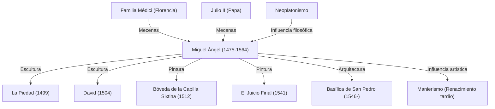

Miguel Ángel Buonarroti (1475-1564) es considerado, junto con Leonardo da Vinci y Rafael, uno de los tres grandes maestros del Renacimiento. Como escultor, pintor, arquitecto y poeta, dejó una huella imborrable y profunda en la historia del arte occidental. En este artículo, exploramos su vida, la filosofía con la que abordó el arte, cómo dio vida a numerosas obras maestras y el impacto que dejó para la posteridad.

## El florecimiento de su talento y el encuentro con los Médici

Miguel Ángel nació en 1475 en Caprese, en la región de la Toscana. Amamantado desde su infancia por la esposa de un picapedrero, desarrolló un profundo apego hacia la piedra, llegando a afirmar más tarde: «Mi talento para la escultura lo absorbí junto con la leche de mi nodriza».

Su talento floreció tempranamente y llamó la atención de Lorenzo de Médici («El Magnífico»), la figura más influyente de Florencia. Bajo el mecenazgo de la familia Médici, tuvo contacto con esculturas de la antigua Grecia y Roma, y al relacionarse con los humanistas de la Academia Platónica, su visión artística se moldeó de manera decisiva. Las experiencias de este período dieron origen a la profunda espiritualidad y a la búsqueda de la belleza ideal presentes en toda su obra.

## El nacimiento de dos obras maestras: La Piedad y el David

Siendo aún joven, Miguel Ángel se trasladó a Roma, donde a los 24 años completó su primera gran obra maestra: *La Piedad*. La imagen de la Virgen María sosteniendo el cuerpo inerte de Cristo desprende una profunda tristeza y una belleza sagrada, con pliegues en su vestidura tan suaves que cuesta creer que hayan sido esculpidos en frío mármol. Esta obra consolidó su fama de forma indiscutible.

Posteriormente, al regresar a Florencia, esculpió el *David* a partir de un colosal bloque de mármol. La figura tensa de David justo antes de enfrentarse al gigante Goliat fue recibida con entusiasmo como símbolo de la independencia y fortaleza de la República de Florencia. Esta obra, que plasma a la perfección el conocimiento anatómico del cuerpo humano y una fuerza vital que emana desde el interior, es considerada una de las cumbres del arte escultórico.

## La imposición papal y la Capilla Sixtina

Aunque Miguel Ángel se consideraba a sí mismo ante todo un «escultor», su extraordinario talento llevó a los gobernantes de la época a exigirle también obras de pintura y arquitectura. El ejemplo más célebre fue el encargo del papa Julio II para pintar la bóveda de la Capilla Sixtina.

Aceptó el encargo a regañadientes, pero una vez comenzado el trabajo no admitió concesiones: erigió andamios y, trabajando recostado boca arriba durante cerca de cuatro años, pintó los monumentales frescos basados en el libro del *Génesis*. Esta bóveda, que llevó la belleza y el dinamismo del cuerpo humano hasta sus límites absolutos, se convirtió en un hito trascendental en la historia de la pintura. Junto con *El Juicio Final*, pintado años después en el altar de la misma capilla, continúa transmitiendo al mundo moderno la grandeza de su genio pictórico.

## Filosofía artística: «Liberar la vida que duerme en el mármol»

En el núcleo del arte de Miguel Ángel residía una singular filosofía: «Dentro de cada bloque de mármol ya existe una estatua, y la tarea del escultor es retirar el material sobrante para liberarla». Este pensamiento, profundamente influenciado por el neoplatonismo, reflejaba su convicción sagrada de extraer la idea (la forma ideal) que habita en la materia.

Las esculturas que dejó incompletas hacia el final de su vida, como los *Esclavos inacabados*, capturan figuras humanas que forcejean por emerger del bloque de piedra, como si expresaran la lucha entre la materia y el espíritu, o la angustia de un alma que intenta liberarse de la prisión del cuerpo físico.

## Influencia en la posteridad y legado eterno

Su arrolladora fuerza expresiva, en particular sus posturas en torsión extrema y la musculatura exagerada (preludio del manierismo), ejerció una influencia decisiva en los artistas contemporáneos y posteriores. La evolución del arte occidental hacia una expresión más dramática y emocional, rompiendo con la armonía y el equilibrio del Renacimiento clásico, es inconcebible sin la figura de Miguel Ángel.

Hasta su muerte a los 88 años, continuó empuñando el cincel; su vida fue una búsqueda incansable de la creación. Tal como lo resumió en su vejez con la célebre frase «Aún estoy aprendiendo», fue un eterno buscador que aspiró siempre a cimas más altas. A través de los siglos, sus obras siguen hablándonos con fuerza sobre el potencial ilimitado de la humanidad y la nobleza del espíritu.

## Logros e influencias de Miguel Ángel

