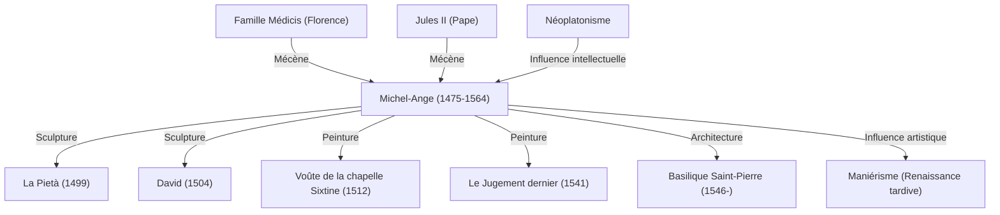

Michel-Ange Buonarroti (1475-1564) est considéré, aux côtés de Léonard de Vinci et de Raphaël, comme l'un des trois grands maîtres de la Renaissance. Sculpteur, peintre, architecte et poète, il a laissé une empreinte indélébile dans l'histoire de l'art occidental. Cet article explore comment il a donné naissance à d'innombrables chefs-d'œuvre, la philosophie qui guidait son art, ainsi que sa vie et son influence sur la postérité.

## Éclosion d'un talent et rencontre avec les Médicis

Michel-Ange naît en 1475 à Caprese, en Toscane. Élevé dès sa petite enfance par la femme d'un tailleur de pierre qui lui servait de nourrice, il déclarera plus tard avoir « tété l'amour de la pierre et le talent de la sculpture avec le lait de sa nourrice », témoignant de son attachement viscéral à cette matière.

Son génie précoce attire rapidement l'attention de Laurent de Médicis (dit « le Magnifique »), alors figure dominante de Florence. Sous le mécénat bienveillant de la famille Médicis, au contact des sculptures de la Grèce et de la Rome antiques et en échangeant avec les humanistes de l'Académie platonicienne, sa vision artistique prend forme. Cette période formatrice a profondément nourri la quête de spiritualité et de beauté idéale qui caractérise l'ensemble de son œuvre.

## La naissance des chefs-d'œuvre : La Pietà et David

Parti très jeune pour Rome, Michel-Ange achève à l'âge de 24 ans son premier chef-d'œuvre absolu, *La Pietà*. La Vierge Marie tenant la dépouille du Christ dégage une douleur poignante et une grâce divine indicible, sublimées par la souplesse stupéfiante des drapés sculptés dans le marbre froid. Cette création magistrale assura définitivement sa renommée à travers l'Italie.

De retour à Florence, il sculpte la monumentale statue de *David* dans un bloc de marbre réputé impossible à tailler. Saisi juste avant d'affronter le géant Goliath, David, vibrant d'une tension palpable, fut accueilli avec ferveur comme le symbole de l'indépendance et de la bravoure de la République florentine. Alliant une maîtrise parfaite de l'anatomie humaine à une formidable vitalité intérieure, cette œuvre demeure l'un des sommets de l'histoire de la sculpture.

## La contrainte papale et la chapelle Sixtine

Michel-Ange se considérait avant tout comme sculpteur. Pourtant, en raison de son génie hors du commun, les puissants de l'époque exigèrent de lui qu'il s'adonne également à la peinture et à l'architecture. L'exemple le plus emblématique reste la commande passée par le pape Jules II pour la voûte de la chapelle Sixtine.

Bien qu'ayant accepté la commande à contrecœur, l'artiste refusa tout compromis dès qu'il commença le chantier. Perché sur des échafaudages dans des postures harassantes, le dos courbé, il consacra près de quatre ans à peindre cette immense fresque consacrée au livre de la Genèse. Poussant à son paroxysme la beauté et la vigueur du corps humain, ce plafond est devenu un monument de l'histoire de l'art pictural. Associé au *Jugement dernier*, peint des années plus tard sur le mur de l'autel de la même chapelle, il témoigne de la grandeur sans égale de son génie de peintre.

## Philosophie artistique : « Libérer la vie emprisonnée dans le marbre »

Au cœur de la démarche artistique de Michel-Ange se trouve une conviction profonde : la statue est déjà présente dans le bloc de marbre, et le rôle du sculpteur consiste simplement à éliminer la matière superflue pour la libérer. Fortement imprégnée de néoplatonisme, cette vision traduisait chez lui une véritable vocation sacrée : faire émerger l'Idée (la forme idéale) emprisonnée dans la matière.

Ses œuvres tardives, comme la série des *Esclaves* laissés inachevés (*non finito*), révèlent des figures humaines semblant se débattre pour s'extraire de la pierre brute. Elles semblent incarner le déchirement perpétuel entre l'esprit et la matière, ou la lutte de l'âme cherchant à s'affranchir de la prison du corps charnel.

## Influence sur la postérité et héritage immortel

Son intensité expressive phénoménale, caractérisée par des torsions dynamiques et une musculature puissante — annonciatrice du maniérisme —, a profondément marqué ses contemporains et les générations suivantes. La transition de l'art occidental d'une harmonie classique de la Renaissance vers des formes plus dramatiques et chargées d'émotion ne saurait être comprise sans Michel-Ange.

Maniant le ciseau jusqu'à son dernier souffle à l'âge de 88 ans, sa vie fut une quête créatrice insatiable. Comme en témoigne sa célèbre devise de fin de vie, « Ancora imparo » (« J'apprends encore »), il fut un perpétuel chercheur de perfection spirituelle et esthétique. À travers les siècles, ses créations continuent de proclamer avec force l'élévation de l'âme et les capacités infinies de l'esprit humain.

## Réalisations et influences de Michel-Ange

