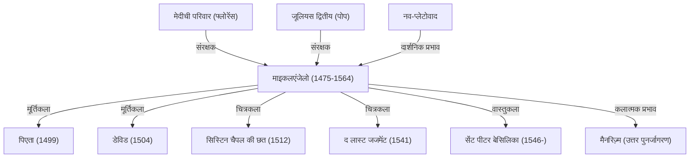

माइकलएंजेलो बुओनारोती (1475-1564) को लियोनार्डो दा विंची और राफेल के साथ पुनर्जागरण (रेनेसां) के तीन महानतम उस्तादों में गिना जाता है। एक मूर्तिकार, चित्रकार, वास्तुकार और कवि के रूप में, उन्होंने पश्चिमी कला के इतिहास पर एक अमिट और गहरी छाप छोड़ी। इस लेख में, हम उनके जीवन, उनकी कलात्मक दृष्टि और दर्शन, उनकी कालजयी कृतियों और भावी पीढ़ियों पर उनके प्रभाव का अन्वेषण करेंगे।

## प्रतिभा का प्रस्फुटन और मेदीची परिवार से भेंट

माइकलएंजेलो का जन्म 1475 में टस्कनी के काप्रेसे (Caprese) में हुआ था। बचपन में एक पत्थर तराशने वाले की पत्नी (दाई) का दूध पीकर बड़े हुए माइकलएंजेलो का पत्थर से गहरा लगाव था। बाद में उन्होंने कहा भी था, "मेरी मूर्तिकला की प्रतिभा मैंने अपनी दाई के दूध के साथ ही ग्रहण की थी।"

उनकी प्रतिभा बचपन में ही निखरने लगी और फ्लोरेंस के प्रभावशाली शासक लोरेंजो दे' मेदीची (Lorenzo de' Medici - 'द मैग्निफिसेंट') की नज़र उन पर पड़ी। मेदीची परिवार के संरक्षण में, उन्हें प्राचीन ग्रीक और रोमन मूर्तिकला को करीब से देखने और प्लेटोनिक अकादमी के मानवतावादी विचारकों से संवाद करने का अवसर मिला, जिससे उनके कलात्मक दृष्टिकोण को एक ठोस आधार मिला। इस दौर के अनुभवों ने ही उनकी कला में गहरी आध्यात्मिकता और आदर्श सौंदर्य की खोज को जन्म दिया।

## अमर कृतियों का निर्माण: पिएता और डेविड

कम उम्र में ही रोम पहुंचे माइकलएंजेलो ने मात्र 24 वर्ष की आयु में अपनी पहली उत्कृष्ट कृति 'पिएता' (Pietà) का निर्माण पूरा किया। मृत ईसा मसीह को अपनी गोद में थामे माता मरियम की इस मूर्ति में, ठंडे संगमरमर से तराशे गए वस्त्रों की कोमल सिलवटें, अगाध शोक और अलौकिक पवित्रता का अनूठा संगम देखने को मिलता है। इस कृति ने उन्हें रातोंरात विश्वप्रसिद्ध बना दिया।

इसके बाद, फ्लोरेंस लौटकर उन्होंने संगमरमर के एक विशाल शिलाखंड से 'डेविड' (David) की विश्वविख्यात प्रतिमा तराशी। विशालकाय गोलियत का सामना करने से ठीक पहले तनाव से भरे डेविड की मुद्रा को तत्कालीन फ्लोरेंटाइन गणराज्य की स्वतंत्रता और शक्ति के प्रतीक के रूप में अभूतपूर्व सराहना मिली। मानव शरीर की सटीक संरचना और आंतरिक जीवन-ऊर्जा का सजीव चित्रण करने वाली यह कृति मूर्तिकला के शिखर पर मानी जाती है।

## पोप का आदेश और सिस्टिन चैपल

यद्यपि माइकलएंजेलो स्वयं को मुख्य रूप से एक "मूर्तिकार" मानते थे, किंतु उनकी असाधारण प्रतिभा के कारण उस समय के शासकों ने उनसे चित्रकारी और वास्तुकला के कार्य भी करवाए। इसका सबसे प्रसिद्ध उदाहरण पोप जूलियस द्वितीय द्वारा सिस्टिन चैपल (Sistine Chapel) की छत पर चित्र बनाने का आदेश था।

उन्होंने भारी मन से यह कार्य स्वीकार किया, लेकिन एक बार काम शुरू करने के बाद उन्होंने कोई समझौता नहीं किया। पाड़ (scaffolding) बनाकर, पीठ के बल लेटकर लगभग चार वर्षों के अथक परिश्रम से उन्होंने 'उत्पत्ति की पुस्तक' (Genesis) पर आधारित विशाल भित्तिचित्र (fresco) तैयार किया। मानव शरीर के सौंदर्य और गतिशीलता की चरम अभिव्यक्ति प्रस्तुत करने वाली यह छत चित्रकला के इतिहास में एक मील का पत्थर साबित हुई। बाद में उसी चैपल की वेदी की दीवार पर चित्रित 'द लास्ट जजमेंट' (The Last Judgment) के साथ मिलकर, यह आज भी उनकी महान चित्रकला क्षमता का साक्ष्य प्रस्तुत करती है।

## कला दर्शन: "संगमरमर में सोए जीवन को मुक्त करना"

माइकलएंजेलो की कला के मूल में एक अनूठा दर्शन था: "संगमरमर के पत्थर के भीतर पहले से ही एक मूर्ति छिपी होती है, और मूर्तिकार का काम केवल अनावश्यक हिस्से को तराशकर उस रूप को मुक्त करना है।" नव-प्लेटोवाद (Neoplatonism) से गहरे प्रभावित इस विचार ने पदार्थ के भीतर विद्यमान 'आइडिया' (आदर्श रूप) को बाहर लाने के उनके पवित्र दायित्व को दर्शाया।

अपने जीवन के उत्तरार्ध में छोड़ी गई 'अपूर्ण दास' (Unfinished Slaves) जैसी कृतियों में पाषाण खंड से बाहर निकलने के लिए छटपटाते मानव रूपों को दर्शाया गया है, जो मानो पदार्थ और चेतना के संघर्ष, अथवा नश्वर शरीर रूपी कारागार से मुक्त होने को आतुर आत्मा की व्यथा को व्यक्त करते हैं।

## भावी पीढ़ियों पर प्रभाव और शाश्वत विरासत

उनकी शक्तिशाली अभिव्यक्ति, विशेष रूप से अत्यधिक मुड़ी हुई भाव-भंगिमाएं और उभरी हुई मांसपेशियां (जो आगे चलकर 'मैनरिज़्म' (Mannerism) की अग्रदूत बनीं), ने समकालीन और भावी कलाकारों को गहराई से प्रभावित किया। पुनर्जागरण के संतुलन और सामंजस्य को तोड़कर अधिक भावनात्मक और नाटकीय अभिव्यक्ति की ओर मुड़ने वाली पश्चिमी कला की धारा को माइकलएंजेलो के बिना नहीं समझा जा सकता।

88 वर्ष की आयु में देहांत होने तक उन्होंने अपनी छेनी कभी नहीं छोड़ी। उनका पूरा जीवन सृजन की एक अतृप्त प्यास था। अपने अंतिम वर्षों में उनके कहे शब्द "मैं अब भी सीख रहा हूँ" (Ancora imparo) इस बात का प्रमाण हैं कि वे सदैव उच्चता की खोज में लगे रहे। उनकी कृतियाँ सदियों बाद आज भी हमें मनुष्य की असीम संभावनाओं और मानवीय चेतना की भव्यता का सशक्त संदेश देती हैं।

## माइकलएंजेलो की उपलब्धियां और सहसंबंध

