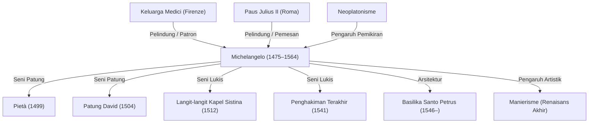

Michelangelo Buonarroti (1475–1564) adalah salah satu dari tiga maestro besar Renaisans Tinggi bersama Leonardo da Vinci dan Raffaello (Raphael). Sebagai pematung, pelukis, arsitek, dan penyair, ia meninggalkan jejak mendalam yang tak terhapuskan dalam sejarah seni Barat. Artikel ini mengupas bagaimana ia melahirkan berbagai mahakarya, filosofi yang mendasari pendekatan artistiknya, serta perjalanan hidup dan pengaruh abadinya bagi generasi mendatang.

## Berkembangnya Bakat dan Pertemuan dengan Keluarga Medici

Michelangelo lahir pada tahun 1475 di Caprese, daerah Toskana. Sejak bayi ia dibesarkan dan disusui oleh istri seorang pemahat batu, yang membuatnya kelak berkata bahwa bakat mematungnya terserap bersama dengan air susu ibu susunya. Hal ini menumbuhkan keterikatan yang sangat kuat dalam dirinya terhadap batu sebagai medium seni.

Bakatnya berkembang pesat sejak usia muda dan menarik perhatian Lorenzo de' Medici (Il Magnifico), penguasa berpengaruh di Firenze. Di bawah naungan keluarga Medici, ia bersentuhan langsung dengan patung-patung kuno Yunani dan Romawi, serta berinteraksi dengan kaum humanis dari Akademi Neoplatonik Firenze. Pengalaman inilah yang secara mendalam membentuk pandangan artistiknya, melandasi spiritualitas yang mendalam dan pencarian keindahan ideal yang tercermin dalam karya-karyanya.

## Kelahiran Mahakarya: Pieta dan Daud (David)

Pergi ke Roma saat masih muda, Michelangelo menyelesaikan mahakarya pertamanya, *Pietà*, pada usia 24 tahun. Sosok Perawan Maria yang mendekap jenazah Kristus menampilkan lipatan kain yang begitu lembut hingga seolah tidak berasal dari marmer yang dingin, memancarkan kesedihan yang mendalam sekaligus keindahan yang kudus. Mahakarya ini mengukuhkan reputasinya sebagai seniman terkemuka.

Sekembalinya ke Firenze, ia memahat patung *David* dari sebongkah marmer raksasa. Menampilkan sosok Daud yang penuh ketegangan sesaat sebelum menghadapi raksasa Goliat, karya ini disambut dengan antusiasme luar biasa sebagai simbol kemerdekaan dan kekuatan Republik Firenze pada masa itu. Penguasaan anatomi tubuh manusia yang sempurna dan penggambaran vitalitas kehidupan yang memancar dari dalam menjadikan patung ini salah satu puncak tertinggi seni patung dunia.

## Keterikatan dengan Paus dan Kapel Sistina

Meskipun Michelangelo menganggap dirinya murni sebagai seorang pematung, bakatnya yang luar biasa membuat para penguasa pada zamannya memaksanya untuk mengerjakan proyek lukisan dan arsitektur. Contoh paling terkenal adalah penugasan lukisan langit-langit Kapel Sistina oleh Paus Julius II.

Ia menerima tugas ini dengan berat hati. Namun begitu pengerjaan dimulai, ia pantang berkompromi. Dengan mendirikan perancah dan melukis sambil mendongak dan berbaring telentang selama kurang lebih empat tahun, ia menyelesaikan lukisan dinding (fresco) kolosal bertema Kitab Kejadian. Lukisan langit-langit ini mengeksplorasi keindahan dan dinamisme tubuh manusia hingga batas tertinggi, menjadikannya tonggak bersejarah dalam seni lukis. Bersama dengan *Penghakiman Terakhir* (The Last Judgment) yang dilukis di dinding altar kapel bertahun-tahun kemudian, karya-karya ini menjadi bukti keagungan bakat melukisnya hingga hari ini.

## Filosofi Seni: "Membebaskan Kehidupan yang Tertidur di Dalam Marmer"

Di balik karya seni Michelangelo, terdapat filosofi khas yang meyakini bahwa "sebuah patung sebenarnya telah terkandung di dalam sebongkah marmer, dan tugas seorang pematung hanyalah memahat bagian yang tidak diperlukan demi membebaskan figur tersebut." Pemikiran ini sangat dipengaruhi oleh Neoplatonisme, mencerminkan rasa panggilan suci dalam dirinya untuk menyingkap ide murni (bentuk ideal) yang terkurung di dalam materi.

Rangkaian karya dari masa tuanya, seperti seri *Para Budak yang Belum Selesai* (Non finito / The Slaves), memperlihatkan sosok manusia yang seakan meronta untuk melepaskan diri dari bongkahan batu. Karya-karya ini seolah mengekspresikan pergulatan abadi antara materi dan roh, atau penderitaan jiwa yang mendamba kebebasan dari penjara raga.

## Pengaruh bagi Masa Depan dan Warisan Abadi

Kekuatan ekspresinya yang memukau—khususnya pose tubuh yang meliuk ekstrem (contrapposto dinamis) dan penggambaran otot yang dramatis (pelopor Manierisme)—memberikan pengaruh yang amat besar bagi seniman sezaman maupun generasi setelahnya. Transformasi seni Barat yang mendobrak keselarasan dan keseimbangan Renaisans menuju ekspresi yang lebih emosional dan dramatis tidak dapat dilepaskan dari pengaruh Michelangelo.

Hingga menghembuskan napas terakhir pada usia 88 tahun, ia terus mengayunkan pahatnya; seluruh hidupnya adalah wujud kehausan yang tiada henti akan kreasi. Sebagaimana ucapannya di usia senja, "Aku masih terus belajar" (Ancora imparo), ia adalah seorang pencari sejati yang senantiasa menatap ke puncak yang lebih tinggi. Melintasi abad demi abad, karya-karyanya tetap berbicara lantang kepada kita hari ini tentang kemungkinan manusia yang tanpa batas dan keluhuran jiwa.

## Prestasi dan Hubungan Pengaruh Michelangelo

