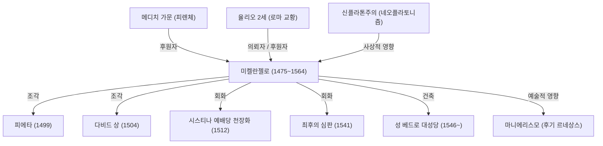

미켈란젤로 부오나로티(1475년~1564년)는 레오나르도 다빈치, 라파엘로와 함께 르네상스 3대 거장으로 꼽히며, 조각가이자 화가, 건축가, 시인으로서 서양 미술사에 지울 수 없는 깊은 발자취를 남겼습니다. 본 글에서는 그가 어떻게 수많은 걸작을 탄생시켰으며 어떤 철학으로 예술에 임했는지, 그의 파란만장한 생애와 후대에 미친 영향을 집중 조명합니다.

## 재능의 개화와 메디치 가문과의 만남

미켈란젤로는 1475년 토스카나 지방의 카프레세에서 태어났습니다. 어린 시절 석공 아내의 젖을 먹고 자란 그는 훗날 "나의 조각 재능은 유모의 젖과 함께 들이마신 것"이라고 회고했을 만큼, 돌이라는 소재에 남다른 애착을 품고 있었습니다.

그의 비범한 재능은 일찍이 꽃을 피워 피렌체의 통치자였던 로렌초 데 메디치(위대한 로렌초)의 눈에 띄었습니다. 메디치 가문의 후원 아래 고대 그리스·로마의 조각을 접하고, 플라톤 아카데미의 인문주의자들과 교류하며 그의 예술관은 깊이 있게 형성되었습니다. 이 시기의 경험은 그의 작품 전반에 흐르는 숭고한 정신성과 이상미 추구의 굳건한 토대가 되었습니다.

## 걸작의 탄생: 피에타와 다비드

젊은 나이에 로마로 향한 미켈란젤로는 불과 24세의 나이에 첫 번째 불후의 걸작 《피에타》를 완성합니다. 숨을 거둔 그리스도를 품에 안은 성모 마리아의 모습은 차가운 대리석으로 조각되었다고는 믿기지 않을 만큼 부드러운 옷자락의 주름과 깊은 비애, 그리고 성스러운 아름다움을 발산합니다. 이 작품으로 그의 명성은 확고부동해졌습니다.

이후 피렌체로 돌아온 그는 거대한 대리석 원석을 깎아 《다비드 상》을 탄생시킵니다. 거인 골리앗과의 결전을 앞둔 팽팽한 긴장감 속 다비드의 모습은 당시 피렌체 공화국의 독립과 불굴의 힘을 상징하는 작품으로 열렬한 환호를 받았습니다. 인체 해부학에 대한 완벽한 이해와 내면에서 용솟음치는 생명력을 완벽히 형상화한 이 조각상은 인류 조각 예술의 정점으로 꼽힙니다.

## 교황의 부름과 시스티나 예배당

미켈란젤로는 스스로를 확고히 '조각가'로 규정했으나, 그의 탁월한 천재성 탓에 당대 권력자들로부터 회화와 건축 작업까지 끊임없이 강요받았습니다. 가장 대표적인 사례가 바로 교황 율리오 2세가 내린 시스티나 예배당 천장화 제작 명령이었습니다.

그는 내키지 않는 마음으로 의뢰를 수락했으나, 작업에 돌입하자 한 치의 타협도 허용하지 않았습니다. 비계를 설치하고 고개를 젖힌 채 약 4년에 걸쳐 《창세기》를 주제로 한 거대한 프레스코 천장화를 홀로 완성해 냈습니다. 인간 육체의 역동적인 아름다움을 극한까지 끌어올린 이 천장화는 회화사의 기념비적 걸작이 되었습니다. 훗날 같은 예배당 제단 벽에 그린 《최후의 심판》과 더불어 그의 화업이 지닌 위대함을 오늘날까지 생생히 전하고 있습니다.

## 예술 철학: "대리석 속에 잠든 생명을 해방하다"

미켈란젤로의 예술 세계 밑바탕에는 "대리석 안에는 이미 하나의 형상이 잠들어 있으며, 조각가의 역할은 불필요한 부분을 깎아내어 그 형상을 해방하는 것뿐이다"라는 독창적인 철학이 있었습니다. 이 사상은 신플라톤주의의 영향을 깊이 받은 것으로, 물질 속에 깃든 이데아(이상적 형상)를 이끌어낸다는 그의 성스러운 사명감을 잘 드러냅니다.

만년에 남긴 《미완성의 노예들》(Non finito) 연작은 거친 돌덩이 속에서 몸부림치며 빠져나오려는 인간의 모습을 포착하고 있으며, 물질과 정신의 갈등, 또는 육체라는 감옥에서 벗어나고자 고뇌하는 영혼의 절규를 형상화한 듯한 깊은 울림을 줍니다.

## 후대에 미친 영향과 영원한 유산

그의 압도적인 표현력, 특히 극적으로 뒤틀린 자세와 과장된 근육 묘사(마니에리스모의 선구)는 동시대 및 후대 예술가들에게 막대한 영향을 끼쳤습니다. 르네상스의 조화와 균형미를 뛰어넘어 보다 감정적이고 극적인 표현으로 나아간 서양 미술의 도도한 흐름은 미켈란젤로 없이는 설명할 수 없습니다.

88세로 세상을 떠날 때까지 정을 놓지 않았던 그의 생애는 창작을 향한 끝없는 갈망 그 자체였습니다. "나는 아직도 배우고 있다(Ancora imparo)"라는 만년의 명언처럼, 그는 언제나 더 높은 경지를 향해 나아간 구도자였습니다. 그의 작품들은 시대를 초월하여 오늘날 우리에게도 인간이 지닌 무한한 가능성과 정신의 숭고함을 힘차게 전하고 있습니다.

## 미켈란젤로의 주요 업적과 상관관계

