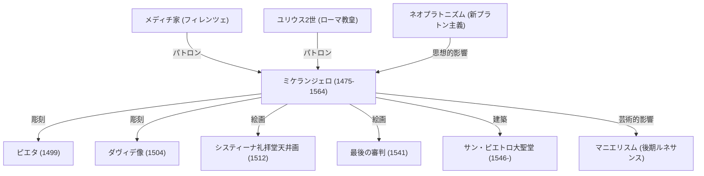

ミケランジェロ・ブオナローティ（1475年 - 1564年）は、レオナルド・ダ・ヴィンチ、ラファエロと並び称されるルネサンス三大巨匠の一人であり、彫刻家、画家、建築家、そして詩人として、西洋美術史に消えることのない深い足跡を残しました。本記事では、彼がどのようにして数々の傑作を生み出し、どのような哲学を持って芸術に向き合ったのか、その生涯と後世への影響に迫ります。

## 才能の開花とメディチ家との出会い

ミケランジェロは1475年、トスカーナ地方のカプレーゼで生まれました。幼少期から石工の妻の乳を飲んで育った彼は、後に「自分の彫刻の才能は乳母の乳と一緒に吸い込んだものだ」と語るほど、石という素材に強い愛着を持っていました。

彼の才能は早くから開花し、フィレンツェの有力者であったロレンツォ・デ・メディチ（イル・マニフィコ）の目に留まります。メディチ家の庇護の下、古代ギリシャ・ローマの彫刻に触れ、またプラトン・アカデミーの人文主義者たちと交流することで、彼の芸術観は大きく形成されていきました。この時期の経験が、彼の作品に見られる深い精神性と理想美の追求に繋がっています。

## 傑作の誕生：ピエタとダヴィデ

若くしてローマに赴いたミケランジェロは、24歳で第一の傑作『ピエタ』を完成させます。死せるキリストを抱く聖母マリアの姿は、冷たい大理石から彫り出されたとは思えないほどの柔らかな衣服の襞と、圧倒的な深い悲哀、そして神聖な美しさを放っています。この作品によって彼の名声は確固たるものとなりました。

その後、フィレンツェに戻った彼は、巨大な大理石の塊から『ダヴィデ像』を彫り上げます。巨人ゴリアテに立ち向かう直前の、緊張感に満ちたダヴィデの姿は、当時のフィレンツェ共和国の独立と力強さの象徴として熱狂的に迎えられました。完璧な人体構造の把握と、内面から湧き出る生命力を見事に表現したこの作品は、彫刻芸術の頂点の一つとされています。

## 教皇の呪縛とシスティーナ礼拝堂

ミケランジェロは自らを「彫刻家」であると強く自負していましたが、その類まれなる才能ゆえに、時の権力者たちから絵画や建築の制作も強要されました。最も有名な例が、教皇ユリウス2世によるシスティーナ礼拝堂天井画の制作依頼です。

彼は渋々この依頼を引き受けましたが、いざ制作に取り掛かると妥協を許さず、足場を組み、仰向けになりながら約4年間の歳月をかけて『創世記』を主題とする巨大なフレスコ画を描き上げました。人間の肉体の美しさと躍動感を極限まで追求したこの天井画は、絵画史における金字塔となりました。後に同礼拝堂の祭壇壁に描かれた『最後の審判』とともに、彼の画業の偉大さを現代に伝えています。

## 芸術哲学：「大理石の中に眠る生命を解放する」

ミケランジェロの芸術の根底には、「あらかじめ大理石の中には一つの像が埋まっており、彫刻家の仕事は不要な部分を削り落とし、その像を解放することである」という独自の哲学がありました。この思想は、新プラトン主義の影響を強く受けており、物質の中に宿るイデア（理想の形）を引き出すという彼の神聖な使命感を表しています。

晩年に残された『未完成の奴隷像』などの作品群は、石塊から半ば抜け出そうと身悶えする人間の姿を捉えており、物質と精神の葛藤、あるいは肉体という牢獄から解放されようとする魂の苦悩を表現しているかのようです。

## 後世への影響と永遠の遺産

彼の圧倒的な表現力、特に極端にねじられたポーズや誇張された筋肉表現（マニエリスムの先駆）は、同時代および後世の芸術家たちに絶大な影響を与えました。ルネサンスの調和と均衡を打ち破り、より感情的で劇的な表現へと向かう西洋美術の流れは、ミケランジェロなしには語れません。

88歳でこの世を去るまでノミを振るい続けた彼の生涯は、まさに創造への飽くなき渇望そのものでした。「まだ学ぶことがある」という晩年の言葉が示す通り、彼は常に高みを目指し続けた求道者でした。彼の作品は、時代を超えて現代の私たちにも、人間の持つ無限の可能性と精神の崇高さを力強く語りかけています。

## ミケランジェロの功績と相関関係

