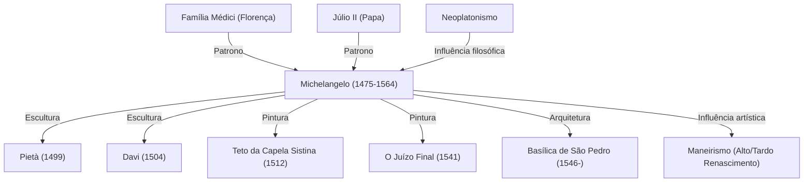

Michelangelo Buonarroti (1475–1564) é reconhecido, ao lado de Leonardo da Vinci e Rafael, como um dos três grandes mestres do Renascimento. Como escultor, pintor, arquiteto e poeta, deixou marcas indeléveis na história da arte ocidental. Neste artigo, exploramos como ele concebeu inúmeras obras-primas, a filosofia com que abordou sua criação artística, sua trajetória de vida e seu impacto duradouro para a posteridade.

## O Despertar do Talento e o Encontro com os Médici

Michelangelo nasceu em 1475 na cidade de Caprese, na região da Toscana. Criado desde a infância pela esposa de um pedreiro, que serviu como sua ama de leite, ele afirmaria mais tarde que absorveu o amor pela escultura e pela pedra junto com o leite materno de sua ama, revelando uma ligação visceral com o mármore.

Seu talento precoce logo chamou a atenção de Lourenço de Médici (conhecido como *O Magnífico*), governante de Florença. Sob a proteção e o patronato da influente família Médici, teve contato com esculturas da Grécia e Roma antigas e interagiu com humanistas da Academia Platônica, experiências fundamentais para a consolidação de sua cosmovisão artística. Esse período formativo moldou a profunda espiritualidade e a busca pela beleza ideal evidentes em todas as suas criações.

## O Surgimento das Obras-Primas: Pietà e Davi

Ao mudar-se para Roma ainda jovem, Michelangelo concluiu aos 24 anos sua primeira obra-prima indiscutível: a *Pietà*. A Virgem Maria sustentando o corpo de Cristo transmite uma dor imensurável e uma beleza sagrada comovente, realçadas pela fluidez impressionante das dobras das vestes esculpidas no mármore rígido. Essa escultura consolidou seu renome em toda a Itália.

De volta a Florença, ele transformou um imenso bloco de mármore bruto na célebre estátua de *Davi*. Retratado no momento de máxima tensão que antecede o confronto com o gigante Golias, Davi foi aclamado pela população como símbolo da liberdade, coragem e soberania da República de Florença. Pelo domínio anatômico irrepreensível e pela vibração interior da figura, a obra é reverenciada como um dos ápices da história da escultura.

## A Imposição Papal e a Capela Sistina

Embora Michelangelo se definisse categoricamente como escultor, seu gênio extraordinário levou os governantes da época a exigir que realizasse também projetos de pintura e arquitetura. O exemplo mais notável foi a encomenda do teto da Capela Sistina pelo Papa Júlio II.

Mesmo tendo aceitado a tarefa a contragosto, ele trabalhou com rigor absoluto e sem concessões. Apoiado em andaimes e trabalhando em posições extenuantes com o corpo inclinado para cima ao longo de quase quatro anos, pintou os monumentais afrescos inspirados no livro do Gênesis. Exaltando a imponência, a beleza e o dinamismo do corpo humano, essa abóbada tornou-se um marco divisor na história da pintura. Anos depois, completou na parede do altar *O Juízo Final*, reforçando a grandeza imortal de seu legado pictórico.

## Filosofia Artística: "Libertar a Vida Aprisionada no Mármore"

Na essência da arte de Michelangelo residia uma filosofia singular: a de que a escultura já existe, oculta e completa, no interior do bloco de mármore, cabendo ao escultor apenas desbastar o excesso para libertá-la. Esse pensamento, profundamente enraizado no neoplatonismo, traduzia um senso de missão sagrada: extrair a Ideia (a forma perfeita) que dorme na matéria bruta.

Suas esculturas tardias, como os *Escravos* inacabados (*non finito*), mostram corpos contorcendo-se para escapar da pedra, expressando a pungente luta entre o espírito e a matéria, ou o anseio da alma humana por se desvencilhar do cárcere corporal.

## Influência na Posteridade e Legado Eterno

Sua expressividade arrebatadora, marcada por poses de intensa torção corporal (*contrapposto* e *figura serpentinata*) e anatomias vigorosas — precursoras do maneirismo —, exerceu uma influência colossal sobre seus contemporâneos e gerações sucessivas. A evolução da arte ocidental da harmonia clássica renascentista para linguagens mais emotivas e dramáticas é indissociável da obra de Michelangelo.

Empunhando o cinzel até o fim de seus 88 anos de vida, sua jornada foi movida por um ímpeto criador insaciável. Como resumiu em sua célebre frase na velhice, "Ainda aprendo" (*Ancora imparo*), foi um eterno peregrino na busca pela perfeição artística. Através dos séculos, suas obras continuam a nos comover e a celebrar a dignidade, a espiritualidade e o infinito potencial humano.

## Realizações e Relações de Michelangelo

