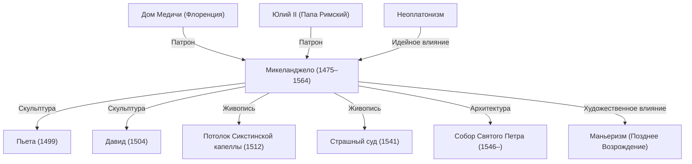

Микеланджело Буонарроти (1475–1564) — один из трех величайших мастеров Высокого Возрождения наряду с Леонардо да Винчи и Рафаэлем. Скульптор, живописец, архитектор и поэт, он оставил неизгладимый след в истории западного искусства. В этой статье мы рассмотрим, как создавались его непревзойденные шедевры, какую философию он вкладывал в творчество, а также его жизненный путь и влияние на мировую культуру.

## Расцвет таланта и знакомство с семьей Медичи

Микеланджело родился в 1475 году в тосканском городке Капрезе. С раннего детства он воспитывался в семье каменотеса, чья жена была его кормилицей. Позже мастер вспоминал, что впитал любовь к резцу и мрамору вместе с молоком своей кормилицы, подчеркивая свою глубинную привязанность к камню.

Его выдающийся дар проявился очень рано и привлек внимание могущественного правителя Флоренции Лоренцо де Медичи (Великолепного). Под покровительством семьи Медичи юный Микеланджело изучал античные скульптуры Греции и Рима, а также общался с гуманистами Платоновской академии. Этот опыт заложил основы его художественного мировоззрения, определив неустанное стремление к глубокой духовности и идеальной красоте, пронизывающее все его произведения.

## Рождение шедевров: «Пьета» и «Давид»

В молодом возрасте отправившись в Рим, Микеланджело уже в 24 года завершил свой первый великий шедевр — мраморную группу «Пьета» («Оплакивание Христа»). Образ Девы Марии, держащей на коленях тело Христа, поражает тончайшей пластикой складок одеяния, высеченных из холодного камня, бездонной скорбью и неземной красотой. Это творение принесло художнику широкое признание и славу.

Вернувшись во Флоренцию, он создал из гигантской мраморной глыбы монументальную статую «Давид». Образ Давида, исполненный предельного внутреннего напряжения перед схваткой с Голиафом, был восторженно принят горожанами как символ свободы, стойкости и независимости Флорентийской республики. Безупречное знание анатомии человека и передача пульсирующей жизненной силы возвели эту статую в ранг одной из вершин мирового скульптурного искусства.

## Воля папы и Сикстинская капелла

Микеланджело неизменно считал себя скульптором, однако из-за его феноменального гения властители того времени принуждали его браться за живопись и архитектуру. Наиболее яркий пример — заказ папы римского Юлия II на роспись потолка Сикстинской капеллы.

Хотя он взялся за этот проект неохотно, в работе он не терпел никаких компромиссов. Соорудив строительные леса и проводя долгие часы в изнурительной позе лицом вверх, он почти четыре года создавал грандиозную фреску на сюжеты книги Бытия. Воспевающий величие, мощь и пластику человеческого тела, этот свод стал поворотной вехой в истории живописи. Позднее написанный на алтарной стене капеллы «Страшный суд» окончательно утвердил непревзойденный масштаб его живописного дарования.

## Философия искусства: «Освобождение жизни, сокрытой в мраморе»

В основе эстетики Микеланджело лежала уникальная концепция: образ изначально заключен внутри мраморной глыбы, а задача скульптора — лишь отсечь лишний камень и вызволить фигуру на свободу. Эта идея глубоко перекликалась с неоплатонизмом, отражая священную миссию художника — извлечь эйдос (идеальную форму), заточенную в плотной материи.

Созданные в поздний период жизни неоконченные статуи из серии «Рабы» (*non finito*) представляют собой фигуры, буквально вырывающиеся из каменной массы. Они визуализируют вечный конфликт материи и духа, а также мучительную борьбу человеческой души за освобождение из темницы бренного тела.

## Влияние на потомков и вечное наследие

Его мощная экспрессия, сложные динамичные ракурсы и подчеркнуто рельефная мускулатура (предвосхитившие маньеризм) оказали колоссальное влияние на современников и последующие поколения художников. Движение западного искусства от гармонии и баланса Ренессанса к более эмоциональным и драматическим формам невозможно представить без Микеланджело.

Не выпуская резца из рук до самых последних дней своей 88-летней жизни, он воплощал собой неутолимую жажду созидания. Его знаменитые слова, сказанные в преклонном возрасте — «Я все еще учусь» (*Ancora imparo*), — свидетельствуют о неустанном духовном и художественном поиске. Шедевры Микеланджело продолжают звучать сквозь века, напоминая современному зрителю о безграничном потенциале и величии человеческого духа.

## Достижения и взаимосвязи

