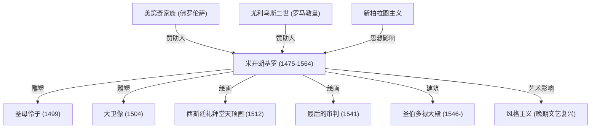

米开朗基罗·博那罗蒂（1475年—1564年）与列奥纳多·达·芬奇、拉斐尔并称为“文艺复兴后三杰”。作为集雕塑家、画家、建筑师与诗人于一身的通才，他在西方艺术史上留下了不可磨灭的深远印记。本文将带您深入探讨他如何创作出流芳百世的传世杰作，探寻他在艺术探索中所秉持的崇高哲学，以及他的生平对后世产生的永恒影响。

## 天赋初显与结缘美第奇家族

1475年，米开朗基罗出生于托斯卡纳大区的卡普雷塞。幼年时期，他寄养于一位石匠家庭，吃着石匠妻子的乳汁长大。他后来常说道：“我的雕刻天赋是与乳母的奶水一同吸入体内的。”这让他自幼便对石头这一材质产生了极深的眷恋。

他的卓越才华很早便展露锋芒，并引起了佛罗伦萨实际统治者洛伦佐·德·美第奇（“伟大的洛伦佐”）的青睐。在美第奇家族的资助与庇护下，他得以近距离接触大量古希腊罗马雕塑，并与柏拉图学园的人文主义学者深入交往。这些经历奠定了他一生的艺术视野，深刻影响了其作品中展现出的崇高精神性与对理想美的执着追求。

## 杰作诞生：《圣母怜子》与《大卫》

青年时期的米开朗基罗前往罗马，年仅24岁便完成了他的第一件传世杰作《圣母怜子》（哀悼基督）。雕像中圣母玛利亚怀抱受难基督，冰冷坚硬的大理石化作柔软细腻的衣褶，散发着无尽的深沉哀伤与神圣之美。这部作品一举奠定了他无可动摇的艺术声誉。

回到佛罗伦萨后，他利用一块被其他雕刻家遗弃的巨大大理石，雕凿出了举世闻名的《大卫像》。雕像生动刻画了大卫迎击巨人歌利亚前夕高度紧绷、蓄势待发的坚毅姿态，被佛罗伦萨共和国热烈奉为自由独立与坚强意志的象征。作品凭借对人体解剖结构的完美把握和蕴蓄于内的勃勃生机，被公认为雕塑艺术史上的最高峰之一。

## 教皇的枷锁与西斯廷礼拜堂

尽管米开朗基罗始终以“雕塑家”自居，但其无与伦比的天赋却使他屡屡受到教皇与当权者的驱使，被迫承担绘画与建筑项目。其中最著名的莫过于教皇尤利乌斯二世委托他绘制的西斯廷礼拜堂天顶画。

他虽勉强接受了这项差事，但一旦投入创作便绝不妥协。他搭建脚手架，以仰卧仰首的姿势苦战约四年之久，终于完成了以《创世纪》为题材的宏伟湿壁画。这组天顶画将人体健美与动感张力发挥到了极致，成为世界绘画史上的不朽丰碑。后来他在同一礼拜堂祭坛墙面上创作的《最后的审判》，同样向世人昭示着其绘画艺术的无可匹敌。

## 艺术哲学：“解放沉睡于大理石中的生命”

米开朗基罗的艺术核心，蕴含着一种独特的哲学理念：“每一块大理石中都已经沉睡着一座雕像，雕塑家的天职只是凿去多余的边角，将这尊雕像解放出来。”这一思想深受新柏拉图主义的影响，寄托着他旨在从粗糙物质中引出“理念”（理想之形）的神圣使命感。

他在晚年创作的《未完成的奴隶像》等系列作品中，刻画了似乎拼尽全力试图挣脱石块桎梏的人形躯体，淋漓尽致地展现了物质与精神的冲突，宛如灵魂渴望从肉体牢笼中破壁而出的痛苦与呐喊。

## 启迪后世与永恒遗产

米开朗基罗极具震撼力的艺术表现手法——尤其是极致扭曲的动态姿势（蛇形体态）与充满张力的肌肉夸张表现，成为了风格主义（矫饰主义）的先驱，对同时代及后世艺术家产生了深远影响。西方美术打破文艺复兴古典和谐与平衡、迈向更具戏剧张力与情感冲突的演进道路，若缺少了米开朗基罗便无从谈起。

直到88岁离世前，他始终手握凿刀，毕生都在对艺术创作进行无止境的追寻。正如他晚年留下的一句名言“我仍在学习”（Ancora imparo），他永远是一位不断攀登艺术绝顶的求道者。他的作品跨越了时间的长河，至今仍在向我们雄辩地诉说着人类无限的创造力与精神的崇高。

## 米开朗基罗的成就与脉络图谱

