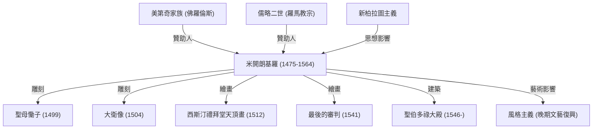

米開朗基羅·博那羅蒂（1475年—1564年）與李奧納多·達文西、拉斐爾並稱為「文藝復興三傑」。身為雕刻家、畫家、建築師與詩人，他在西方藝術史上留下了難以磨滅的深刻印記。本文將深入剖析他是如何創作出眾多傳世傑作，探討他面對藝術時秉持的獨特哲學，以及其波瀾壯闊的一生對後世所帶來的深遠影響。

## 天賦初綻與美第奇家族的淵源

米開朗基羅於1475年出生於托斯卡納地區的卡普雷塞。幼年寄養於石匠家庭的他，是喝著石匠妻子的乳汁長大的。他日後曾坦言：「自己的雕刻天賦，是與奶媽的乳汁一同吸入體內的。」這使他自幼便對石頭這種材質產生了無比深厚的情感。

他的卓越天賦很早便展露無遺，並受到佛羅倫斯實質統治者羅倫佐·德·美第奇（「偉大的羅倫佐」）的青睞。在美第奇家族的庇護與贊助下，他得以親炙古典希臘與羅馬雕塑，並與柏拉圖學園的人文主義學者們深入交流。這些青年時期的經歷，奠定了他日後在作品中追求深邃精神性與理想美的藝術觀。

## 傳世傑作的誕生：《聖母慟子》與《大衛像》

年輕時前往羅馬的米開朗基羅，年僅24歲便完成了第一件顛峰之作《聖母慟子》（哀悼基督）。雕像中聖母瑪利亞懷抱著死去的基督，將冰冷堅硬的大理石化為輕柔流暢的衣褶，散發出無盡的哀慟與崇高的神聖之美。這部曠世巨作讓他名震全義大利。

隨後回到佛羅倫斯的他，將一塊曾被他人棄置的巨大大理石，精心雕琢成舉世聞名的《大衛像》。雕像生動刻劃了大衛在迎戰巨人歌利亞前夕、充滿高度張力與堅毅自信的神態，被佛羅倫斯共和國熱烈視為自由獨立與堅定力量的象徵。作品對人體解剖構造的精準掌握，以及自內而外散發的磅礴生命力，被公認為雕塑藝術的至高巔峰。

## 教宗的束縛與西斯汀禮拜堂

米開朗基羅始終以「雕刻家」自豪，但因其無與倫比的天賦，當時的權貴一再強求他從事繪畫與建築工作。最廣為人知的，便是教宗儒略二世強令他承擔西斯汀禮拜堂天頂畫的委託。

雖然他百般不願地接下這項重任，但一旦動工便絕不妥協。他搭建鷹架，長達四年之久以仰臥仰首的極限姿態作畫，最終完成了以《創世紀》為主題的巨幅濕壁畫。這座天頂畫將人體之美與動態張力推向極致，成為世界繪畫史上的不朽里程碑。日後他在同座禮拜堂祭壇牆上所繪製的《最後的審判》，更與天頂畫一同見證了他繪畫技藝的偉大。

## 藝術哲學：「解放沉睡於大理石中的生命」

米開朗基羅的藝術本質中，蘊含著一套獨特的哲思：「大理石之中早已沉睡著一尊造像，雕刻家的職責只是鑿去多餘的部分，將那尊造像解放出來。」這種思想深受新柏拉圖主義的啟發，體現了他誓從物質之中提煉出「理型」（理想之形）的神聖使命感。

他晚年留下的《未完成的奴隸像》等系列作品，生動捕捉了宛如拼命想從石塊中掙脫而出的人體姿態，具象化了物質與精神的拉鋸與衝突，更彷彿是靈魂亟欲從肉體牢籠中解脫的無聲吶喊。

## 後世影響與永恆遺產

米開朗基羅極具衝擊力的表現手法，尤其是極端扭轉的動態姿態（蛇形身軀）與張力十足的肌肉線條，為後續的風格主義（矯飾主義）奠定了基石，對同時代及後世藝術家產生了難以估量的影響。若沒有米開朗基羅，西方藝術打破文藝復興的古典均衡與和諧、轉向更具戲劇張力與充沛情感的歷史進程便無法成立。

直到88歲高齡辭世前，他依然手持鑿子持續創作，畢生都在燃燒對創造的無盡渴望。誠如他晚年著名的箴言「我仍在學習」（Ancora imparo），他始終是一位不斷向更高境界攀登的求道者。他的作品跨越了時空，至今仍向當代的我們，強烈訴說著人類所擁有的無限潛能與心靈的崇高。

## 米開朗基羅的成就與關聯圖譜

