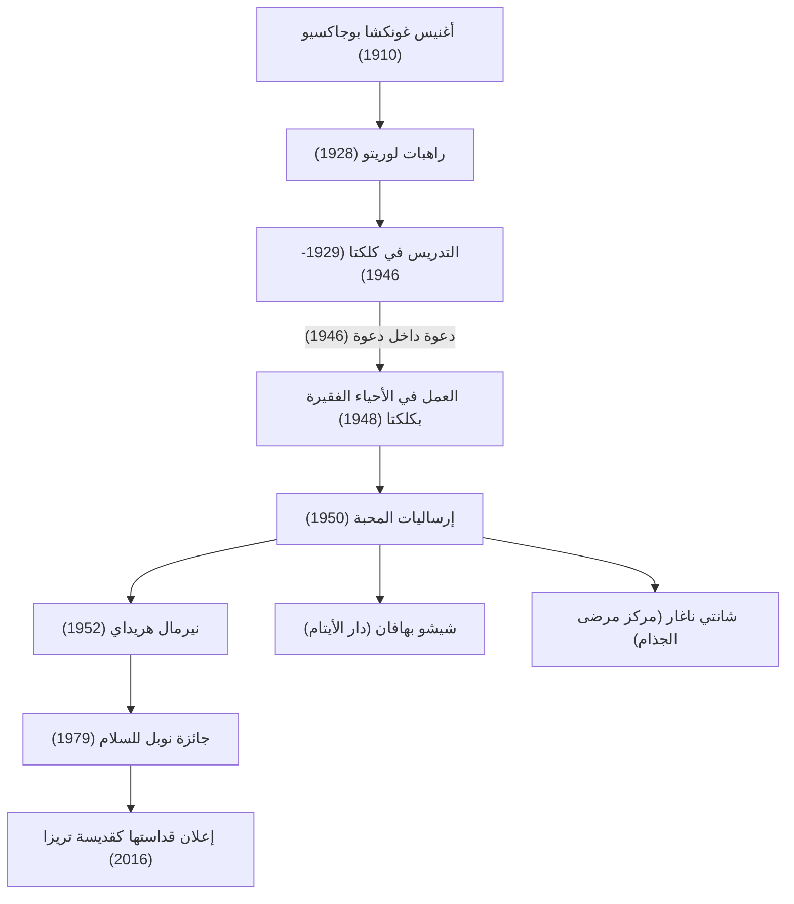

الأم تريزا (1910 - 1997) هي واحدة من أبرز الشخصيات الإنسانية في القرن العشرين، وراهبة كاثوليكية كرست حياتها لخدمة "أفقر الفقراء". لا تزال حياتها وفلسفتها تؤثر على الناس في جميع أنحاء العالم متجاوزة الحدود الدينية. يستكشف هذا المقال بعمق حياتها الحافلة بالأحداث، وإيمانها الراسخ، والإرث العظيم الذي تركته للأجيال القادمة.

## السنوات الأولى: الصحوة لخدمة الله

وُلدت الأم تريزا، واسمها الحقيقي أغنيس غونكشا بوجاكسيو، في 26 أغسطس 1910 في العاصمة الحالية لمقدونيا الشمالية سكوبيه، لعائلة كاثوليكية ثرية من أصل ألباني. كان لإيمان والدتها العميق، التي كانت مستعدة دائمًا لمساعدة الفقراء، تأثير كبير في تشكيل قيمها. اهتمت أغنيس بالعمل التبشيري منذ سن مبكرة، وغادرت مسقط رأسها في سن 18 عامًا للانضمام إلى راهبات لوريتو في أيرلندا. وهناك مُنحت الاسم الديني "تريزا" وبدأت في تعلم اللغة الإنجليزية استعدادًا لعملها التبشيري في الهند.

## سنوات كلكتا: "دعوة داخل دعوة"

في عام 1929، وصلت تريزا إلى كلكتا (كولكاتا حاليًا) في الهند. قامت بتدريس الجغرافيا والتاريخ في مدرسة للبنات تديرها دير القديسة مريم، وأصبحت لاحقًا مديرة لها. وعلى الرغم من أنها عاشت حياة مرضية كمربية، إلا أن قلبها كان يعتصر ألمًا بسبب الفقر المدقع في الأحياء الفقيرة في كلكتا، والتي تمتد خارج أسوار الدير.

جاءت نقطة التحول في 10 سبتمبر 1946، في قطار متجه إلى دارجيلنغ. في ذلك الوقت، تلقت تريزا إلهامًا قويًا من الله "لترك كل شيء والخدمة بين أفقر الفقراء". ووصفت هذه التجربة بأنها "دعوة داخل دعوة". حددت هذه التجربة الداخلية مسار بقية حياتها.

## تأسيس إرساليات المحبة وتوسيع الأنشطة

بعد الحصول على إذن خاص من الفاتيكان لمغادرة الدير، أسست تريزا "إرساليات المحبة" في عام 1950. اتخذت الراهبات الساري القطني الأبيض ذو الحواف الزرقاء الذي ترتديه النساء الهنديات كزي ديني، وبدأن في إنقاذ الأشخاص الذين انهاروا في شوارع الأحياء الفقيرة، والأيتام، ومرضى الجذام.

في عام 1952، استحوذت على معبد هندوسي مهجور وافتتحت "بيت الموتى" (نيرمال هريداي). كان هذا المرفق مخصصًا للأشخاص الذين تُركوا في الشوارع وعلى وشك الموت، لقضاء لحظاتهم الأخيرة محاطين بالحب مع الحفاظ على كرامتهم الإنسانية. استندت أفعالها، بغض النظر عن الدين أو الوضع الاجتماعي (الطائفة)، بشكل خالص على "حب الإنسان الذي يعاني".

## فلسفة الأم تريزا: القيام بأشياء صغيرة بحب كبير

كانت الفلسفة الكامنة وراء أفعال الأم تريزا بسيطة للغاية ولكنها عميقة. "لا يمكننا القيام بأشياء عظيمة في هذا العالم. لا يمكننا سوى القيام بأشياء صغيرة بحب كبير." بالنسبة لها، كان الشخص الذي يعاني أمام عينيها هو "المسيح في صورة أخرى". وكانت خدمة الفقراء خدمة مباشرة لله.

كما لفتت الانتباه ليس فقط إلى الفقر المادي، بل إلى الفقر الروحي أيضًا. وصفت الوحدة والعزلة التي يعاني منها الناس في البلدان المتقدمة الغنية بـ "الفقر الأعظم"، وتركت هذه الكلمات: "عكس الحب ليس الكراهية، بل اللامبالاة." هذه الرسالة هي حقيقة عالمية يتردد صداها بعمق في مجتمع اليوم.

## التأثير على الأجيال القادمة والإرث

في عام 1979، حصلت على جائزة نوبل للسلام لسنوات طويلة من العمل المتفاني. من المعروف أنها رفضت مأدبة حفل توزيع الجوائز وتبرعت بتكلفتها لفقراء كلكتا. تعمل "إرساليات المحبة" التي أسستها الآن في أكثر من 130 دولة حول العالم، ويواصل الآلاف من الراهبات والمتطوعين عملها.

من ناحية أخرى، هناك أيضًا انتقادات لأنشطتها، مثل تدني مستوى الرعاية الطبية والتركيز على الخلاص الروحي بدلاً من تخفيف الألم. ومع ذلك، وحتى مع أخذ هذه المناقشات في الاعتبار، فإن مساهمتها التي لا تقدر بثمن كانت في تسليط الضوء على "الأشخاص المهجورين" في جميع أنحاء العالم وإحداث تحول جذري في كيفية تقديم المساعدة الإنسانية.

توفيت الأم تريزا في 5 سبتمبر 1997 عن عمر يناهز 87 عامًا، وأعلنها البابا فرنسيس "قديسة" في عام 2016. تظل حياتها علامة أبدية على كيف يمكن لـ "القدرة على الحب" التي يمتلكها كل إنسان أن تغير العالم.
