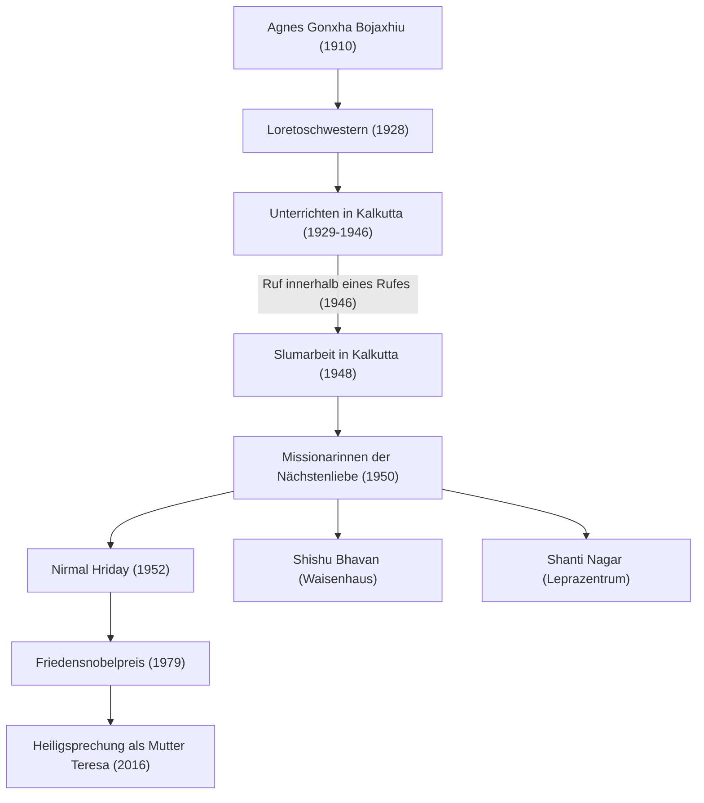

Mutter Teresa (1910 - 1997) war eine herausragende Humanitäre des 20. Jahrhunderts und eine katholische Nonne, die ihr Leben den "Ärmsten der Armen" widmete. Ihre Lebensweise und Philosophie beeinflussen weiterhin Menschen auf der ganzen Welt und überschreiten religiöse Grenzen. In diesem Artikel befassen wir uns intensiv mit ihrem bewegten Leben, den unerschütterlichen Überzeugungen in ihrem Inneren und dem großen Erbe, das sie zukünftigen Generationen hinterlassen hat.

## Frühe Jahre: Erwachen zum Dienst an Gott

Mutter Teresa, geboren als Agnes Gonxha Bojaxhiu, wurde am 26. August 1910 in Skopje, der heutigen Hauptstadt Nordmazedoniens, in eine wohlhabende albanisch-katholische Familie geboren. Die Präsenz ihrer frommen Mutter, die den Armen stets die Hand reichte, prägte maßgeblich die Bildung ihrer Werte. Agnes, die sich schon als Kind für Missionsarbeit interessierte, verließ im Alter von 18 Jahren ihre Heimatstadt und trat den Loretoschwestern in Irland bei. Hier erhielt sie den Ordensnamen "Teresa" und lernte Englisch zur Vorbereitung auf ihre Missionstätigkeit in Indien.

## Tage in Kalkutta: "Ein Ruf innerhalb eines Rufes"

1929 kam Teresa in Kalkutta (heute Kolkata), Indien, an. Sie unterrichtete Geografie und Geschichte an einer Mädchenschule, die vom St. Mary's Convent geleitet wurde, und war später deren Schulleiterin. Obwohl sie ein erfülltes Leben als Erzieherin führte, war ihr Herz ständig vom extremen Elend in den Slums von Kalkutta, das sich jenseits der Klostermauern ausbreitete, geplagt.

Ein Wendepunkt kam am 10. September 1946 während einer Zugfahrt nach Darjeeling. Damals erhielt Teresa eine starke Offenbarung von Gott, "alles zu verlassen und unter den Ärmsten der Armen zu arbeiten". Sie beschrieb dies als "Ruf innerhalb eines Rufes" (Call within a call). Diese innere Erfahrung sollte den Verlauf ihres weiteren Lebens bestimmen.

## Gründung der Missionarinnen der Nächstenliebe und Ausweitung der Aktivitäten

Nachdem Teresa vom Vatikan die Sondererlaubnis erhalten hatte, das Kloster zu verlassen, gründete sie 1950 die "Missionarinnen der Nächstenliebe" (Missionaries of Charity). Sie übernahmen den weißen Baumwollsari mit blauem Rand, der von indischen Frauen getragen wurde, als Ordensgewand und begannen, Menschen zu retten, die auf den Straßen der Slums zusammengebrochen waren, sowie Waisen und Leprakranke.

1952 erhielt sie einen verlassenen Hindu-Tempel und eröffnete das "Haus für Sterbende" (Nirmal Hriday). Dies war eine Einrichtung, in der Menschen, die auf den Straßen verlassen wurden und am Rande des Todes standen, zumindest ihre letzten Momente umgeben von Liebe und in menschlicher Würde verbringen konnten. Ihre Aktivitäten basierten rein auf "Liebe zu leidenden Menschen", unabhängig von Religion oder Kaste.

## Mutter Teresas Philosophie: Kleine Dinge mit großer Liebe

Die Philosophie, die Mutter Teresas Handlungen stützte, war sehr einfach, aber tiefgründig: "Wir können keine großen Dinge in dieser Welt tun. Wir können nur kleine Dinge mit großer Liebe tun." Für sie war die leidende Person vor ihren Augen "Christus in Verkleidung". Den Armen zu dienen, war ein direkter Dienst an Gott.

Sie konzentrierte sich auch nicht nur auf materielle Armut, sondern auch auf geistige Armut. Sie nannte die Einsamkeit und Entfremdung, die Menschen in wohlhabenden Industrieländern erleben, die "größte Armut" und hinterließ die Worte: "Das Gegenteil von Liebe ist nicht Hass, es ist Gleichgültigkeit." Diese Botschaft ist eine universelle Wahrheit, die auch in der modernen Gesellschaft tief mitschwingt.

## Einfluss auf zukünftige Generationen und Vermächtnis

1979 wurde ihr für ihre jahrelange aufopferungsvolle Arbeit der Friedensnobelpreis verliehen. Es ist eine berühmte Anekdote, dass sie das Bankett zur Preisverleihung ablehnte und die Gelder den Armen von Kalkutta spendete. Die von ihr gegründeten "Missionarinnen der Nächstenliebe" sind heute in über 130 Ländern weltweit tätig, wobei Tausende von Nonnen und Freiwilligen ihren Willen fortsetzen.

Auf der anderen Seite gibt es auch kritische Meinungen zu ihrer Arbeit, wie z.B. der niedrige medizinische Standard und ihre Betonung des geistigen Heils gegenüber der Schmerzlinderung. Aber selbst wenn man diese Debatten berücksichtigt, ist ihre Leistung, ein Licht auf die "verlassenen Menschen" der Welt zu werfen und einen grundlegenden Paradigmenwechsel in der Art der humanitären Hilfe herbeizuführen, unermesslich.

Am 5. September 1997 im Alter von 87 Jahren verstorben, wurde Mutter Teresa 2016 von Papst Franziskus als "Heilige" heiliggesprochen. Ihr Leben bleibt ein ewiger Wegweiser, der zeigt, wie die "Kraft zur Liebe", die jeder einzelne Mensch besitzt, die Welt verändern kann.
