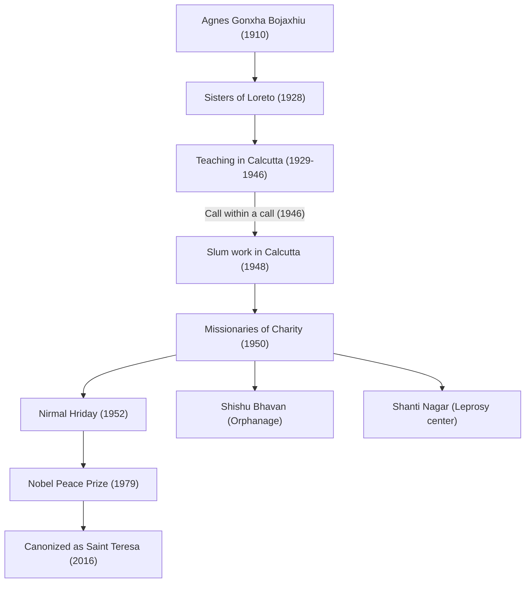

Mother Teresa (1910 - 1997) was a prominent 20th-century humanitarian and a Catholic nun who dedicated her life to the "poorest of the poor." Her way of life and philosophy continue to influence people around the world, transcending religious boundaries. In this article, we delve deeply into her turbulent life, the unwavering beliefs at her core, and the great legacy she left to future generations.

## Early Life: Awakening to Serve God

Mother Teresa, born Agnes Gonxha Bojaxhiu, was born on August 26, 1910, in Skopje, the current capital of North Macedonia, into a wealthy Albanian Catholic family. The presence of her devout mother, who constantly reached out to the poor, greatly influenced the formation of her values. Agnes, who had been interested in missionary work since childhood, left her hometown at the age of 18 and joined the Sisters of Loreto in Ireland. Here she received the religious name "Teresa" and learned English in preparation for missionary work in India.

## Days in Calcutta: "A Call Within a Call"

In 1929, Teresa arrived in Calcutta (now Kolkata), India. She taught geography and history at a girls' school run by St. Mary's Convent, later serving as its principal. Although she led a fulfilling life as an educator, her heart was constantly pained by the extreme poverty in the slums of Calcutta spreading beyond the convent walls.

A turning point came on September 10, 1946, during a train ride to Darjeeling. It was then that Teresa received a strong revelation from God to "leave everything and work among the poorest of the poor." She described this as a "call within a call." This inner experience would determine the course of her subsequent life.

## Founding of the Missionaries of Charity and Expansion of Activities

Having obtained special permission from the Vatican to leave the convent, Teresa founded the "Missionaries of Charity" in 1950. Adopting the white cotton sari with a blue border worn by Indian women as their religious habit, they set out to rescue people who had collapsed on the streets of the slums, orphans, and leprosy patients.

In 1952, she received an abandoned Hindu temple and opened the "Home for the Dying" (Nirmal Hriday). This was a facility where people abandoned on the streets and on the verge of death could at least spend their final moments surrounded by love and with human dignity. Her activities were purely based on "love for suffering human beings," regardless of religion or caste.

## Mother Teresa's Philosophy: Small Things with Great Love

The philosophy that supported Mother Teresa's actions was very simple yet profound: "We cannot do great things in this world. We can only do small things with great love." To her, the person suffering before her eyes was "Christ in disguise." Serving the poor was a direct service to God.

She also focused not only on material poverty but also on spiritual poverty. She called the loneliness and alienation experienced by people in affluent developed countries the "greatest poverty" and left behind the words, "The opposite of love is not hatred, it is indifference." This message is a universal truth that resonates deeply even in modern society.

## Influence on Future Generations and Legacy

In 1979, she was awarded the Nobel Peace Prize for her years of dedicated work. It is a famous anecdote that she declined the award ceremony banquet and donated the funds to the poor of Calcutta. The "Missionaries of Charity" she founded now operates in over 130 countries worldwide, with thousands of nuns and volunteers carrying on her will.

On the other hand, there is also critical opinion regarding her work, such as the low standard of medical care and her emphasis on spiritual salvation over pain relief. However, even considering these debates, her achievement of shedding light on the "abandoned people" of the world and bringing about a fundamental paradigm shift in the nature of humanitarian aid is immeasurable.

Passing away on September 5, 1997, at the age of 87, Mother Teresa was canonized as a "Saint" by Pope Francis in 2016. Her life remains an eternal guidepost showing how the "power to love" possessed by each individual human being can change the world.
