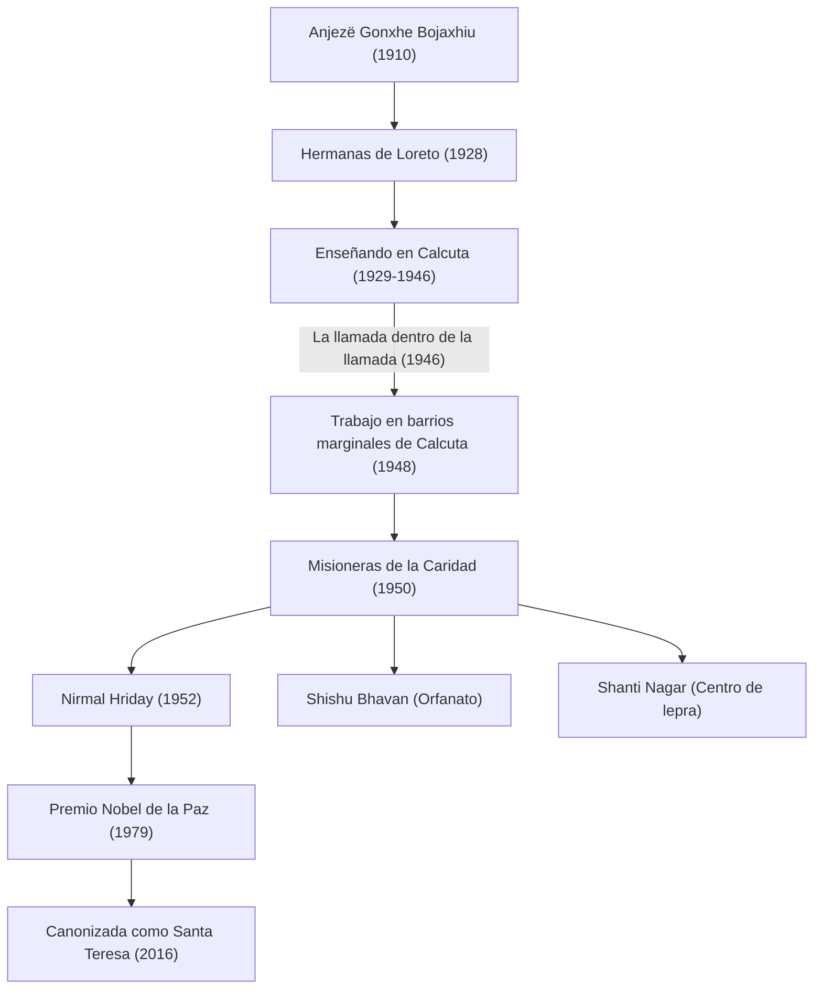

La Madre Teresa (1910 - 1997) es una trabajadora humanitaria representativa del siglo XX y una monja de la Iglesia Católica que dedicó su vida a los "más pobres de entre los pobres". Su forma de vida y su filosofía continúan influyendo en personas de todo el mundo, trascendiendo las fronteras religiosas. En este artículo, profundizaremos en su vida llena de acontecimientos, su fe inquebrantable que yace en el fondo y el gran legado que dejó a la posteridad.

## Infancia: El despertar al servicio de Dios

La Madre Teresa, cuyo verdadero nombre era Anjezë Gonxhe Bojaxhiu, nació el 26 de agosto de 1910 en Skopje, la actual capital de Macedonia del Norte, en una familia católica acomodada de ascendencia albanesa. La existencia de su madre, que era muy devota y siempre tendía la mano a los pobres, tuvo una gran influencia en la formación de sus valores. Desde muy joven, Anjezë se interesó por las actividades misioneras, y a los 18 años dejó su ciudad natal para unirse a las Hermanas de Loreto en Irlanda. Aquí recibió el nombre religioso de "Teresa" y aprendió inglés y otras materias preparándose para el trabajo misionero en la India.

## Los días en Calcuta: "La llamada dentro de la llamada"

En 1929, Teresa llega a Calcuta, India (actual Calcuta). Enseñó geografía e historia en una escuela de niñas dirigida por el Convento de Santa María, y más tarde también fue directora. Aunque vivía días plenos como educadora, su corazón siempre estaba atormentado por la extrema pobreza de los barrios marginales de Calcuta, que se extendían más allá de los muros del convento.

El punto de inflexión llegó el 10 de septiembre de 1946, en un tren con destino a Darjeeling. En este momento, Teresa recibió una fuerte revelación de Dios pidiéndole "dejarlo todo y trabajar entre los más pobres". Ella describió esto como "la llamada dentro de la llamada". Esta experiencia interna determinaría el resto de su vida.

## La fundación de las Misioneras de la Caridad y la expansión de sus actividades

Habiendo obtenido un permiso especial del Vaticano para abandonar el convento, Teresa fundó las "Misioneras de la Caridad" en 1950. Adoptaron como hábito religioso el sari de algodón blanco con bordes azules que usan las mujeres indias, y se embarcaron en el rescate de personas abandonadas en las calles de los barrios marginales, huérfanos y pacientes con lepra.

En 1952, recibió un templo hindú abandonado y abrió la "Casa del Moribundo" (Nirmal Hriday). Este era un centro donde las personas abandonadas en las calles y al borde de la muerte podían, al menos, pasar sus últimos momentos rodeados de amor y manteniendo su dignidad humana. Sus actividades se basaban puramente en el "amor al ser humano que sufre", sin distinción alguna de religión o clase social (casta).

## La filosofía de la Madre Teresa: Pequeñas cosas con gran amor

La filosofía que sustentaba las acciones de la Madre Teresa era sumamente simple, pero profunda: "No podemos hacer grandes cosas en esta tierra. Solo podemos hacer pequeñas cosas con gran amor". Para ella, la persona que sufría frente a sus ojos era "Cristo disfrazado". Servir a los pobres era un servicio directo a Dios.

Además, prestó atención no solo a la pobreza material, sino también a la pobreza espiritual. Llamó "la mayor pobreza" a la soledad y la alienación que sufren las personas en los países desarrollados ricos, y dejó la frase: "Lo contrario del amor no es el odio, sino la indiferencia". Este mensaje es una verdad universal que resuena profundamente incluso en la sociedad moderna.

## Influencia en la posteridad y legado

En 1979, fue galardonada con el Premio Nobel de la Paz por sus muchos años de dedicación. Es famosa la anécdota de que rechazó el banquete de la ceremonia de premiación y donó ese dinero para los pobres de Calcuta. Las "Misioneras de la Caridad" que ella fundó, actualmente desarrollan sus actividades en más de 130 países alrededor del mundo, y miles de monjas y voluntarios continúan su voluntad.

Por otro lado, también existen opiniones críticas sobre sus actividades debido al bajo nivel de atención médica y por haber priorizado la salvación espiritual sobre el alivio del dolor. Sin embargo, incluso incluyendo estos debates, es incalculable el mérito de haber dado luz a las "personas abandonadas" de todo el mundo y haber provocado un cambio de paradigma fundamental en la forma de entender el apoyo humanitario.

El 5 de septiembre de 1997, la Madre Teresa falleció a la edad de 87 años y fue canonizada como "Santa" por el Papa Francisco en 2016. Su vida sirve como una guía eterna, mostrando cómo el "poder de amar" que posee cada ser humano puede cambiar el mundo.
