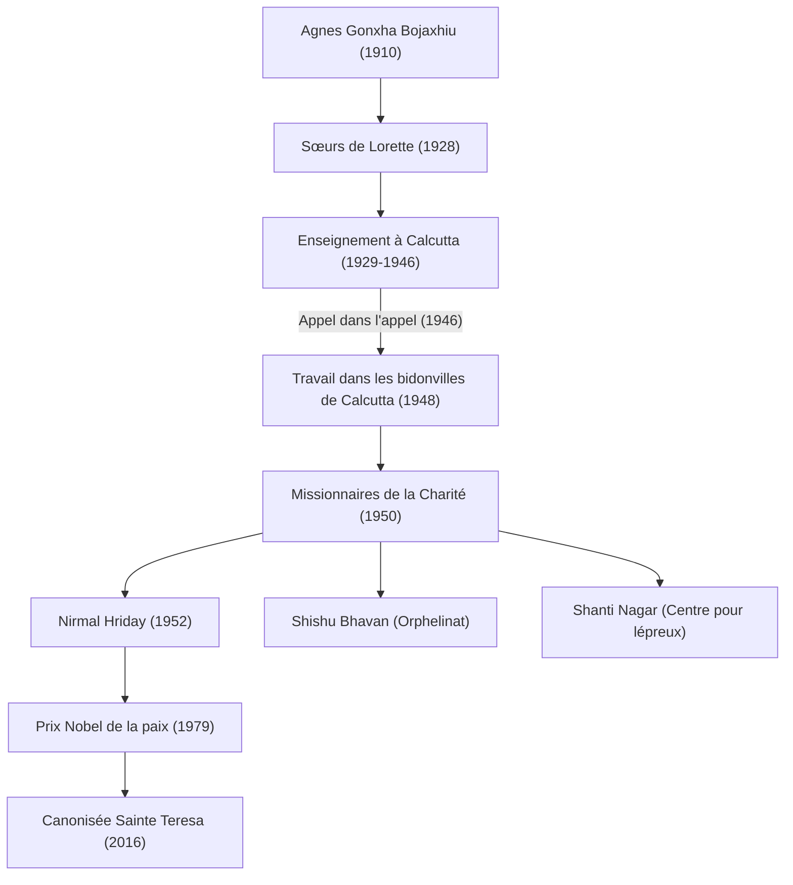

Mère Teresa (1910 - 1997) est une figure humanitaire majeure du XXe siècle et une religieuse catholique qui a consacré sa vie aux « plus pauvres d'entre les pauvres ». Sa vie et sa philosophie continuent d'influencer les peuples du monde entier au-delà des frontières religieuses. Cet article explore en profondeur sa vie mouvementée, sa foi inébranlable et l'immense héritage qu'elle a laissé aux générations futures.

## Les premières années : l'éveil au service de Dieu

Mère Teresa, née Agnes Gonxha Bojaxhiu le 26 août 1910 dans l'actuelle Skopje, capitale de la Macédoine du Nord, est issue d'une famille catholique aisée d'origine albanaise. La présence de sa mère, profondément religieuse et toujours prête à tendre la main aux pauvres, a grandement influencé la formation de ses valeurs. Intéressée par le travail missionnaire dès son plus jeune âge, Agnes quitte sa ville natale à 18 ans pour rejoindre les Sœurs de Lorette en Irlande. C'est là qu'elle reçoit le nom de religion « Teresa » et apprend l'anglais en vue de son travail missionnaire en Inde.

## Les années à Calcutta : « L'appel dans l'appel »

En 1929, Teresa arrive à Calcutta (aujourd'hui Kolkata), en Inde. Elle enseigne la géographie et l'histoire dans une école de filles dirigée par le couvent Sainte-Marie, dont elle deviendra plus tard la directrice. Bien qu'elle mène une vie épanouissante en tant qu'éducatrice, son cœur est constamment tourmenté par l'extrême pauvreté des bidonvilles de Calcutta qui s'étendent au-delà des murs du couvent.

Le tournant survient le 10 septembre 1946, dans un train en route pour Darjeeling. Teresa reçoit alors une forte révélation de Dieu lui demandant de « tout abandonner pour travailler parmi les plus pauvres ». Elle décrit cette expérience comme un « appel dans l'appel » (Call within a call). Cette expérience intérieure allait déterminer le reste de sa vie.

## Fondation des Missionnaires de la Charité et expansion des activités

Après avoir obtenu une permission spéciale du Vatican pour quitter le couvent, Teresa fonde les « Missionnaires de la Charité » en 1950. Adoptant comme habit religieux le sari en coton blanc à bordure bleue porté par les femmes indiennes, elles entreprennent de secourir les personnes effondrées dans les rues des bidonvilles, les orphelins et les lépreux.

En 1952, elle acquiert un temple hindou abandonné et ouvre la « Maison des mourants » (Nirmal Hriday). Il s'agissait d'un établissement destiné à permettre aux personnes abandonnées dans la rue et mourantes de passer au moins leurs derniers instants enveloppées d'amour et dans le respect de leur dignité humaine. Ses actions, sans distinction de religion ou de statut social (caste), étaient fondées purement sur « l'amour pour l'être humain qui souffre ».

## La philosophie de Mère Teresa : faire de petites choses avec un grand amour

La philosophie qui sous-tendait les actions de Mère Teresa était très simple, mais profonde. « Nous ne pouvons pas faire de grandes choses dans ce monde. Nous ne pouvons faire que de petites choses avec un grand amour. » Pour elle, la personne qui souffrait sous ses yeux était le « Christ déguisé ». Servir les pauvres était un service direct à Dieu.

Elle s'est également intéressée à la pauvreté spirituelle, et non pas seulement à la pauvreté matérielle. Elle qualifiait la solitude et l'aliénation des habitants des pays développés et riches de « plus grande pauvreté » et a laissé ces mots : « Le contraire de l'amour n'est pas la haine, c'est l'indifférence. » Ce message est une vérité universelle qui résonne profondément dans la société d'aujourd'hui.

## L'impact et l'héritage pour la postérité

En 1979, elle a reçu le prix Nobel de la paix pour ses longues années d'activités dévouées. L'épisode où elle a refusé le banquet de la cérémonie de remise des prix pour faire don de son coût aux pauvres de Calcutta est célèbre. Les « Missionnaires de la Charité » qu'elle a fondées sont aujourd'hui actives dans plus de 130 pays à travers le monde, et des milliers de religieuses et de bénévoles poursuivent son œuvre.

D'un autre côté, il existe également des critiques à l'égard de ses activités, pointant du doigt le faible niveau des soins médicaux et l'importance accordée au salut spirituel plutôt qu'au soulagement de la douleur. Cependant, même en tenant compte de ces débats, sa contribution inestimable a été de mettre en lumière les « personnes abandonnées » du monde entier et d'apporter un changement de paradigme fondamental dans la façon dont l'aide humanitaire est dispensée.

Décédée le 5 septembre 1997 à l'âge de 87 ans, Mère Teresa a été canonisée « sainte » par le pape François en 2016. Sa vie reste un repère éternel montrant comment la « capacité d'aimer » de chaque être humain peut changer le monde.
