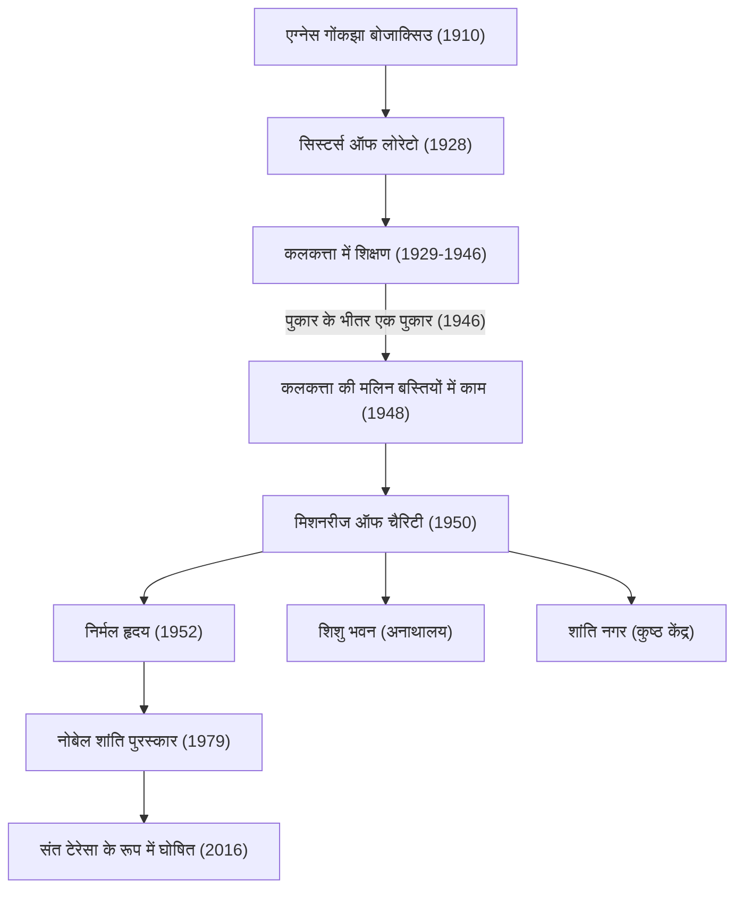

मदर टेरेसा (1910 - 1997) 20वीं सदी की एक प्रमुख मानवतावादी थीं और एक कैथोलिक नन थीं जिन्होंने अपना जीवन "सबसे गरीबों में सबसे गरीब" लोगों के लिए समर्पित कर दिया। उनका जीवन और दर्शन धर्म की सीमाओं से परे दुनिया भर के लोगों को प्रभावित करता आ रहा है। इस लेख में, हम उनके उथल-पुथल भरे जीवन, उनके अटूट विश्वासों और आने वाली पीढ़ियों के लिए छोड़ी गई महान विरासत के बारे में गहराई से जानेंगे।

## प्रारंभिक जीवन: ईश्वर की सेवा के प्रति जागृति

मदर टेरेसा, जिनका असली नाम एग्नेस गोंकझा बोजाक्सिउ था, का जन्म 26 अगस्त 1910 को वर्तमान उत्तरी मैसेडोनिया की राजधानी स्कोप्जे में एक धनी अल्बानियाई कैथोलिक परिवार में हुआ था। उनके मूल्यों को आकार देने में उनकी माँ का बहुत बड़ा प्रभाव था, जो गहराई से धार्मिक थीं और हमेशा गरीबों की मदद करती थीं। बचपन से ही मिशनरी काम में गहरी दिलचस्पी रखने वाली एग्नेस ने 18 साल की उम्र में अपना घर छोड़ दिया और आयरलैंड में सिस्टर्स ऑफ लोरेटो में शामिल हो गईं। यहीं पर उन्हें "टेरेसा" नाम मिला और उन्होंने भारत में मिशनरी काम की तैयारी के लिए अंग्रेजी और अन्य विषय सीखे।

## कलकत्ता में दिन: "पुकार के भीतर एक पुकार"

1929 में, टेरेसा भारत के कलकत्ता (अब कोलकाता) पहुंचीं। उन्होंने सेंट मैरी कॉन्वेंट द्वारा संचालित लड़कियों के स्कूल में भूगोल और इतिहास पढ़ाया और बाद में प्रधानाध्यापिका के रूप में भी कार्य किया। हालाँकि वह एक शिक्षिका के रूप में एक पूर्ण जीवन जी रही थीं, फिर भी कॉन्वेंट की दीवारों के पार कलकत्ता की मलिन बस्तियों में अत्यधिक गरीबी देखकर उनका दिल हमेशा दुखी रहता था।

उनके जीवन में महत्वपूर्ण मोड़ 10 सितंबर 1946 को आया, जब वह दार्जिलिंग जाने वाली ट्रेन में थीं। इस समय, टेरेसा को ईश्वर से एक मजबूत संदेश मिला, जिसने उन्हें "सब कुछ छोड़कर सबसे गरीब लोगों के बीच काम करने" के लिए कहा। उन्होंने इसे "पुकार के भीतर एक पुकार" (Call within a call) बताया। इस आंतरिक अनुभव ने उनके बाकी जीवन की दिशा तय कर दी।

## मिशनरीज ऑफ चैरिटी की स्थापना और गतिविधियों का विस्तार

वेटिकन से विशेष अनुमति लेकर कॉन्वेंट छोड़ने के बाद, टेरेसा ने 1950 में "मिशनरीज ऑफ चैरिटी" की स्थापना की। उन्होंने नीले किनारे वाली सफेद सूती साड़ी को अपनी नन की पोशाक के रूप में अपनाया (जिसे भारतीय महिलाएं पहनती थीं) और मलिन बस्तियों की सड़कों पर गिरे लोगों, अनाथों और कुष्ठ रोगियों को बचाने के लिए काम करना शुरू कर दिया।

1952 में, उन्हें एक परित्यक्त हिंदू मंदिर मिला और उन्होंने "निर्मल हृदय" (मरने वालों के लिए एक घर) खोला। यह एक ऐसी जगह थी जहां सड़कों पर छोड़े गए और मरने वाले लोग प्यार से घिरे रह सकते थे और कम से कम अपने अंतिम क्षणों को मानवीय गरिमा के साथ बिता सकते थे। उनका काम पूरी तरह से धर्म या जाति की परवाह किए बिना "पीड़ित मानवता के लिए प्यार" पर आधारित था।

## मदर टेरेसा का दर्शन: बड़े प्यार से छोटे काम करना

मदर टेरेसा के कार्यों के पीछे का दर्शन बहुत ही सरल लेकिन गहरा था: "हम इस दुनिया में बड़े काम नहीं कर सकते। हम केवल बड़े प्यार से छोटे काम कर सकते हैं।" उनके लिए, उनके सामने पीड़ित व्यक्ति "भेष में मसीह" था। गरीबों की सेवा करना सीधे ईश्वर की सेवा करना था।

उन्होंने न केवल भौतिक गरीबी बल्कि आध्यात्मिक गरीबी पर भी ध्यान दिया। उन्होंने अमीर, विकसित देशों में लोगों के अलगाव और अकेलेपन को "सबसे बड़ी गरीबी" कहा, और ये शब्द छोड़े: "प्यार का विपरीत नफरत नहीं, बल्कि उदासीनता है।" यह संदेश एक सार्वभौमिक सत्य है जो आधुनिक समाज में गहराई से गूंजता है।

## भावी पीढ़ियों पर प्रभाव और विरासत

1979 में, उन्हें उनके वर्षों के समर्पित काम के लिए नोबेल शांति पुरस्कार से सम्मानित किया गया। यह कहानी प्रसिद्ध है कि उन्होंने पुरस्कार समारोह के भोज में भाग लेने से इनकार कर दिया और उस पैसे को कलकत्ता के गरीब लोगों को दान कर दिया। उनके द्वारा स्थापित "मिशनरीज ऑफ चैरिटी" अब दुनिया भर के 130 से अधिक देशों में काम करती है, जहाँ हजारों नन और स्वयंसेवक उनकी विरासत को आगे बढ़ा रहे हैं।

दूसरी ओर, चिकित्सा देखभाल के निम्न स्तर और दर्द निवारण के बजाय आध्यात्मिक राहत पर जोर देने के कारण उनके काम की कुछ आलोचनाएं भी हुई हैं। हालाँकि, इन बहसों के बावजूद, दुनिया भर में "परित्यक्त लोगों" पर प्रकाश डालने और मानवीय सहायता के दृष्टिकोण में एक मौलिक बदलाव लाने में उनकी उपलब्धियां अथाह हैं।

5 सितंबर 1997 को 87 वर्ष की आयु में निधन होने के बाद, मदर टेरेसा को 2016 में पोप फ्रांसिस द्वारा "संत" घोषित किया गया था। उनका जीवन यह दिखाने के लिए एक शाश्वत मार्गदर्शक बना हुआ है कि कैसे हर व्यक्ति के भीतर "प्यार करने की शक्ति" दुनिया को बदल सकती है।
