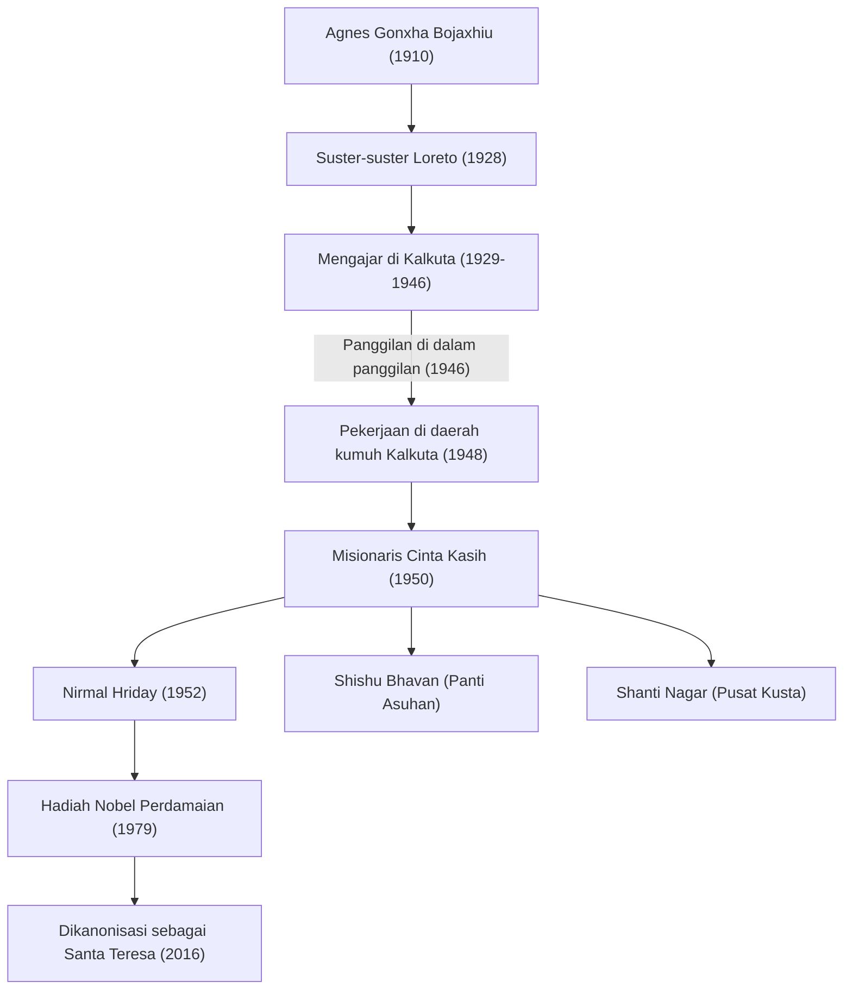

Bunda Teresa (1910 - 1997) adalah seorang tokoh kemanusiaan terkemuka abad ke-20 dan biarawati Katolik yang mendedikasikan hidupnya untuk "orang termiskin di antara yang miskin." Jalan hidup dan filosofinya terus memengaruhi orang-orang di seluruh dunia, melampaui batas-batas agama. Dalam artikel ini, kita akan menggali lebih dalam tentang kehidupannya yang penuh pergolakan, keyakinan teguh yang mendasarinya, dan warisan besar yang ia tinggalkan untuk generasi mendatang.

## Masa Muda: Panggilan untuk Melayani Tuhan

Bunda Teresa, bernama asli Agnes Gonxha Bojaxhiu, lahir pada tanggal 26 Agustus 1910 di Skopje, ibu kota Makedonia Utara saat ini, dalam sebuah keluarga Katolik Albania yang kaya. Kehadiran ibunya yang taat dan selalu mengulurkan tangan kepada orang miskin sangat memengaruhi pembentukan nilai-nilainya. Agnes, yang tertarik pada pekerjaan misionaris sejak kecil, meninggalkan kampung halamannya pada usia 18 tahun dan bergabung dengan Suster-suster Loreto di Irlandia. Di sini ia menerima nama biara "Teresa" dan belajar bahasa Inggris sebagai persiapan untuk kegiatan misionaris di India.

## Hari-hari di Kalkuta: "Panggilan di Dalam Panggilan"

Pada tahun 1929, Teresa tiba di Kalkuta (sekarang Kolkata), India. Ia mengajar geografi dan sejarah di sebuah sekolah khusus perempuan yang dikelola oleh Biara St. Mary, dan kemudian menjabat sebagai kepala sekolah. Meskipun ia menjalani kehidupan yang memuaskan sebagai pendidik, hatinya terus-menerus terluka oleh kemiskinan ekstrem di daerah kumuh Kalkuta yang membentang di balik tembok biara.

Titik balik terjadi pada 10 September 1946, selama perjalanan kereta api ke Darjeeling. Saat itulah Teresa menerima wahyu yang kuat dari Tuhan untuk "meninggalkan segalanya dan bekerja di antara orang-orang termiskin dari yang miskin." Ia menggambarkan ini sebagai "panggilan di dalam panggilan (Call within a call)." Pengalaman batin ini akan menentukan arah kehidupannya di masa depan.

## Pendirian Misionaris Cinta Kasih dan Perluasan Kegiatan

Setelah memperoleh izin khusus dari Vatikan untuk meninggalkan biara, Teresa mendirikan "Misionaris Cinta Kasih (Missionaries of Charity)" pada tahun 1950. Mengadopsi sari katun putih dengan tepi biru yang dikenakan oleh wanita India sebagai pakaian biara mereka, mereka mulai menyelamatkan orang-orang yang pingsan di jalanan daerah kumuh, anak yatim piatu, dan penderita kusta.

Pada tahun 1952, ia menerima sebuah kuil Hindu yang ditinggalkan dan membuka "Rumah bagi yang Menjelang Ajal" (Nirmal Hriday). Ini adalah fasilitas di mana orang-orang yang ditelantarkan di jalanan dan di ambang kematian setidaknya dapat menghabiskan saat-saat terakhir mereka dikelilingi oleh cinta dan dengan martabat manusia. Kegiatannya murni berdasarkan "cinta kepada manusia yang menderita," tanpa memandang agama atau kasta.

## Filosofi Bunda Teresa: Hal-hal Kecil dengan Cinta yang Besar

Filosofi yang mendukung tindakan Bunda Teresa sangat sederhana namun mendalam: "Kita tidak dapat melakukan hal-hal besar di dunia ini. Kita hanya dapat melakukan hal-hal kecil dengan cinta yang besar." Baginya, orang yang menderita di depan matanya adalah "Kristus yang menyamar." Melayani orang miskin adalah pelayanan langsung kepada Tuhan.

Selain itu, ia memusatkan perhatian tidak hanya pada kemiskinan materi tetapi juga kemiskinan spiritual. Ia menyebut kesepian dan keterasingan yang dialami oleh orang-orang di negara maju yang makmur sebagai "kemiskinan terbesar" dan meninggalkan kata-kata, "Lawan dari cinta bukanlah kebencian, melainkan ketidakpedulian." Pesan ini adalah kebenaran universal yang bergema dalam bahkan dalam masyarakat modern.

## Pengaruh pada Generasi Mendatang dan Warisan

Pada tahun 1979, ia dianugerahi Hadiah Nobel Perdamaian atas pengabdiannya selama bertahun-tahun. Ada anekdot terkenal bahwa ia menolak jamuan makan malam upacara penghargaan dan menyumbangkan dananya kepada orang miskin di Kalkuta. "Misionaris Cinta Kasih" yang ia dirikan kini beroperasi di lebih dari 130 negara di seluruh dunia, dengan ribuan biarawati dan sukarelawan meneruskan wasiatnya.

Di sisi lain, ada juga pendapat kritis mengenai pekerjaannya, seperti rendahnya standar perawatan medis dan penekanannya pada penyelamatan spiritual daripada penghilang rasa sakit. Namun, bahkan dengan mempertimbangkan perdebatan ini, pencapaiannya dalam memberikan pencerahan kepada "orang-orang yang terabaikan" di dunia dan membawa perubahan paradigma mendasar dalam sifat bantuan kemanusiaan tidak dapat diukur.

Meninggal dunia pada 5 September 1997, pada usia 87 tahun, Bunda Teresa dikanonisasi sebagai "Orang Suci (Santa)" oleh Paus Fransiskus pada tahun 2016. Kehidupannya tetap menjadi penunjuk jalan abadi yang menunjukkan bagaimana "kekuatan untuk mencintai" yang dimiliki oleh setiap manusia individu dapat mengubah dunia.
