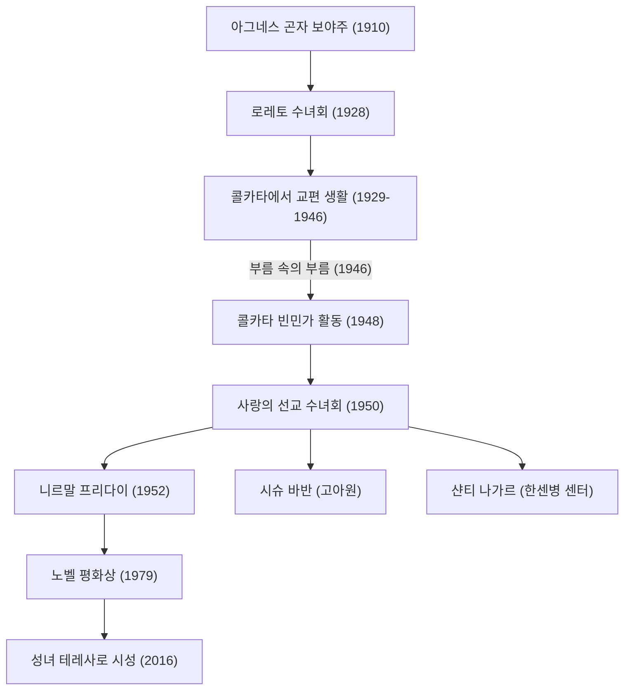

마더 테레사(1910년 - 1997년)는 20세기를 대표하는 인도주의자이자 '가장 가난한 사람들 중의 가장 가난한 사람'을 위해 평생을 바친 가톨릭 교회의 수녀입니다. 그녀의 삶의 방식과 그 철학은 종교의 틀을 넘어 전 세계 사람들에게 계속해서 영향을 미치고 있습니다. 본 기사에서는 그녀의 파란만장한 생애, 기저에 있는 흔들림 없는 신념, 그리고 후세에 남긴 위대한 유산에 대해 깊이 파헤쳐 봅니다.

## 성장 과정: 하느님에 대한 봉사로의 각성

마더 테레사, 본명 아그네스 곤자 보야주(Agnes Gonxha Bojaxhiu)는 1910년 8월 26일 현재 북마케도니아의 수도 스코페에서 알바니아계의 부유한 가톨릭 가정에서 태어났습니다. 그녀의 가치관 형성에 큰 영향을 미친 것은 신앙심이 깊고 항상 가난한 사람들에게 손을 내밀었던 어머니의 존재였습니다. 어릴 적부터 선교 활동에 관심을 가졌던 아그네스는 18세에 고향을 떠나 아일랜드의 로레토 수녀회에 입회합니다. 이곳에서 그녀는 '테레사'라는 수도명을 받고 인도에서의 선교 활동을 위해 영어 등을 배웠습니다.

## 콜카타에서의 나날: '부름 속의 부름'

1929년, 테레사는 인도의 캘커타(현재의 콜카타)에 도착합니다. 그녀는 성 마리아 수녀원이 운영하는 여학교에서 지리와 역사를 가르쳤고, 나중에는 교장도 역임했습니다. 교육자로서 충실한 나날을 보내고 있었지만, 수녀원 벽 너머로 펼쳐진 콜카타 빈민가의 극심한 빈곤에 그녀의 마음은 항상 아팠습니다.

전환기가 찾아온 것은 1946년 9월 10일, 다르질링으로 향하는 기차 안이었습니다. 테레사는 이때 '모든 것을 버리고 가장 가난한 사람들 사이에서 일하라'는 하느님의 강한 계시를 받습니다. 그녀는 이를 '부름 속의 부름(Call within a call)'이라고 표현했습니다. 이 내적 경험이 그녀의 이후 인생을 결정짓게 됩니다.

## 사랑의 선교 수녀회 창설과 활동의 확대

바티칸으로부터 특별 허가를 받아 수녀원을 떠난 테레사는 1950년에 '사랑의 선교 수녀회(Missionaries of Charity)'를 설립했습니다. 그녀들은 인도 여성이 입는 하얀 무명 사리(파란색 테두리가 있는 것)를 수도복으로 삼고, 빈민가의 길거리에서 쓰러진 사람들, 고아, 한센병 환자 등의 구제에 나섰습니다.

1952년에는 힌두교의 폐사원을 양도받아 '임종을 앞둔 이들의 집(Nirmal Hriday)'을 개설합니다. 이곳은 길거리에 버려져 죽어가는 사람들이 적어도 마지막 순간만큼은 인간의 존엄성을 유지하며 사랑에 둘러싸여 맞이할 수 있도록 하기 위한 시설이었습니다. 그녀의 활동은 종교나 신분(카스트)을 전혀 묻지 않고 순수하게 '고통받는 인간에 대한 사랑'에 기초한 것이었습니다.

## 마더 테레사의 철학: 작은 일을 큰 사랑으로

마더 테레사의 행동을 뒷받침했던 철학은 매우 단순하면서도 심오한 것이었습니다. "우리는 이 세상에서 위대한 일을 할 수 없습니다. 오직 작은 일을 큰 사랑으로 할 수 있을 뿐입니다." 그녀에게 눈앞에서 고통받는 사람은 '변장한 그리스도' 그 자체였습니다. 가난한 사람들에게 봉사하는 것은 하느님에 대한 직접적인 봉사였던 것입니다.

또한, 그녀는 물질적인 빈곤뿐만 아니라 정신적인 빈곤에도 눈을 돌렸습니다. 풍요로운 선진국에서 사람들이 겪는 고독과 소외감을 '가장 큰 빈곤'이라고 부르며, "사랑의 반대말은 미움이 아니라 무관심이다"라는 말을 남겼습니다. 이 메시지는 현대 사회에서도 깊이 울려 퍼지는 보편적인 진리입니다.

## 후세에 미친 영향과 유산

1979년, 그녀의 오랜 헌신적인 활동에 대해 노벨 평화상이 수여되었습니다. 시상식 만찬을 사양하고 그 비용을 콜카타의 가난한 사람들을 위해 기부한 일화는 유명합니다. 그녀가 설립한 '사랑의 선교 수녀회'는 현재 전 세계 130개국 이상에서 활동을 전개하고 있으며, 수천 명의 수녀와 자원봉사자들이 그녀의 유지를 이어가고 있습니다.

한편으로, 그녀의 활동에 대해서는 의료 수준이 낮다는 점이나 고통의 완화보다 정신적인 구원을 중시했다는 점 등에서 비판적인 의견도 존재합니다. 그러나 그러한 논쟁을 포함하더라도, 그녀가 전 세계의 '버림받은 사람들'에게 빛을 비추고 인도주의적 지원의 방식에 근본적인 패러다임 전환을 가져온 공적은 헤아릴 수 없습니다.

1997년 9월 5일, 87세의 나이로 세상을 떠난 마더 테레사는 2016년에 프란치스코 교황에 의해 '성인'으로 시성되었습니다. 그녀의 생애는 한 명 한 명의 인간이 가진 '사랑하는 힘'이 세상을 어떻게 바꿀 수 있는지를 보여주는 영원한 이정표가 되고 있습니다.
