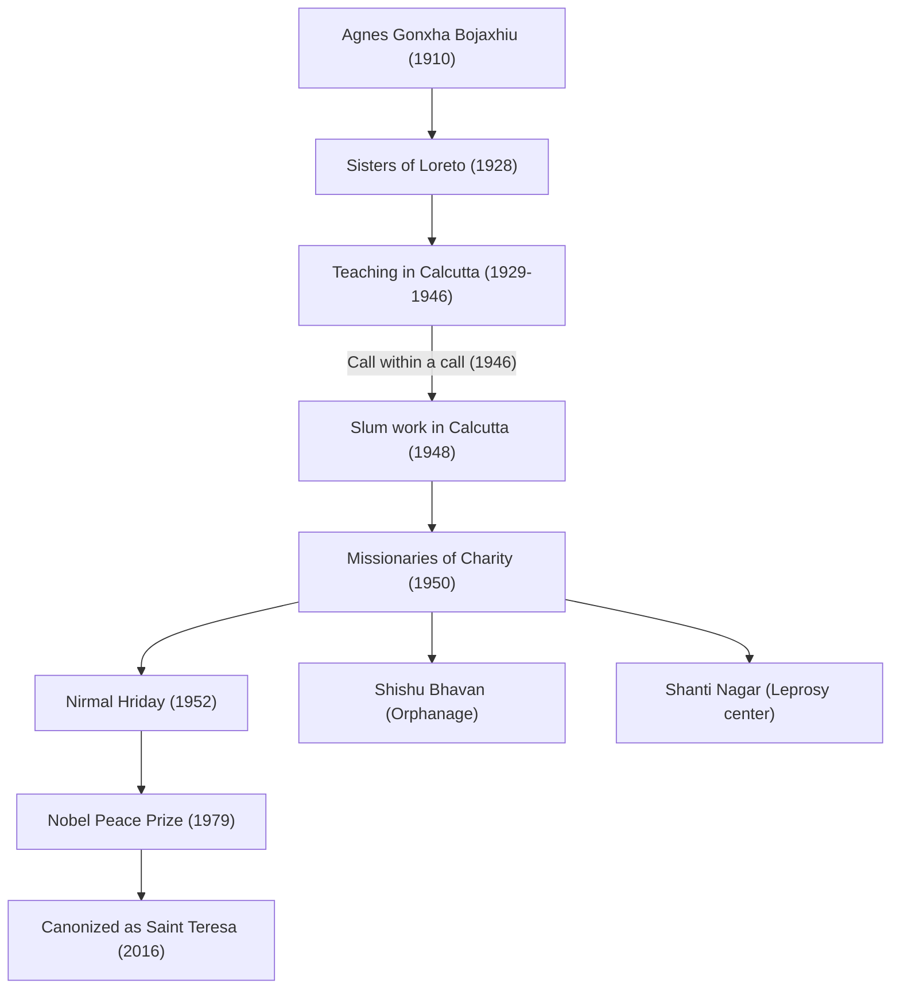

マザー・テレサ（1910年 - 1997年）は、20世紀を代表する人道支援家であり、「貧しい人の中の最も貧しい人」のために生涯を捧げたカトリック教会の修道女です。彼女の生き様やその哲学は、宗教の枠を超えて世界中の人々に影響を与え続けています。本記事では、彼女の波乱に満ちた生涯、根底にある揺るぎない信念、そして後世に遺した大いなる遺産について深く掘り下げます。

## 生い立ち：神への奉仕への目覚め

マザー・テレサ、本名アグネス・ゴンジャ・ボヤジュは、1910年8月26日に現在の北マケドニアの首都スコピエで、アルバニア系の裕福なカトリック家庭に生まれました。彼女の価値観の形成に大きな影響を与えたのは、信仰心に厚く、常に貧しい人々に手を差し伸べていた母親の存在でした。幼い頃から宣教師の活動に関心を抱いていたアグネスは、18歳で故郷を離れ、アイルランドのロレト修道会に入会します。ここで彼女は「テレサ」という修道名を授かり、インドでの宣教活動に向けて英語などを学びました。

## カルカッタでの日々：「呼びかけの中の呼びかけ」

1929年、テレサはインドのカルカッタ（現在のコルカタ）に到着します。彼女は聖マリア修道院が運営する女子校で地理と歴史を教え、後には校長も務めました。教育者として充実した日々を送っていましたが、修道院の壁の向こうに広がるカルカッタのスラム街の極度の貧困に、彼女の心は常に痛めつけられていました。

転機が訪れたのは1946年9月10日、ダージリンへ向かう列車の車中でした。テレサはこの時、「すべてを捨てて、最も貧しい人々の間で働くように」という神からの強い啓示を受けます。彼女はこれを「呼びかけの中の呼びかけ（Call within a call）」と表現しました。この内的体験が、彼女のその後の人生を決定づけることになります。

## 神の愛の宣教者会の創設と活動の拡大

バチカンからの特別な許可を得て修道院を離れたテレサは、1950年に「神の愛の宣教者会（Missionaries of Charity）」を設立しました。彼女たちは、インドの女性が着る白い木綿のサリー（青い縁取りが施されたもの）を修道服とし、スラム街の路上で行き倒れた人々、孤児、ハンセン病患者などの救済に乗り出しました。

1952年には、ヒンドゥー教の廃寺院を譲り受け、「死を待つ人々の家（ニルマル・フリダイ）」を開設します。ここは、路上で見捨てられ、死に瀕している人々が、せめて最期の時を人間の尊厳を保ちながら、愛情に包まれて迎えられるようにするための施設でした。彼女の活動は、宗教や身分（カースト）を一切問わず、純粋に「苦しむ人間への愛」に基づいたものでした。

## マザー・テレサの哲学：小さなことを大きな愛をもって

マザー・テレサの行動を支えていた哲学は非常にシンプルでありながら、奥深いものでした。「私たちは、この世で大きなことはできません。小さなことを、大きな愛をもって行うことしかできないのです」。彼女にとって、目の前で苦しんでいる人は「変装したキリスト」そのものでした。貧しい人々に奉仕することは、神への直接的な奉仕であったのです。

また、彼女は物質的な貧困だけでなく、精神的な貧困にも目を向けました。豊かな先進国において人々が抱える孤独や疎外感を「最大の貧困」と呼び、「愛の反対は憎しみではなく、無関心である」という言葉を残しています。このメッセージは、現代社会においても深く響く普遍的な真理です。

## 後世への影響と遺産

1979年、彼女の長年の献身的な活動に対し、ノーベル平和賞が授与されました。授賞式の晩餐会を辞退し、その費用をカルカッタの貧しい人々のために寄付したエピソードは有名です。彼女が設立した「神の愛の宣教者会」は、現在では世界130カ国以上で活動を展開し、何千人もの修道女とボランティアが彼女の遺志を継いでいます。

一方で、彼女の活動に対しては、医療水準の低さや、痛みの緩和よりも精神的な救済を重視したことなどから批判的な意見も存在します。しかし、それらの議論を含めても、彼女が世界中の「見捨てられた人々」に光を当て、人道支援のあり方に根本的なパラダイムシフトをもたらした功績は計り知れません。

1997年9月5日、87歳でこの世を去ったマザー・テレサは、2016年にローマ教皇フランシスコによって「聖人」に列せられました。彼女の生涯は、一人ひとりの人間が持つ「愛する力」が世界をどう変え得るかを示す、永遠の道しるべとなっています。
