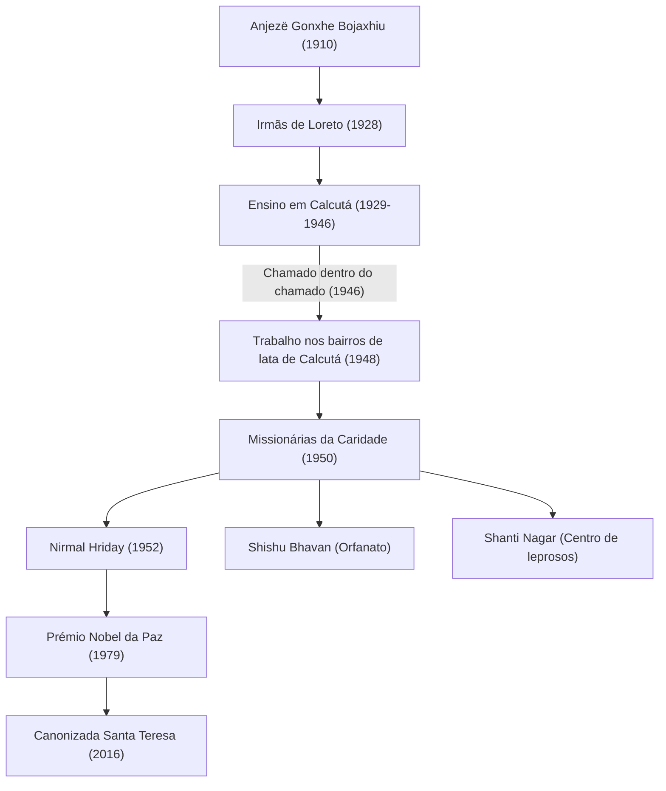

Madre Teresa (1910 - 1997) foi uma das principais figuras humanitárias do século XX e uma freira católica que dedicou a sua vida aos "mais pobres dos pobres". O seu modo de vida e a sua filosofia continuam a influenciar pessoas em todo o mundo, transcendendo as fronteiras religiosas. Este artigo explora em profundidade a sua vida agitada, a sua fé inabalável e o grande legado que deixou para as gerações vindouras.

## Primeiros anos: o despertar para o serviço a Deus

Madre Teresa, cujo nome verdadeiro era Anjezë Gonxhe Bojaxhiu, nasceu a 26 de agosto de 1910 na atual capital da Macedónia do Norte, Skopje, no seio de uma abastada família católica de origem albanesa. A forte fé da sua mãe, que estava sempre pronta a ajudar os pobres, teve uma grande influência na formação dos seus valores. Interessada pelo trabalho missionário desde tenra idade, Anjezë deixou a sua terra natal aos 18 anos para se juntar às Irmãs de Loreto, na Irlanda. Aí recebeu o nome religioso de "Teresa" e aprendeu inglês para o seu trabalho missionário na Índia.

## Os anos em Calcutá: "O chamado dentro do chamado"

Em 1929, Teresa chegou a Calcutá (atual Kolkata), na Índia. Ensinou geografia e história numa escola para raparigas dirigida pelo convento de Santa Maria, tornando-se mais tarde sua diretora. Apesar de ter uma vida gratificante como educadora, o seu coração estava constantemente angustiado pela pobreza extrema dos bairros de lata de Calcutá, que se estendiam para além dos muros do convento.

O ponto de viragem ocorreu a 10 de setembro de 1946, num comboio a caminho de Darjeeling. Nessa altura, Teresa recebeu uma forte revelação de Deus para "abandonar tudo e servir entre os mais pobres". Ela descreveu esta experiência como um "chamado dentro do chamado" (Call within a call). Esta experiência interior iria determinar o resto da sua vida.

## Fundação das Missionárias da Caridade e expansão das atividades

Tendo obtido autorização especial do Vaticano para deixar o convento, Teresa fundou as "Missionárias da Caridade" em 1950. Adotaram como hábito religioso o sari de algodão branco com orlas azuis, usado pelas mulheres indianas, e começaram a resgatar pessoas que tinham desmaiado nas ruas dos bairros de lata, órfãos e leprosos.

Em 1952, adquiriu um templo hindu abandonado e abriu a "Casa dos Moribundos" (Nirmal Hriday). Este era um estabelecimento onde as pessoas abandonadas na rua e à beira da morte podiam passar os seus últimos momentos envolvidas em amor e mantendo a sua dignidade humana. As suas ações, independentemente da religião ou do estatuto social (casta), baseavam-se puramente no "amor pelo ser humano que sofre".

## A filosofia de Madre Teresa: fazer pequenas coisas com grande amor

A filosofia subjacente às ações de Madre Teresa era muito simples, mas profunda. "Não podemos fazer grandes coisas neste mundo. Só podemos fazer pequenas coisas com grande amor". Para ela, a pessoa que sofria perante os seus olhos era o próprio "Cristo disfarçado". Servir os pobres era um serviço direto a Deus.

Também chamou a atenção não só para a pobreza material, mas também para a pobreza espiritual. Ela referiu-se à solidão e à alienação vividas pelas pessoas nos países desenvolvidos ricos como a "maior pobreza" e deixou estas palavras: "O oposto do amor não é o ódio, é a indiferença". Esta mensagem é uma verdade universal que ressoa profundamente na sociedade atual.

## Impacto nas gerações futuras e legado

Em 1979, recebeu o Prémio Nobel da Paz pelos seus muitos anos de dedicação. O episódio em que recusou o banquete da cerimónia de entrega do prémio e doou o seu custo aos pobres de Calcutá é famoso. As "Missionárias da Caridade" que fundou estão agora ativas em mais de 130 países em todo o mundo, com milhares de freiras e voluntários a darem continuidade ao seu trabalho.

Por outro lado, existem também críticas às suas atividades, como o baixo nível de cuidados médicos e a ênfase na salvação espiritual em vez do alívio da dor. No entanto, mesmo tendo em conta estes debates, o seu contributo inestimável foi o de lançar luz sobre as "pessoas abandonadas" em todo o mundo e provocar uma mudança fundamental de paradigma na prestação de ajuda humanitária.

Falecida a 5 de setembro de 1997, aos 87 anos, Madre Teresa foi canonizada "santa" pelo Papa Francisco em 2016. A sua vida continua a ser um marco eterno de como o "poder de amar" que cada ser humano possui pode mudar o mundo.
