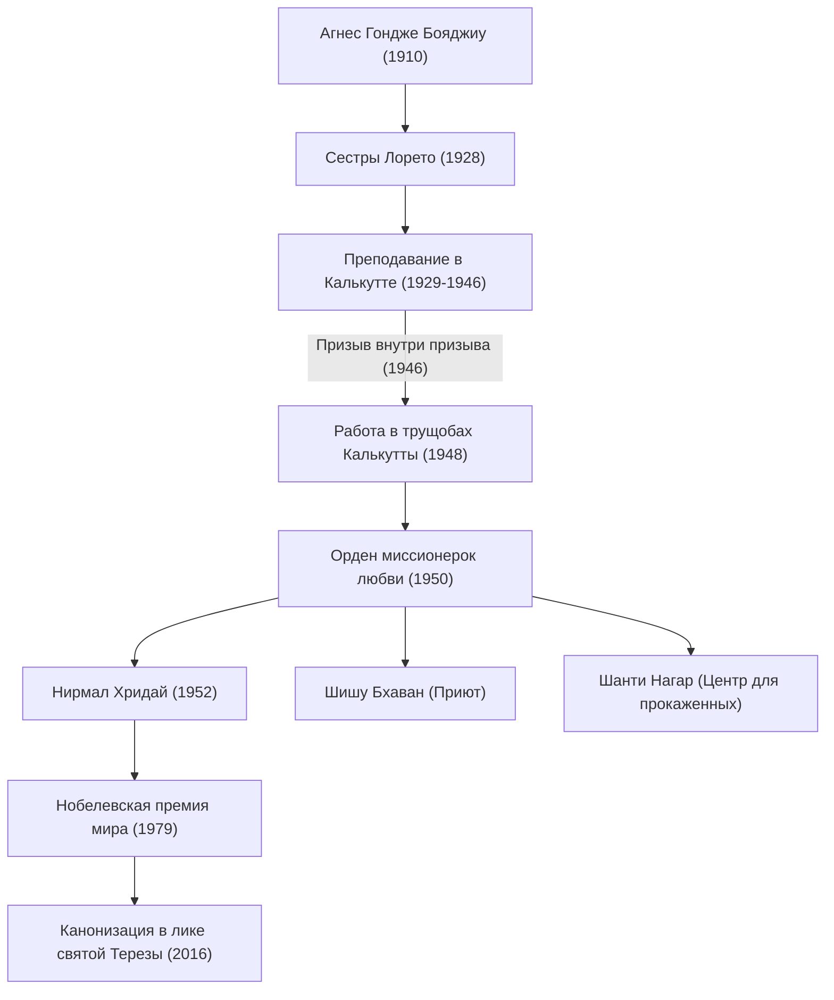

Мать Тереза (1910 - 1997) — выдающийся гуманитарный деятель XX века и католическая монахиня, посвятившая свою жизнь «беднейшим из бедных». Ее жизнь и философия продолжают оказывать влияние на людей во всем мире, выходя за рамки религий. В этой статье подробно рассматривается ее полная событий жизнь, ее непоколебимая вера и огромное наследие, которое она оставила будущим поколениям.

## Ранние годы: пробуждение к служению Богу

Мать Тереза, урожденная Агнес Гондже Бояджиу, родилась 26 августа 1910 года в Скопье (нынешней столице Северной Македонии) в состоятельной католической семье албанского происхождения. Большое влияние на формирование ее ценностей оказала мать, глубоко верующая женщина, всегда готовая помочь бедным. Заинтересовавшись миссионерской деятельностью с ранних лет, Агнес в 18 лет покинула родной город и вступила в ирландский монашеский орден сестер Лорето. Здесь она получила монашеское имя «Тереза» и начала изучать английский язык для миссионерской работы в Индии.

## Годы в Калькутте: «Призыв внутри призыва»

В 1929 году Тереза прибыла в Калькутту (ныне Колката), Индия. Она преподавала географию и историю в школе для девочек при монастыре Святой Марии, а позже стала ее директором. Несмотря на насыщенную жизнь педагога, ее сердце постоянно терзала крайняя нищета калькуттских трущоб, раскинувшихся за стенами монастыря.

Поворотный момент наступил 10 сентября 1946 года в поезде по пути в Дарджилинг. Тогда Тереза получила сильное откровение от Бога с призывом «оставить всё и служить среди самых бедных». Она описала этот опыт как «призыв внутри призыва» (Call within a call). Этот внутренний опыт определил всю ее дальнейшую жизнь.

## Основание Ордена миссионерок любви и расширение деятельности

Получив специальное разрешение Ватикана покинуть монастырь, Тереза в 1950 году основала «Орден миссионерок любви» (Missionaries of Charity). В качестве монашеского облачения они выбрали белое хлопчатобумажное сари с синей каймой, которое носят индийские женщины, и начали спасать людей, упавших на улицах трущоб, сирот и больных проказой.

В 1952 году она получила в дар заброшенный индуистский храм и открыла «Дом для умирающих» (Нирмал Хридай). Это было учреждение, где брошенные на улице и умирающие люди могли провести свои последние минуты, окруженные любовью, сохраняя человеческое достоинство. Ее деятельность не знала религиозных и сословных (кастовых) различий, основываясь исключительно на «любви к страдающему человеку».

## Философия матери Терезы: делать малые дела с большой любовью

Философия, лежащая в основе действий матери Терезы, была очень простой, но глубокой. «Мы не можем делать великие дела в этом мире. Мы можем делать только малые дела с большой любовью». Для нее человек, страдающий перед ее глазами, был самим «Христом под маской». Служение бедным было прямым служением Богу.

Она также обращала внимание не только на материальную, но и на духовную нищету. Она называла одиночество и отчуждение людей в богатых развитых странах «величайшей нищетой» и оставила такие слова: «Противоположность любви — не ненависть, а равнодушие». Это послание — универсальная истина, которая глубоко отзывается в современном обществе.

## Влияние на потомков и наследие

В 1979 году за многолетнюю самоотверженную деятельность ей была присуждена Нобелевская премия мира. Известен случай, когда она отказалась от банкета по случаю вручения премии и пожертвовала его стоимость в пользу бедных Калькутты. Основанный ею «Орден миссионерок любви» в настоящее время действует более чем в 130 странах мира, и тысячи монахинь и волонтеров продолжают ее дело.

С другой стороны, в адрес ее деятельности существует и критика, в частности, из-за низкого уровня медицинского обслуживания и акцента на духовном спасении, а не на облегчении физической боли. Однако, даже принимая во внимание эти дискуссии, ее бесценная заслуга заключается в том, что она пролила свет на «брошенных людей» во всем мире и вызвала фундаментальный сдвиг парадигмы в оказании гуманитарной помощи.

Мать Тереза ушла из жизни 5 сентября 1997 года в возрасте 87 лет. В 2016 году папа Франциск причислил ее к лику «святых». Ее жизнь служит вечным ориентиром того, как «способность любить», заложенная в каждом человеке, может изменить мир.
