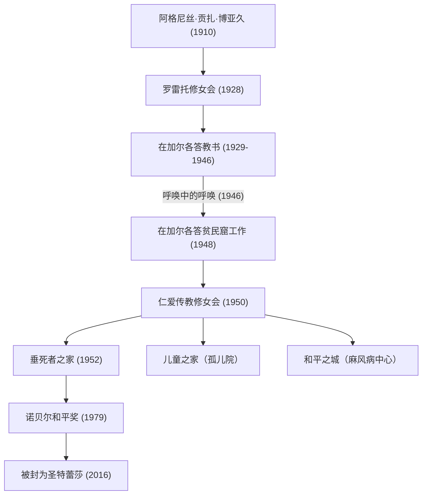

特蕾莎修女（1910年 - 1997年）是20世纪最具代表性的人道主义者，也是将一生奉献给“穷人中最穷的人”的天主教修女。她的生活方式和哲学跨越了宗教的界限，持续影响着世界各地的人们。本文将深入探讨她充满波折的一生、根深蒂固的坚定信念，以及留给后世的伟大遗产。

## 早年经历：献身于神的觉醒

特蕾莎修女，本名阿格尼丝·贡扎·博亚久，1910年8月26日出生于现北马其顿首都斯科普里的一个富裕的阿尔巴尼亚裔天主教家庭。对她价值观形成产生重大影响的是她虔诚且总是向穷人伸出援手的母亲。从小就对传教士活动抱有兴趣的阿格尼丝在18岁时离开故乡，加入了爱尔兰的罗雷托修女会。在这里，她被授予了“特蕾莎”这个修女名，并为了在印度进行传教活动而学习了英语等知识。

## 在加尔各答的日子：“呼唤中的呼唤”

1929年，特蕾莎抵达印度的加尔各答（现加尔各答）。她在圣玛利亚修道院运营的女子学校教授地理和历史，后来还担任了校长。尽管作为一名教育工作者度过了充实的日子，但修道院墙外加尔各答贫民窟里极度的贫困始终折磨着她的心。

转机出现在1946年9月10日，在前往大吉岭的火车上。特蕾莎此时受到神的强烈启示：“放弃一切，在最贫穷的人中工作”。她将其形容为“呼唤中的呼唤（Call within a call）”。这种内在体验决定了她后来的人生。

## 仁爱传教修女会的创立与活动的扩大

获得梵蒂冈的特别许可离开修道院的特蕾莎，于1950年创立了“仁爱传教修女会（Missionaries of Charity）”。她们将印度女性穿的带有蓝边的白色棉质纱丽作为修女服，开始救助倒在贫民窟街头的人、孤儿和麻风病患者等。

1952年，她接手了一座废弃的印度教寺庙，开设了“垂死者之家（Nirmal Hriday）”。这是一个旨在让被遗弃在街头、濒临死亡的人们，至少在生命的最后时刻能够保持人的尊严，并在爱的包围中离世的设施。她的活动不分宗教和身份（种姓），纯粹基于“对受苦之人的爱”。

## 特蕾莎修女的哲学：怀着大爱做小事

支撑特蕾莎修女行动的哲学非常简单，却又十分深奥：“我们在这个世界上做不了伟大的事情。我们只能怀着大爱做小事。”对她来说，眼前受苦的人就是“伪装的基督”本身。为穷人服务，就是对神的直接服务。

此外，她不仅关注物质上的贫困，也关注精神上的贫困。她将在富裕的发达国家中人们所感受到的孤独和疏离感称为“最大的贫困”，并留下了“爱的反面不是仇恨，而是冷漠”的名言。这一信息在现代社会中依然产生着深刻的共鸣，是一条普遍的真理。

## 对后世的影响与遗产

1979年，为了表彰她多年来的奉献活动，她被授予诺贝尔和平奖。她拒绝参加颁奖典礼的晚宴，并将这笔费用捐赠给加尔各答的穷人，这一事迹广为人知。她创立的“仁爱传教修女会”目前在世界130多个国家开展活动，数千名修女和志愿者继承了她的遗志。

另一方面，对她的活动也存在一些批评意见，如医疗水平低下，以及比起缓解疼痛更注重精神救赎等。然而，即使包含这些争议，她为全世界“被遗弃的人们”带来光明，并在人道援助的方式上带来根本性的范式转变的功绩是不可估量的。

1997年9月5日，87岁的特蕾莎修女离开了人世。2016年，她被教宗方济各封为“圣人”。她的一生是永恒的指路明灯，向人们展示了每个人拥有的“爱的力量”能够如何改变世界。
