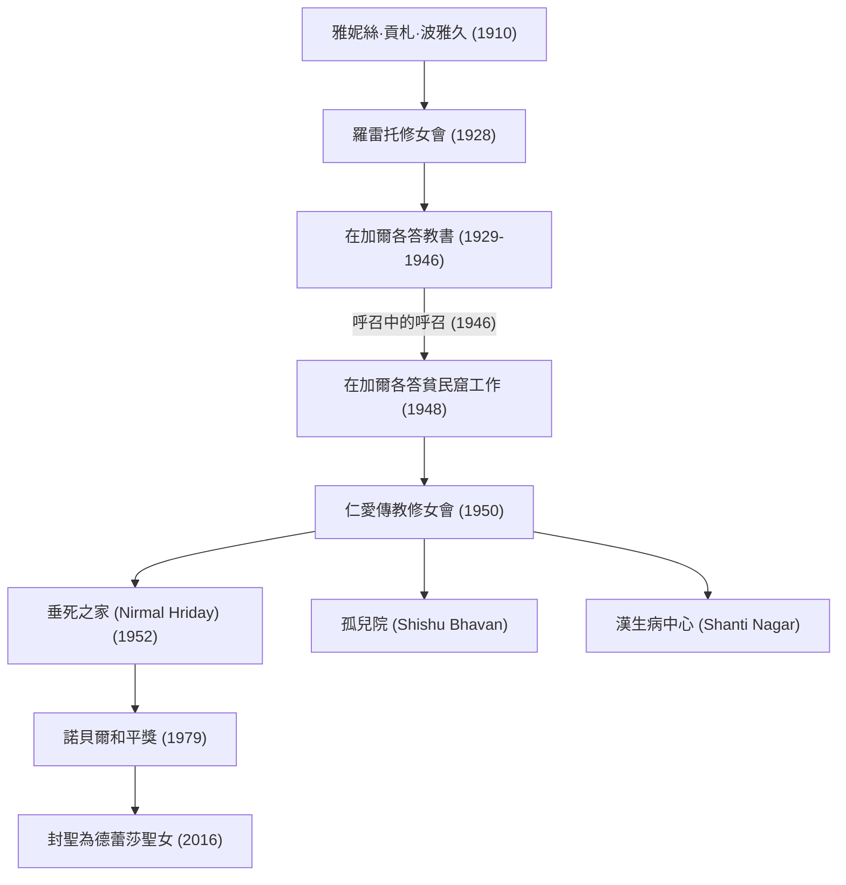

德蕾莎修女（1910年 - 1997年）是20世紀最具代表性的人道救援家，也是一位將一生奉獻給「窮人中的窮人」的天主教修女。她的生活方式與哲學跨越了宗教的界線，持續影響著世界各地的人們。本篇文章將深入探討她充滿波折的一生、根植於內心的堅定信念，以及留給後世的偉大遺產。

## 成長背景：對服侍神的覺醒

德蕾莎修女，本名雅妮絲·貢札·波雅久，1910年8月26日出生於現今北馬其頓首都史高比耶的一個阿爾巴尼亞裔富裕天主教家庭。對她價值觀的形成產生重大影響的，是她那位信仰虔誠且總是對窮人伸出援手的母親。從小就對傳教士活動抱有興趣的雅妮絲，在18歲時離開故鄉，加入了愛爾蘭的羅雷托修女會。在這裡，她被賦予了「德蕾莎」這個修女名，並為了前往印度傳教而學習英語等知識。

## 加爾各答的歲月：「呼召中的呼召」

1929年，德蕾莎抵達印度的加爾各答（現為柯枝市/加爾各答）。她在聖瑪利亞修道院經營的女子學校教授地理與歷史，後來更擔任了校長。雖然作為教育者過著充實的日子，但加爾各答貧民窟在修道院牆外蔓延的極度貧困，始終折磨著她的心。

轉機發生在1946年9月10日，在前往大吉嶺的火車上。德蕾莎在這個時候受到了來自神強烈的啟示：「放棄一切，到最貧窮的人們之中工作」。她將此形容為「呼召中的呼召（Call within a call）」。這次內在的體驗，決定了她往後的人生。

## 仁愛傳教修女會的創立與活動擴張

在獲得梵蒂岡的特別許可後離開修道院的德蕾莎，於1950年創立了「仁愛傳教修女會（Missionaries of Charity）」。她們以印度婦女穿著的白色棉質莎麗（帶有藍色鑲邊）作為修女服，開始拯救倒在貧民窟街頭的人們、孤兒以及漢生病患者等。

1952年，她接收了一座廢棄的印度教寺廟，開設了「垂死之家（Nirmal Hriday）」。這是一個為了讓被遺棄在街頭、瀕臨死亡的人們，至少能在最後的時刻保有人的尊嚴，並在愛的包圍下迎接死亡而設立的機構。她的活動完全不問宗教或身分（種姓），純粹是基於「對受苦之人的愛」。

## 德蕾莎修女的哲學：以大愛做小事

支撐德蕾莎修女行動的哲學非常簡單，卻又無比深奧：「我們在這個世界上做不了偉大的事，只能以偉大的愛做微小的事」。對她而言，眼前受苦的人就是「偽裝的基督」。服務窮人，就是直接服侍神。

此外，她不僅關注物質上的貧窮，也關注精神上的貧窮。她將富裕先進國家中人們所感受到的孤獨與疏離感稱為「最大的貧窮」，並留下了「愛的相反不是仇恨，而是冷漠」的名言。這個訊息在現代社會中依然是引起深刻共鳴的普遍真理。

## 對後世的影響與遺產

1979年，為了表彰她長年奉獻的活動，她被授予了諾貝爾和平獎。她婉拒了頒獎典禮的晚宴，並將這筆費用捐贈給加爾各答窮人的事蹟廣為人知。她所創立的「仁愛傳教修女會」目前在世界130多個國家開展活動，數以千計的修女和志工繼承了她的遺志。

另一方面，對於她的活動也存在著批評的意見，例如醫療水準低落，以及比起緩解疼痛更重視精神上的救贖等。然而，即使包含這些爭議，她為全世界「被遺棄的人們」帶來光明，並為人道救援的模式帶來根本性典範轉移的功績，仍是無可估量的。

1997年9月5日，87歲離開人世的德蕾莎修女，於2016年被教宗方濟各列為「聖人」。她的一生，成為了展現每一個凡人所擁有的「愛的力量」能如何改變世界的永恆指路明燈。
