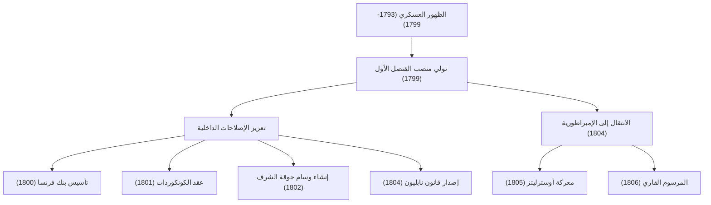
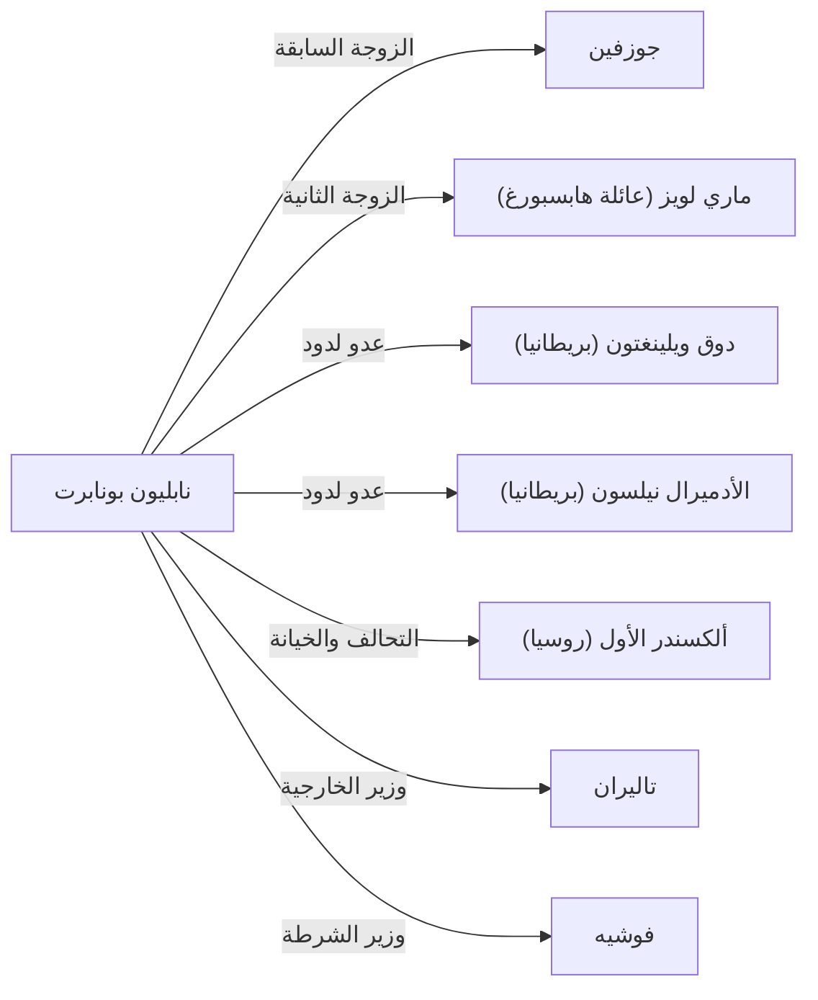

# نابليون بونابرت: ابن الثورة أم دكتاتور؟

في تاريخ العالم، قلة من الشخصيات التي تباينت حولها الآراء مثل نابليون بونابرت. يُعرف بمقولته الشهيرة "كلمة مستحيل ليست في قاموسي"، ولم يكن مجرد عبقري عسكري فحسب، بل كان أيضًا رجل دولة وضع أسس الأنظمة القانونية والبنية التحتية الاجتماعية لأوروبا الحديثة. في هذا المقال، سنتعمق في حياته الدرامية، وفلسفته، وتأثيره على الأجيال القادمة.

## الطريق من كورسيكا إلى إمبراطور فرنسا

وُلد نابليون عام 1769 لعائلة من النبلاء الصغار في جزيرة كورسيكا في البحر الأبيض المتوسط، ولم تكن بدايته مثالية على الإطلاق. خلال فترة شبابه، ذهب للدراسة في مدرسة عسكرية في البر الرئيسي لفرنسا، حيث تعرض للسخرية بسبب لهجته الكورسيكية، وقضى فترة شبابه في عزلة. ومع ذلك، عوّض هذه العزلة بالقراءة والدراسة، وتعمق في أفكار التنوير مثل أفكار روسو، والتاريخ.

جاءت نقطة التحول بالنسبة له مع الثورة الفرنسية عام 1789. ومع انهيار النظام القديم (Ancien Régime) وظهور نظام يعتمد على الجدارة، برز نابليون بفضل تكتيكاته المتميزة في المدفعية. بدءًا من إنجازاته العسكرية في حصار تولون عام 1793، حقق سلسلة من الانتصارات في حملتيه على إيطاليا ومصر، ليرتقي إلى بطل قومي.

وفي عام 1799، استولى على السلطة من خلال "انقلاب 18 برومير". وتولى السلطة الفعلية كقنصل أول، وفي عام 1804 توّج نفسه إمبراطورًا للشعب الفرنسي. هذا الحدث، الذي أعاد النظام الملكي الذي يفترض أن الثورة قد رفضته، أحدث صدمة كبيرة للمثقفين في ذلك الوقت، كما يظهر من قصة بيتهوفن الذي شطب اسمه من سيمفونيته الثالثة "إيرويكا" (البطولية).

## الإنجازات العسكرية وتدفق الإصلاحات الداخلية

كانت عظمة نابليون تكمن في براعته في الإدارة الداخلية وبناء هيكل الدولة بقدر تكمن في قوته الساحقة في ساحة المعركة. دعونا نلقي نظرة على إنجازاته الرئيسية وتدفقها في الرسم البياني التالي.

يُعتبر إقرار "قانون نابليون" (القانون المدني الفرنسي) أعظم إرث له. صاغ هذا القانون المبادئ الأساسية للمجتمع المدني الحديث: "مطلقية حقوق الملكية"، و"حرية التعاقد"، و"المساواة أمام القانون". في أواخر حياته، تذكر نابليون نفسه هذا القانون قائلاً: "مَجْدي الحقيقي ليس في الفوز بأربعين معركة. ما لن يُنسى أبدًا وسيعيش إلى الأبد هو قانوني المدني".

## فلسفة نابليون: الجدارة والإيمان بالعقل

في صميم مبادئ نابليون كانت هناك قناعة عميقة بـ "الجدارة" و"العقل". كان يعتقد أن المناصب يجب أن تُمنح بناءً على القدرة والإنجازات وليس على الأصل أو النسب. لأن هو نفسه قد صعد من جزيرة نائية إلى إمبراطور بقدراته الخاصة، كانت هذه الفكرة تحمل قوة إقناع كبيرة.

علاوة على ذلك، كانت تكتيكاته العسكرية مثل "تحقيق أقصى قدر من الحركة" و"التدمير الفردي" تستند إلى حسابات رياضية وعقلانية، بعيدًا عن العواطف والنظريات الروحية. من ناحية أخرى، كان يتمتع بموهبة في الخطابة لرفع معنويات جنوده، وكان رائدًا في "الدعاية النابليونية" التي تلاعبت بمهارة بعلم النفس البشري.

## السقوط والتأثير على الأجيال القادمة

كانت إمبراطورية نابليون في ذروتها، ولكن "المرسوم القاري" الذي أصدره لإخضاع بريطانيا انتهى به الأمر إلى خنق اقتصاد بلاده، وبدأت بداية النهاية بهزيمته الساحقة في حملة روسيا (1812). هُزم في معركة لايبزيغ ونُفي إلى جزيرة إلبا. بعد ذلك، حقق هروبًا معجزيًا وعاد إلى السلطة في "المئة يوم"، لكنه تعرض لهزيمته النهائية في معركة واترلو (1815)، ونُفي إلى جزيرة سانت هيلانة النائية في جنوب المحيط الأطلسي. وفي عام 1821، أنهى حياته المليئة بالأحداث عن عمر يناهز 51 عامًا.

ومع ذلك، فإن التأثير الذي تركه لا يُقاس. فنتيجة لتقدم جيوشه في جميع أنحاء أوروبا، ومن سخرية القدر، تم تصدير مُثُل الثورة الفرنسية (الحرية والمساواة والأخوة) إلى أجزاء مختلفة، مما أيقظ القومية في مختلف البلدان. وأدى هذا لاحقًا إلى حركات التوحيد الألمانية والإيطالية.

## رسم بياني للعلاقات: الأشخاص المحيطون بنابليون

## خاتمة

كان نابليون بونابرت مدمرًا وبانيًا في نفس الوقت. وجه كدكتاتور تسبب في فقدان ملايين الأرواح في ساحات القتال، ووجه كتجسيد للثورة أرسى أسس القانون الحديث ودمر النظام الإقطاعي القديم. هذا التناقض هو السبب الذي يجعله يستمر في إبهارنا وإثارة الجدل حتى بعد مرور أكثر من 200 عام. إن حياته تقدم لنا درساً عالمياً حول الإمكانيات اللامحدودة للإنسان، والمأساة التي تجلبها الثقة المفرطة في السلطة.
