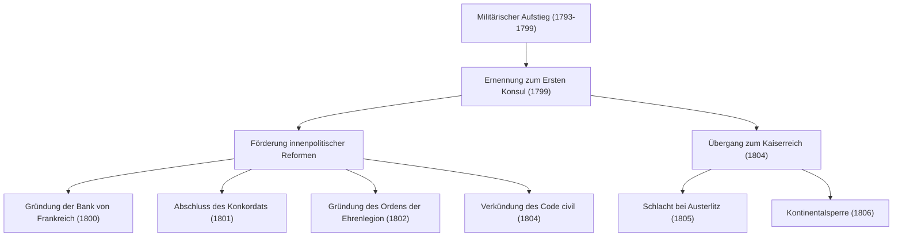
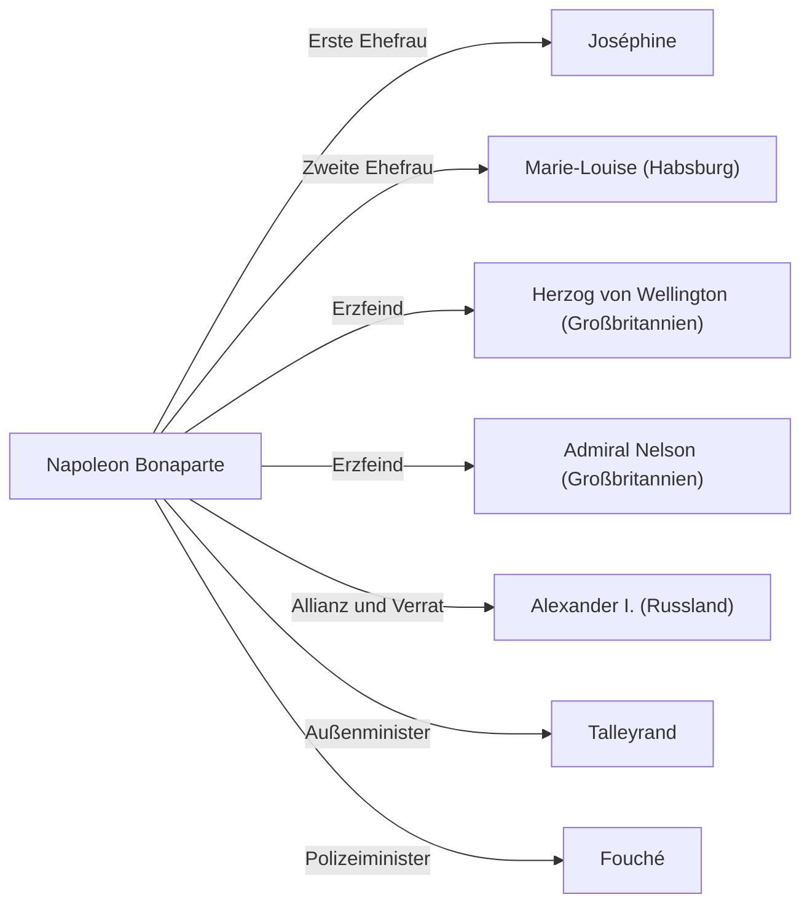

# Napoleon Bonaparte: Kind der Revolution oder Diktator?

In der Weltgeschichte gibt es nur wenige Persönlichkeiten, die so stark umstritten sind wie Napoleon Bonaparte. Bekannt für sein Zitat „Das Wort unmöglich steht nicht in meinem Wörterbuch“, war er nicht nur ein militärisches Genie, sondern auch ein Staatsmann, der den Grundstein für die heutigen Rechts- und Gesellschaftssysteme in Europa legte. In diesem Artikel tauchen wir tief in sein dramatisches Leben, seine Philosophie und seinen Einfluss auf die Nachwelt ein.

## Der Weg von Korsika zum Kaiser der Franzosen

Napoleon wurde 1769 auf der Mittelmeerinsel Korsika in eine Familie des niederen Adels geboren und hatte keineswegs einen privilegierten Start. Als Junge besuchte er eine Militärschule auf dem französischen Festland, wo er wegen seines korsischen Akzents gehänselt wurde und eine einsame Jugend verbrachte. Diese Einsamkeit kompensierte er jedoch durch Lesen und Lernen, wobei er sich intensiv mit den Ideen der Aufklärung, wie etwa denen von Rousseau, und der Geschichte beschäftigte.

Der Wendepunkt für ihn kam mit der Französischen Revolution im Jahr 1789. Mit dem Zusammenbruch des alten Regimes (Ancien Régime) und dem Aufstieg der Meritokratie zeichnete sich Napoleon durch seine herausragenden Artillerietaktiken aus. Beginnend mit seinen Heldentaten bei der Belagerung von Toulon im Jahr 1793 feierte er während seiner Italien- und Ägyptenfeldzüge eine Reihe von Siegen und stieg zum Nationalhelden auf.

1799 übernahm er durch den „Staatsstreich des 18. Brumaire“ die Macht. Er ergriff die tatsächliche Macht als Erster Konsul und krönte sich schließlich 1804 selbst zum Kaiser der Franzosen. Dieses Ereignis, das die Monarchie wiederherstellte, die die Revolution eigentlich abgelehnt hatte, war ein großer Schock für die Intellektuellen der damaligen Zeit. Dies zeigt sich in der Anekdote, dass Beethoven seinen Namen aus seiner 3. Sinfonie, der „Eroica“, strich.

## Flussdiagramm militärischer Errungenschaften und innenpolitischer Reformen

Napoleons Größe lag nicht nur in seiner überwältigenden Stärke auf dem Schlachtfeld, sondern auch in seinem innenpolitischen Geschick, das Grundgerüst eines Staates aufzubauen. Betrachten wir seine wichtigsten Errungenschaften und deren Verlauf in der folgenden Grafik.

Insbesondere die Verkündung des „Code Napoleon“ (Code civil) kann als sein größtes Vermächtnis betrachtet werden. Über dieses Gesetzbuch, das die Grundprinzipien der modernen bürgerlichen Gesellschaft wie „Absolutheit des Eigentums“, „Vertragsfreiheit“ und „Gleichheit vor dem Gesetz“ kodifizierte, erinnerte sich Napoleon in seinen späten Jahren selbst: „Mein wahrer Ruhm besteht nicht darin, vierzig Schlachten gewonnen zu haben. Was nichts auslöschen wird, was ewig leben wird, ist mein Zivilgesetzbuch.“

## Napoleons Philosophie: Meritokratie und der Glaube an die Vernunft

An der Basis von Napoleons Handlungsprinzipien lagen eine konsequente „Meritokratie“ und der Glaube an die „Vernunft“. Er glaubte, dass Status aufgrund von Fähigkeiten und Verdiensten und nicht aufgrund von Herkunft oder Abstammung vergeben werden sollte. Da er selbst aus eigener Kraft von einer Randinsel bis zum Kaiser aufgestiegen war, war diese Idee besonders überzeugend.

Zudem basierten seine militärischen Taktiken, wie die „Maximierung der Mobilität“ und die „Vernichtung im Detail“, auf mathematischen und rationalen Berechnungen und schlossen Emotionen und Spiritualität aus. Andererseits besaß er auch ein Talent für Reden, um die Moral seiner Soldaten zu stärken, und war ein Pionier der „napoleonischen Propaganda“, der die menschliche Psychologie geschickt manipulierte.

## Untergang und Einfluss auf die Nachwelt

Auf dem Höhepunkt des Napoleonischen Reiches ordnete er die „Kontinentalsperre“ an, um Großbritannien in die Knie zu zwingen, was letztlich die eigene Wirtschaft erwürgte. Mit der verheerenden Niederlage im Russlandfeldzug (1812) begann das Vorspiel zum Zusammenbruch. Nach der Niederlage in der Völkerschlacht bei Leipzig wurde er auf die Insel Elba verbannt. Danach gelang ihm eine wundersame Flucht und ein Comeback für die „Herrschaft der Hundert Tage“, doch nach seiner endgültigen Niederlage in der Schlacht bei Waterloo (1815) wurde er auf die einsame Insel St. Helena im Südatlantik verbannt. Im Jahr 1821 endete sein turbulentes, 51-jähriges Leben.

Der Einfluss, den er hinterließ, ist jedoch unermesslich. Als Ergebnis seines Truppenaufmarsches in ganz Europa wurden ironischerweise die Ideale der Französischen Revolution (Freiheit, Gleichheit, Brüderlichkeit) in verschiedene Regionen exportiert und weckten den Nationalismus in den jeweiligen Ländern. Dies führte später zu den deutschen und italienischen Einigungsbewegungen.

## Beziehungsdiagramm: Die Menschen um Napoleon

## Fazit

Napoleon Bonaparte war zugleich Zerstörer und Erbauer. Das Gesicht eines Diktators, der Millionen von Menschenleben auf dem Schlachtfeld forderte, und das Gesicht der Verkörperung der Revolution, der den Grundstein für das moderne Recht legte und das alte Feudalsystem zerstörte. Es ist genau diese widersprüchliche Figur, die uns auch über 200 Jahre später noch fasziniert und zum Gegenstand von Debatten macht. Sein Leben zeigt uns eine universelle Lektion über das unendliche Potenzial des Menschen und die Tragödie, die durch eine Überbewertung der Macht entsteht.
