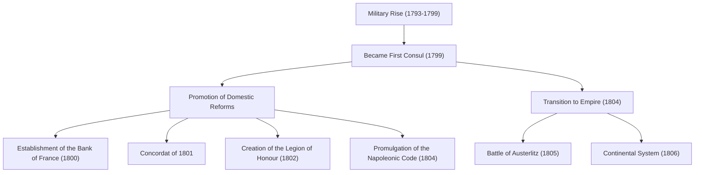
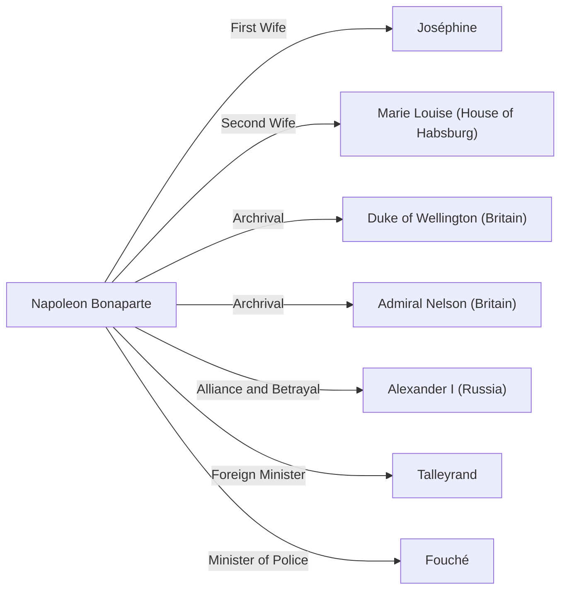

# Napoleon Bonaparte: Child of the Revolution or Dictator?

In world history, few figures are as intensely praised and condemned as Napoleon Bonaparte. Known for the famous quote, "The word impossible is not in my dictionary," he was not merely a military genius, but also a statesman who laid the foundations of modern Europe's legal systems and social infrastructure. In this article, we delve deep into his dramatic life, philosophy, and the influence he had on future generations.

## The Path from Corsica to Emperor of the French

Born in 1769 to a family of minor nobility on the Mediterranean island of Corsica, Napoleon did not exactly have a privileged start in life. While studying at a military academy in mainland France during his boyhood, he was teased for his Corsican accent and spent a lonely youth. However, he compensated for his loneliness through reading and study, becoming deeply devoted to history and Enlightenment thought, such as the works of Rousseau.

The turning point for him came with the French Revolution in 1789. As the old regime (Ancien Régime) collapsed and meritocracy rose to prominence, Napoleon distinguished himself with his outstanding artillery tactics. Starting with his military exploits in the Siege of Toulon in 1793, he accumulated consecutive victories in the Italian and Egyptian campaigns, rising to become a national hero.

Then, in 1799, he seized power through the "Coup of 18 Brumaire." Taking actual control as the First Consul, he finally crowned himself Emperor of the French in 1804. This event, which resurrected the monarchy the revolution had supposedly rejected, delivered a profound shock to intellectuals of the time, as illustrated by the anecdote of Beethoven scratching Napoleon's name from his Symphony No. 3, "Eroica."

## Military Achievements and the Flow of Domestic Reforms

Napoleon's greatness lay not only in his overwhelming strength on the battlefield but also in his domestic political skills, which shaped the backbone of the state. Let's review his major achievements and the course of events in the diagram below.

In particular, the enactment of the "Napoleonic Code (French Civil Code)" can be called his greatest legacy. This code explicitly articulated the basic principles of modern civil society, such as "absolute ownership," "freedom of contract," and "equality before the law." Regarding this code, Napoleon himself reflected in his later years, "My true glory is not in having won forty battles... That which nothing can destroy, that which will live forever, is my Civil Code."

## Napoleon's Philosophy: Belief in Meritocracy and Reason

At the root of Napoleon's behavioral principles was a thorough belief in "meritocracy" and "reason." He believed that status should be granted based on ability and merit, rather than birth or lineage. This ideology carried great persuasive power precisely because he himself had risen from a remote island to become emperor solely on his own merits.

Furthermore, his military tactics, such as "maximizing mobility" and "defeat in detail," eliminated emotion and spiritualism, being based instead on mathematical and rational calculations. At the same time, he excelled at the art of speeches to boost his soldiers' morale, making him a pioneer of "Napoleonic propaganda" who skillfully manipulated human psychology.

## Downfall and Influence on Future Generations

Although the Napoleonic Empire was at its peak, the "Continental System," issued to bring Britain to its knees, ended up strangling his own country's economy. The prelude to collapse began with his devastating defeat in the invasion of Russia (1812). Defeated at the Battle of Leipzig, he was exiled to the island of Elba. Afterward, he made a miraculous escape and returned to power during the "Hundred Days," but suffered his final defeat at the Battle of Waterloo (1815) and was exiled to the remote island of Saint Helena in the South Atlantic. Then, in 1821, he ended his turbulent 51-year life.

However, the impact he left behind is immeasurable. As a result of marching his armies across Europe, the ideals of the French Revolution (liberty, equality, fraternity) were ironically exported to various regions, awakening nationalism in different countries. This would eventually lead to the German and Italian unification movements.

## Correlation Diagram: People Surrounding Napoleon

## Conclusion

Napoleon Bonaparte was a destroyer as well as a builder. He had the face of a dictator who scattered millions of lives on the battlefield, and the face of an embodiment of the revolution who laid the foundation for modern law and destroyed the old feudal systems. This very contradictory figure is the reason why, even more than 200 years later, he continues to fascinate us and remain a subject of debate. His life offers us a universal lesson: the infinite potential of human beings, and the tragedy brought about by overconfidence in power.
