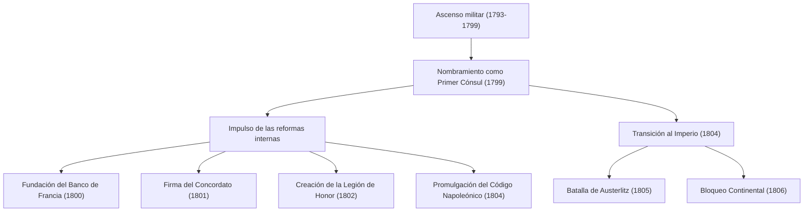
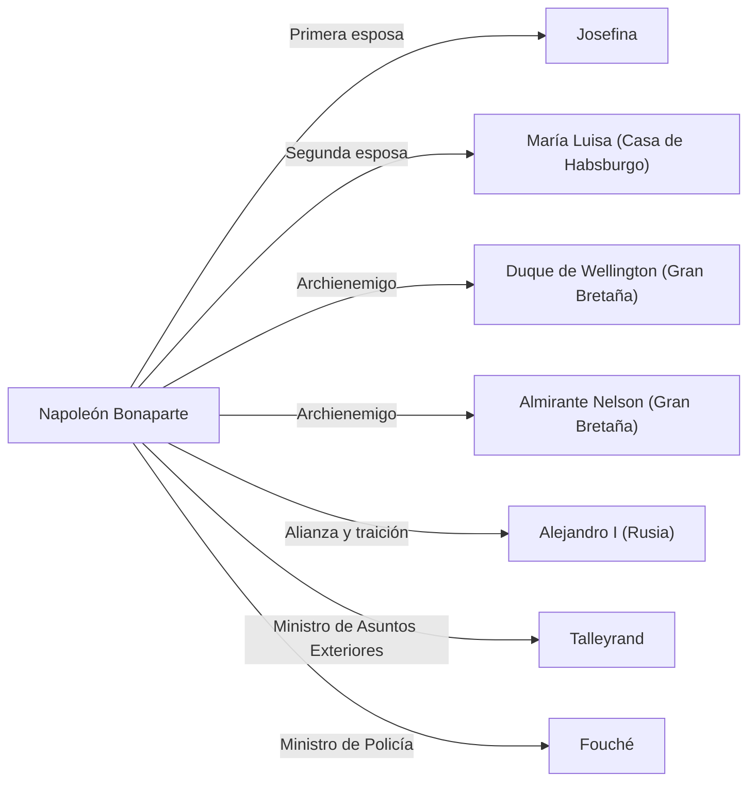

# Napoleón Bonaparte: ¿Hijo de la Revolución o dictador?

En la historia mundial, hay pocas figuras con una reputación tan polarizada como Napoleón Bonaparte. Conocido por su famosa frase "la palabra imposible no está en mi diccionario", no solo fue un genio militar, sino también un estadista que sentó las bases del sistema legal y la infraestructura social de la Europa moderna. En este artículo, profundizaremos en su dramática vida y filosofía, así como en su impacto en la posteridad.

## El camino desde Córcega hasta Emperador de los franceses

Nacido en 1769 en el seno de una familia de la baja nobleza en la isla mediterránea de Córcega, Napoleón no tuvo un comienzo privilegiado. Durante su juventud, cuando estudió en una academia militar en la Francia continental, se burlaban de él por su acento corso y pasó una adolescencia solitaria. Sin embargo, compensó esa soledad con la lectura y el estudio, sumergiéndose profundamente en la historia y en las ideas de la Ilustración de pensadores como Rousseau.

El punto de inflexión en su vida fue la Revolución Francesa de 1789. Mientras el Antiguo Régimen colapsaba y la meritocracia ganaba terreno, Napoleón se destacó por sus excepcionales tácticas de artillería. Comenzando con sus hazañas militares en el asedio de Tolón en 1793, logró una serie de victorias consecutivas en sus campañas en Italia y Egipto, ascendiendo hasta convertirse en un héroe nacional.

Luego, en 1799, tomó el poder mediante el "Golpe de Estado del 18 de brumario". Asumió el control efectivo como Primer Cónsul y finalmente, en 1804, se coronó a sí mismo como Emperador de los franceses. Este evento, que restauró la monarquía que la revolución había rechazado, causó un gran impacto entre los intelectuales de la época, como lo demuestra la anécdota de Beethoven borrando su nombre de la Sinfonía n.º 3 "Eroica".

## Flujo de logros militares y reformas internas

La grandeza de Napoleón residía no solo en su abrumadora fuerza en el campo de batalla, sino también en su habilidad política interna para construir la estructura del Estado. Veamos sus principales logros y trayectoria en el siguiente diagrama.

En particular, la promulgación del "Código Napoleónico" (Código Civil de los franceses) puede considerarse su mayor legado. Sobre este código, que estipuló los principios básicos de la sociedad civil moderna como "la propiedad absoluta", "la libertad de contratación" y "la igualdad ante la ley", el propio Napoleón reflexionó en sus últimos años: "Mi verdadera gloria no está en haber ganado cuarenta batallas. Lo que nada borrará, lo que vivirá eternamente, es mi Código Civil".

## La filosofía de Napoleón: Meritocracia y culto a la razón

En la base de los principios de acción de Napoleón había una profunda creencia en la "meritocracia" y la "razón". Creía que el estatus debía otorgarse en función de la capacidad y los méritos, no por el origen o el linaje. Precisamente porque él mismo ascendió desde una isla periférica hasta convertirse en emperador gracias a su propio esfuerzo, esta idea tenía un gran poder de convicción.

Además, sus tácticas militares, como "maximizar la movilidad" y "derrotar al enemigo por partes", estaban basadas en cálculos matemáticos y racionales, descartando las emociones y las teorías espirituales. Por otro lado, también poseía un gran talento para la oratoria, que utilizaba para elevar la moral de sus soldados, siendo un pionero de la "propaganda napoleónica" que manipulaba hábilmente la psicología humana.

## Caída e impacto en la posteridad

Aunque el Imperio Napoleónico estaba en su apogeo, el "Bloqueo Continental" promulgado para someter a Gran Bretaña terminó estrangulando su propia economía, y la devastadora derrota en la invasión de Rusia (1812) marcó el preludio de su colapso. Fue derrotado en la Batalla de Leipzig y exiliado a la isla de Elba. Posteriormente, logró un escape milagroso y regresó al poder durante los "Cien Días", pero sufrió su derrota final en la Batalla de Waterloo (1815) y fue desterrado a la remota isla de Santa Elena en el Atlántico Sur. Finalmente, en 1821, puso fin a su turbulenta vida de 51 años.

Sin embargo, el impacto que dejó es incalculable. Irónicamente, como resultado del avance de sus ejércitos por toda Europa, los ideales de la Revolución Francesa (libertad, igualdad y fraternidad) se exportaron a diversas regiones, despertando el nacionalismo en varios países. Esto condujo posteriormente a los movimientos de unificación de Alemania e Italia.

## Diagrama de relaciones: Las personas que rodearon a Napoleón

## Conclusión

Napoleón Bonaparte fue tanto un destructor como un constructor. Su rostro como dictador que esparció millones de vidas en el campo de batalla contrasta con su papel como encarnación de la revolución, que sentó las bases del derecho moderno y destruyó el antiguo sistema feudal. Es precisamente esta figura llena de contradicciones la razón por la que, incluso más de 200 años después, sigue fascinándonos y siendo objeto de debate. Su vida nos ofrece una lección universal sobre las infinitas posibilidades del ser humano y la tragedia que conlleva el exceso de confianza en el poder.
