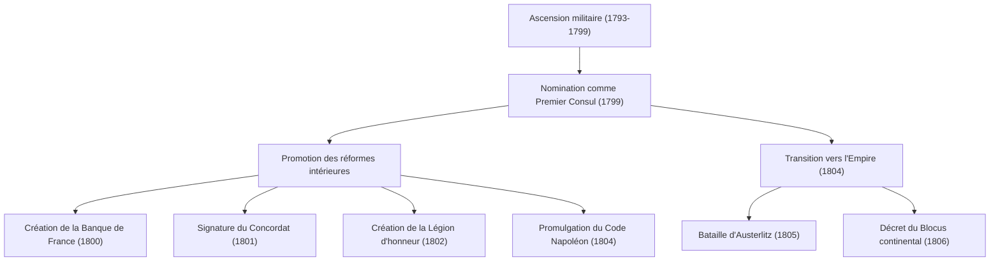
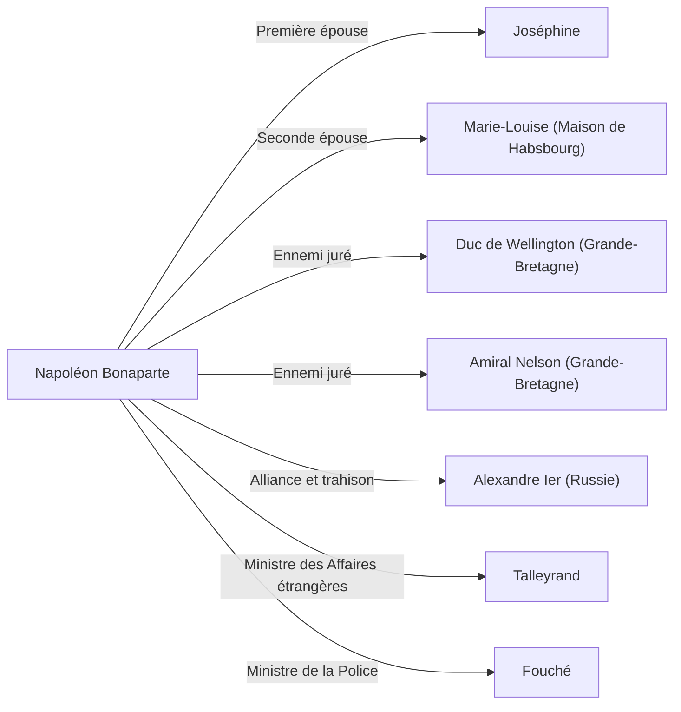

# Napoléon Bonaparte : Enfant de la Révolution ou dictateur ?

Dans l'histoire du monde, peu de figures ont suscité autant de louanges et de critiques que Napoléon Bonaparte. Connu pour sa célèbre citation "Impossible n'est pas français" (bien que l'expression d'origine dise "Le mot impossible n'est pas dans mon dictionnaire"), il n'était pas seulement un génie militaire, mais aussi l'homme d'État qui a posé les bases des systèmes juridiques et de l'infrastructure sociale de l'Europe moderne. Cet article explore sa vie dramatique, sa philosophie et son impact sur les générations futures.

## De la Corse à l'Empereur des Français

Né en 1769 dans une famille de la petite noblesse corse, une île de la Méditerranée, Napoléon n'a pas eu un départ particulièrement privilégié. Envoyé dans une école militaire en France continentale pendant sa jeunesse, il y a passé une adolescence solitaire, moqué pour son accent corse. Cependant, il a comblé cette solitude par la lecture et les études, s'imprégnant profondément des idées des Lumières, comme celles de Rousseau, et de l'histoire.

Le tournant de sa vie fut la Révolution française de 1789. Avec l'effondrement de l'Ancien Régime et la montée de la méritocratie, Napoléon s'est distingué par ses tactiques exceptionnelles dans l'artillerie. Ses exploits lors du siège de Toulon en 1793 ont été le point de départ de victoires successives lors des campagnes d'Italie et d'Égypte, le propulsant au rang de héros national.

Puis, en 1799, il s'empare du pouvoir par le coup d'État du 18 Brumaire. Prenant le contrôle en tant que Premier Consul, il finit par se faire couronner Empereur des Français en 1804. Cet événement, qui restaurait une monarchie que la Révolution était censée avoir abolie, a profondément choqué les intellectuels de l'époque, comme en témoigne l'anecdote de Beethoven effaçant le nom de Napoléon de sa Symphonie n°3, l'"Héroïque".

## Flux des succès militaires et des réformes intérieures

La grandeur de Napoléon ne résidait pas seulement dans sa puissance écrasante sur le champ de bataille, mais aussi dans sa capacité à forger l'ossature d'une nation. Examinons ses principales réalisations et leur déroulement dans le diagramme ci-dessous.

La promulgation du "Code Napoléon" (Code civil des Français) peut être considérée comme son plus grand héritage. Codifiant les principes fondamentaux de la société civile moderne tels que le "caractère absolu du droit de propriété", la "liberté contractuelle" et "l'égalité devant la loi", Napoléon lui-même s'est souvenu vers la fin de sa vie : "Ma vraie gloire n'est pas d'avoir gagné quarante batailles. Ce que rien n'effacera, ce qui vivra éternellement, c'est mon Code civil."

## La philosophie de Napoléon : Méritocratie et foi en la Raison

Au cœur des principes d'action de Napoléon se trouvaient une foi inébranlable en la "méritocratie" et la "raison". Il estimait que le statut devait être accordé en fonction des capacités et des mérites, et non de la naissance ou de la lignée. C'est précisément parce qu'il s'était élevé d'une île lointaine jusqu'au trône impérial par ses propres mérites que cet idéal était si convaincant.

De plus, ses tactiques militaires de "maximisation de la mobilité" et de "défaite au coup par coup" rejetaient les émotions et le moral au profit de calculs mathématiques et rationnels. D'un autre côté, il était aussi un maître du discours pour remonter le moral de ses soldats et fut un pionnier de la "propagande napoléonienne", manipulant habilement la psychologie humaine.

## Chute et héritage

L'Empire napoléonien était à son apogée, mais le "Blocus continental", mis en place pour soumettre la Grande-Bretagne, a finalement étouffé sa propre économie, et la défaite catastrophique de la campagne de Russie (1812) a marqué le début de sa chute. Vaincu à la bataille de Leipzig, il est exilé sur l'île d'Elbe. Il réussit ensuite une évasion miraculeuse et revient pour les "Cent-Jours", mais subit sa défaite finale à la bataille de Waterloo (1815) et est exilé sur l'île isolée de Sainte-Hélène dans l'Atlantique Sud. En 1821, il met fin à une vie tumultueuse de 51 ans.

Cependant, l'impact qu'il a laissé est incommensurable. En faisant avancer ses armées à travers l'Europe, il a ironiquement exporté les idéaux de la Révolution française (Liberté, Égalité, Fraternité), éveillant les nationalismes dans différents pays. Cela conduira plus tard aux mouvements d'unification de l'Allemagne et de l'Italie.

## Diagramme des relations : Les personnes autour de Napoléon

## Conclusion

Napoléon Bonaparte fut à la fois un destructeur et un bâtisseur. Le visage d'un dictateur qui a envoyé des millions de vies se briser sur les champs de bataille, et le visage de l'incarnation de la révolution qui a jeté les bases du droit moderne et détruit l'ancien système féodal. C'est cette figure pleine de contradictions qui explique pourquoi, plus de 200 ans plus tard, il continue de nous fasciner et d'être un sujet de débat. Sa vie nous offre une leçon universelle sur le potentiel infini de l'humanité et la tragédie qu'engendre l'excès de confiance dans le pouvoir.
