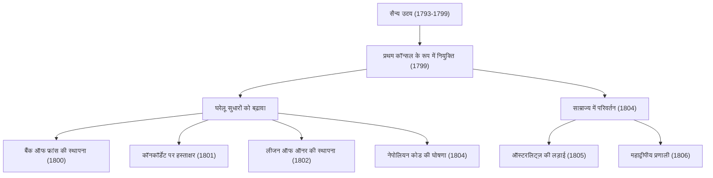
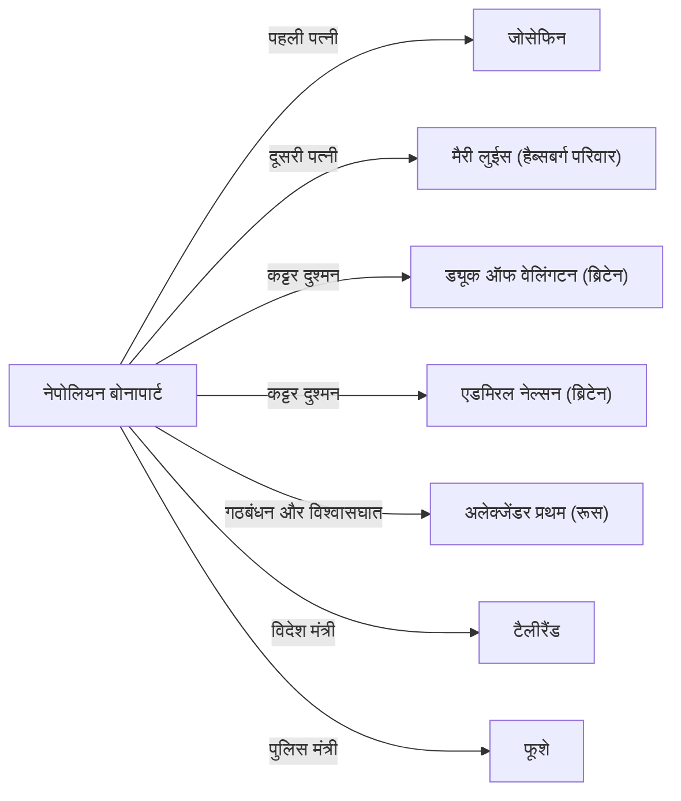

# नेपोलियन बोनापार्ट: क्रांति का पुत्र या तानाशाह?

विश्व इतिहास में, नेपोलियन बोनापार्ट से अधिक विवादित और चर्चित व्यक्ति शायद ही कोई और हो। "असंभव शब्द मेरे शब्दकोश में नहीं है" के अपने प्रसिद्ध उद्धरण के लिए जाने जाने वाले, वह न केवल एक सैन्य प्रतिभा थे, बल्कि एक ऐसे राजनेता भी थे जिन्होंने आधुनिक यूरोपीय कानून और सामाजिक बुनियादी ढांचे की नींव रखी। इस लेख में, हम उनके नाटकीय जीवन, दर्शन और आने वाली पीढ़ियों पर उनके प्रभाव का गहराई से अध्ययन करेंगे।

## कोर्सिका से फ्रांसीसी सम्राट तक का सफर

1769 में भूमध्य सागर के कोर्सिका द्वीप पर एक निम्न-श्रेणी के कुलीन परिवार में जन्मे नेपोलियन की शुरुआत बिल्कुल भी शानदार नहीं थी। अपने बचपन में फ्रांस की मुख्य भूमि पर एक सैन्य अकादमी में पढ़ाई करते हुए, उनके कोर्सिकन लहजे के लिए उनका मज़ाक उड़ाया जाता था, और उन्होंने एक अकेला युवा जीवन बिताया। हालाँकि, उन्होंने उस अकेलेपन की भरपाई पढ़ने और अध्ययन करने से की, और रूसो जैसे ज्ञानोदय के विचारों और इतिहास के प्रति गहराई से समर्पित हो गए।

उनके जीवन का निर्णायक मोड़ 1789 की फ्रांसीसी क्रांति थी। जैसे ही पुरानी व्यवस्था (एंसिएन रिजीम) का पतन हुआ और योग्यतावाद (मेरिटोक्रेसी) का उदय हुआ, नेपोलियन ने अपनी उत्कृष्ट तोपखाने की रणनीति से अपनी पहचान बनाई। 1793 में टूलॉन की घेराबंदी में अपनी सैन्य सफलताओं के साथ शुरुआत करते हुए, उन्होंने इटली और मिस्र के अभियानों में लगातार जीत हासिल की और एक राष्ट्रीय नायक बन गए।

फिर, 1799 में, उन्होंने "18 ब्रूमेयर के तख्तापलट" के माध्यम से सत्ता पर कब्ज़ा कर लिया। प्रथम कॉन्सल के रूप में वास्तविक सत्ता हाथ में लेते हुए, 1804 में, उन्होंने अंततः खुद को फ्रांसीसी लोगों के सम्राट के रूप में ताज पहनाया। राजशाही की यह बहाली, जिसे क्रांति ने अस्वीकार कर दिया था, ने उस समय के बुद्धिजीवियों को गहरा झटका दिया, जैसा कि बीथोवेन द्वारा अपनी सिम्फनी नंबर 3 'इरोइका' से नेपोलियन का नाम हटाने की घटना से पता चलता है।

## सैन्य उपलब्धियां और घरेलू सुधारों का प्रवाह

नेपोलियन की महानता युद्ध के मैदान में उनकी जबरदस्त ताकत के साथ-साथ एक राष्ट्र के ढांचे के निर्माण में उनकी प्रशासनिक क्षमता में भी निहित थी। आइए नीचे दिए गए चित्र में उनकी मुख्य उपलब्धियों और घटनाओं के प्रवाह को देखें।

विशेष रूप से, "नेपोलियन कोड (फ्रांसीसी नागरिक संहिता)" को लागू करना उनकी सबसे बड़ी विरासत माना जा सकता है। इस संहिता के बारे में, जिसने "संपत्ति के अधिकारों की पूर्णता", "अनुबंध की स्वतंत्रता", और "कानून के समक्ष समानता" जैसे आधुनिक नागरिक समाज के मूल सिद्धांतों को संहिताबद्ध किया, नेपोलियन ने अपने अंतिम वर्षों में याद करते हुए कहा: "मेरी असली महिमा मेरी चालीस लड़ाइयों की जीत नहीं है। जो कभी नहीं भुलाया जाएगा और जो हमेशा जीवित रहेगा, वह मेरी नागरिक संहिता है।"

## नेपोलियन का दर्शन: योग्यतावाद और तर्क में विश्वास

नेपोलियन के कार्यों के मूल में "योग्यतावाद" (मेरिटोक्रेसी) और "तर्क" में उनका गहरा विश्वास था। उनका मानना था कि स्थिति या पद जन्म या वंश से नहीं, बल्कि क्षमता और उपलब्धियों के आधार पर दी जानी चाहिए। चूंकि वह खुद एक सुदूर द्वीप से अपनी योग्यता के बल पर सम्राट के पद तक पहुंचे थे, इसलिए यह आदर्श बहुत ही प्रेरक था।

इसके अलावा, उनकी सैन्य रणनीति जैसे "गतिशीलता को अधिकतम करना" और "अलग से हारना (डिवाइड एंड कॉन्कर)" भावनाओं या आध्यात्मिकता से मुक्त, गणितीय और तर्कसंगत गणनाओं पर आधारित थीं। दूसरी ओर, वह सैनिकों का मनोबल बढ़ाने वाले भाषण देने में भी माहिर थे, और मानव मनोविज्ञान को चतुराई से हेरफेर करने वाले "नेपोलियन प्रोपेगैंडा" के अग्रदूत भी थे।

## पतन और बाद की पीढ़ियों पर प्रभाव

यद्यपि नेपोलियन साम्राज्य अपने चरम पर था, लेकिन ब्रिटेन को अपने घुटनों पर लाने के लिए जारी की गई "महाद्वीपीय प्रणाली" ने अंततः उनके अपने देश की अर्थव्यवस्था का दम घोंट दिया, और रूसी अभियान (1812) में विनाशकारी हार के साथ पतन की शुरुआत हुई। लीपज़िग की लड़ाई में हारने के बाद, उन्हें एल्बा द्वीप पर निर्वासित कर दिया गया। उसके बाद, उन्होंने एक चमत्कारी वापसी की और "सौ दिनों" के लिए सत्ता में लौटे, लेकिन वाटरलू की लड़ाई (1815) में अंतिम हार का सामना करना पड़ा और उन्हें दक्षिण अटलांटिक के एक अलग-थलग द्वीप सेंट हेलेना में निर्वासित कर दिया गया। और 1821 में, उनका 51 वर्ष का उथल-पुथल भरा जीवन समाप्त हो गया।

हालाँकि, उनके द्वारा छोड़ी गई विरासत अपार है। पूरे यूरोप में अपनी सेनाओं को आगे बढ़ाने के परिणामस्वरूप, विडंबना यह है कि फ्रांसीसी क्रांति के आदर्श (स्वतंत्रता, समानता, बंधुत्व) विभिन्न क्षेत्रों में फैल गए, जिससे विभिन्न देशों में राष्ट्रवाद जागृत हुआ। इसने बाद में जर्मन और इतालवी एकीकरण आंदोलनों को जन्म दिया।

## संबंध आरेख: नेपोलियन के आसपास के लोग

## निष्कर्ष

नेपोलियन बोनापार्ट एक विनाशक होने के साथ-साथ एक निर्माता भी थे। एक तानाशाह का चेहरा जिसने युद्ध के मैदान में लाखों लोगों की जान ले ली, और एक क्रांति के अवतार का चेहरा जिसने आधुनिक कानून की नींव रखी और पुरानी सामंती व्यवस्था को नष्ट कर दिया। यह विरोधाभासी छवि ही वह कारण है कि 200 से अधिक वर्षों के बाद भी वह हमें मोहित करते हैं और बहस का विषय बने हुए हैं। उनका जीवन हमें मानवीय क्षमता की असीम संभावनाओं और सत्ता में अति-आत्मविश्वास द्वारा लाई गई त्रासदी के सार्वभौमिक सबक सिखाता है।
