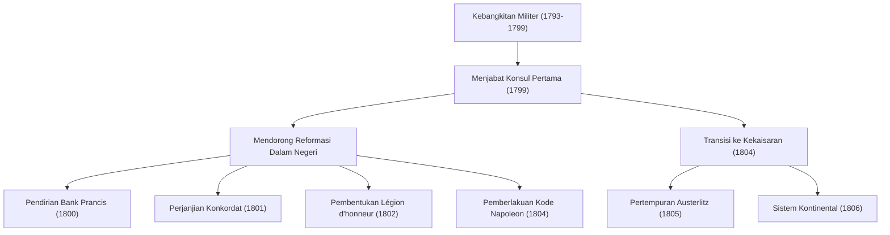
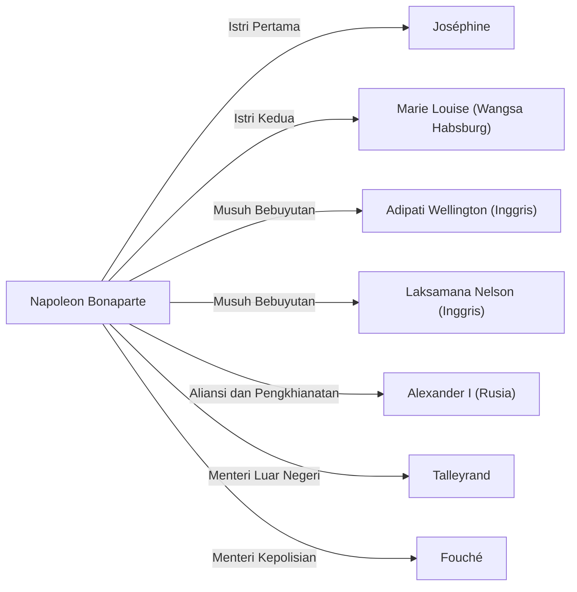

# Napoleon Bonaparte: Anak Revolusi atau Diktator?

Dalam sejarah dunia, jarang ada tokoh yang menuai pujian sekaligus kecaman sehebat Napoleon Bonaparte. Dikenal dengan kutipan terkenalnya, "Kata tidak mungkin tidak ada dalam kamus saya," ia bukan sekadar seorang jenius militer, melainkan juga seorang politikus yang meletakkan dasar bagi sistem hukum dan infrastruktur sosial Eropa modern. Artikel ini akan membahas secara mendalam kehidupan dramatisnya, filosofinya, serta pengaruh yang ia tinggalkan bagi generasi mendatang.

## Jalan dari Pulau Korsika menuju Kaisar Prancis

Lahir pada tahun 1769 dari keluarga bangsawan rendahan di Pulau Korsika, Laut Tengah, Napoleon tidak memulai kehidupannya dengan keberuntungan. Saat menempuh pendidikan di akademi militer di daratan Prancis pada masa remajanya, ia sering diejek karena aksen Korsikanya, sehingga ia menghabiskan masa mudanya dalam kesepian. Namun, ia menebus kesepian itu dengan membaca dan belajar, dan menjadi sangat tertarik pada sejarah serta pemikiran Pencerahan seperti karya-karya Rousseau.

Titik baliknya adalah Revolusi Prancis pada tahun 1789. Di tengah runtuhnya sistem lama (Ancien Régime) dan bangkitnya meritokrasi, Napoleon menonjol dengan taktik artilerinya yang luar biasa. Berawal dari kepahlawanannya dalam Pengepungan Toulon pada tahun 1793, ia meraih serangkaian kemenangan beruntun dalam kampanye militer di Italia dan Mesir, hingga naik daun menjadi pahlawan nasional.

Lalu pada tahun 1799, ia merebut kekuasaan melalui "Kudeta 18 Brumaire". Ia memegang kekuasaan nyata sebagai Konsul Pertama, dan pada tahun 1804 akhirnya menobatkan dirinya sebagai Kaisar Rakyat Prancis. Peristiwa yang membangkitkan kembali sistem monarki yang seharusnya ditolak oleh revolusi ini memberikan kejutan besar bagi para intelektual saat itu, seperti yang ditunjukkan oleh kisah Beethoven yang mencoret nama Napoleon dari Simfoni No. 3, "Eroica".

## Alur Prestasi Militer dan Reformasi Dalam Negeri

Kehebatan Napoleon tidak hanya terletak pada kekuatannya yang luar biasa di medan perang, tetapi juga pada kemampuannya dalam urusan dalam negeri untuk membangun kerangka negara. Mari kita lihat prestasi utama dan alurnya pada diagram di bawah ini.

Khususnya, penetapan "Kode Napoleon (Kitab Undang-Undang Hukum Perdata Prancis)" dapat dikatakan sebagai warisan terbesarnya. Mengenai undang-undang yang merumuskan prinsip-prinsip dasar masyarakat sipil modern ini—yaitu "hak milik mutlak," "kebebasan berkontrak," dan "kesetaraan di hadapan hukum"—Napoleon sendiri di masa tuanya mengenang, "Kejayaan sejatiku bukanlah dari 40 kemenangan pertempuran. Apa yang tidak akan pernah terlupakan dan akan hidup selamanya adalah Kitab Undang-Undang Hukum Perdataku."

## Filosofi Napoleon: Meritokrasi dan Kepercayaan pada Akal

Di balik prinsip tindakan Napoleon terdapat kepercayaan yang kuat pada "meritokrasi" dan "akal" (rasio). Ia percaya bahwa status harus diberikan berdasarkan kemampuan dan prestasi, bukan berdasarkan latar belakang atau garis keturunan. Konsep ini menjadi meyakinkan justru karena ia sendiri berhasil naik takhta dari pulau terpencil semata-mata karena kemampuannya.

Selain itu, taktik militernya seperti "memaksimalkan mobilitas" dan "menghancurkan musuh satu per satu" didasarkan pada perhitungan matematis dan rasional, mengesampingkan emosi dan teori spiritual. Di sisi lain, ia juga mahir dalam berpidato untuk meningkatkan moral para prajurit, dan merupakan pelopor "propaganda Napoleonik" yang dengan terampil memanipulasi psikologi manusia.

## Kejatuhan dan Pengaruhnya bagi Generasi Mendatang

Kekaisaran Napoleon sempat berada di puncaknya, namun "Sistem Kontinental" yang diberlakukan untuk menundukkan Inggris pada akhirnya mencekik ekonomi negaranya sendiri, dan kekalahan telak dalam Kampanye Rusia (1812) menjadi awal keruntuhannya. Ia dikalahkan dalam Pertempuran Leipzig dan diasingkan ke Pulau Elba. Setelah pelarian yang ajaib, ia kembali berkuasa selama "Seratus Hari", tetapi menderita kekalahan akhir dalam Pertempuran Waterloo (1815), dan diasingkan ke pulau terpencil Saint Helena di Atlantik Selatan. Kemudian pada tahun 1821, ia menutup usianya yang ke-51 tahun yang penuh dengan gejolak.

Namun, pengaruh yang ia tinggalkan tak ternilai harganya. Sebagai hasil dari pengerahan pasukannya ke seluruh Eropa, ironisnya cita-cita Revolusi Prancis (Kebebasan, Kesetaraan, dan Persaudaraan) diekspor ke berbagai wilayah, membangkitkan nasionalisme di berbagai negara. Hal ini nantinya akan berujung pada gerakan Penyatuan Jerman dan Penyatuan Italia.

## Diagram Hubungan: Orang-orang di Sekitar Napoleon

## Kesimpulan

Napoleon Bonaparte adalah seorang perusak sekaligus pembangun. Wajahnya sebagai seorang diktator yang mengorbankan jutaan nyawa di medan perang, dan wajahnya sebagai perwujudan revolusi yang meletakkan dasar hukum modern serta menghancurkan sistem feodal lama. Sosoknya yang penuh kontradiksi itulah yang menjadi alasan mengapa ia terus memikat kita dan menjadi perdebatan bahkan setelah lebih dari 200 tahun. Kehidupannya menunjukkan kepada kita pelajaran universal tentang kemungkinan tak terbatas yang dimiliki manusia, serta tragedi yang diakibatkan oleh keyakinan yang berlebihan pada kekuasaan.
