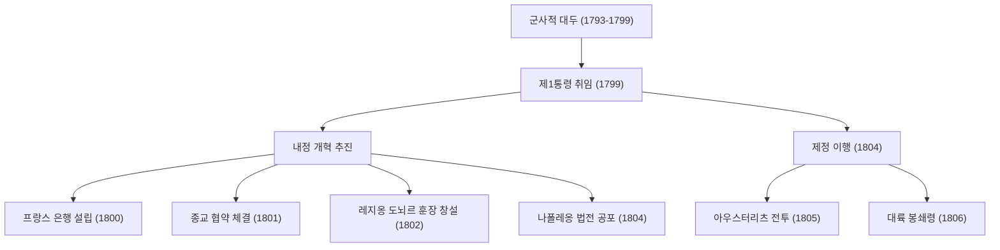
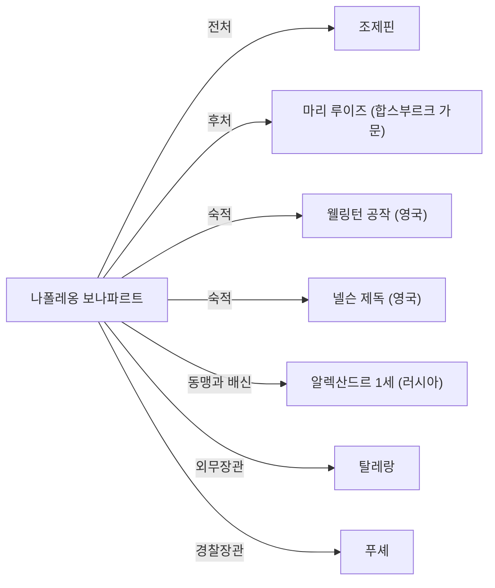

# 나폴레옹 보나파르트: 혁명의 아들인가, 아니면 독재자인가

세계사에서 나폴레옹 보나파르트만큼 훼예포폄(명성과 악평)이 엇갈리는 인물은 드물 것입니다. "내 사전에 불가능이란 단어는 없다"는 명언으로 알려진 그는 단순한 군사적 천재에 그치지 않고, 현대 유럽의 법제와 사회 기반의 초석을 다진 정치가이기도 했습니다. 이 글에서는 그의 극적인 생애와 철학, 그리고 후세에 미친 영향을 깊이 파헤쳐 봅니다.

## 코르시카 섬에서 프랑스 황제로의 길

1769년 지중해의 코르시카 섬에 있는 하급 귀족 집안에서 태어난 나폴레옹은 결코 유복한 출발을 한 것은 아니었습니다. 소년 시절 프랑스 본토의 사관학교로 유학 간 그는 코르시카 사투리로 놀림받으며 고독한 청춘 시절을 보냈습니다. 하지만 그는 그 고독을 독서와 학업으로 채웠고, 루소 등의 계몽사상과 역사학에 깊이 심취해 갔습니다.

그에게 전환점을 가져다준 것은 1789년의 프랑스 혁명입니다. 구체제(앙시앵 레짐)가 붕괴하고 실력주의가 대두하는 가운데, 나폴레옹은 탁월한 포병 전술로 두각을 나타냅니다. 1793년 툴롱 포위전에서의 무훈을 시작으로 이탈리아 원정과 이집트 원정에서 연전연승을 거듭하며 국민적 영웅으로 등극했습니다.

그리고 1799년, "브뤼메르 18일의 쿠데타"를 통해 정권을 장악합니다. 제1통령으로서 실권을 쥐고, 1804년에는 마침내 스스로 프랑스 인민의 황제로 즉위합니다. 혁명이 부정했을 터인 군주제를 부활시킨 이 사건은, 베토벤이 교향곡 제3번 '영웅'에서 그의 이름을 지워버린 일화가 보여주듯 당시 지식인들에게 큰 충격을 주었습니다.

## 군사적 업적과 내정 개혁의 흐름

나폴레옹의 진면목은 전장에서의 압도적인 강함과 동시에 국가의 골격을 만들어가는 내정 수완에 있었습니다. 그의 주요 업적과 흐름을 아래 그림에서 확인해 보겠습니다.

특히 '나폴레옹 법전(프랑스 민법전)'의 제정은 그의 가장 큰 유산이라고 할 수 있습니다. '소유권의 절대', '계약의 자유', '법 앞의 평등'이라는 근대 시민 사회의 기본 원칙을 명문화한 이 법전에 대해, 말년의 나폴레옹 자신도 "나의 진정한 영광은 40번의 전승이 아니다. 결코 잊히지 않고 영원히 살아 숨 쉴 것, 그것은 나의 민법전이다"라고 회고했습니다.

## 나폴레옹의 철학: 실력주의와 이성의 신봉

나폴레옹의 행동 원리 밑바탕에는 철저한 '실력주의'와 '이성'에 대한 신봉이 있었습니다. 그는 출신이나 혈통이 아닌, 능력과 공적에 의해 지위가 주어져야 한다고 생각했습니다. 그 자신이 변방의 섬에서 오직 실력 하나만으로 황제까지 올랐기 때문에 이 이념은 설득력을 가졌습니다.

또한, 그의 군사 전술인 '기동력의 극대화'나 '각개격파'는 감정이나 정신론을 배제하고 수학적이고 합리적인 계산에 바탕을 둔 것이었습니다. 한편으로 병사들의 사기를 높이는 연설의 재능도 뛰어나, 인간의 심리를 교묘하게 조종하는 '나폴레옹적 프로파간다'의 선구자이기도 했습니다.

## 몰락과 후세에 미친 영향

절정기에 있던 나폴레옹 제국이지만, 영국을 굴복시키기 위해 발령한 '대륙 봉쇄령'이 결과적으로 자국의 경제를 조이게 되고, 러시아 원정(1812년)의 궤멸적인 패배로 인해 붕괴의 서곡이 시작됩니다. 라이프치히 전투에서 패하고 엘바 섬으로 유배됩니다. 그 후 기적적인 탈출을 이루어 '백일천하'로 복귀하지만, 워털루 전투(1815년)에서 최종적인 패배를 당하고 남대서양의 고도 세인트헬레나 섬으로 유배되었습니다. 그리고 1821년, 파란만장한 51년의 생애를 마감합니다.

하지만 그가 남긴 영향은 헤아릴 수 없습니다. 그가 유럽 전역으로 군대를 진격시킨 결과, 아이러니하게도 프랑스 혁명의 이념(자유·평등·박애)이 각지로 수출되어 각국의 내셔널리즘(민족주의)을 일깨우게 되었습니다. 이는 훗날의 독일 통일이나 이탈리아 통일 운동으로 이어지게 됩니다.

## 상관도: 나폴레옹을 둘러싼 인물들

## 맺음말

나폴레옹 보나파르트는 파괴자인 동시에 건설자였습니다. 수백만 명의 목숨을 전장에서 잃게 한 독재자로서의 얼굴과, 근대법의 기초를 다지고 낡은 봉건제도를 타파한 혁명의 체현자로서의 얼굴. 그 모순으로 가득 찬 모습이야말로, 그가 200년 이상 지난 지금까지도 우리를 매료시키고 논쟁의 대상이 되는 이유입니다. 그의 생애는 인간이 가진 무한한 가능성과, 권력에 대한 맹신이 초래하는 비극이라는 보편적인 교훈을 우리에게 보여주고 있습니다.
