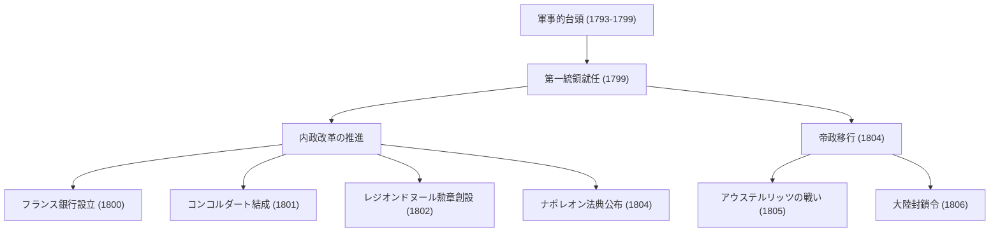
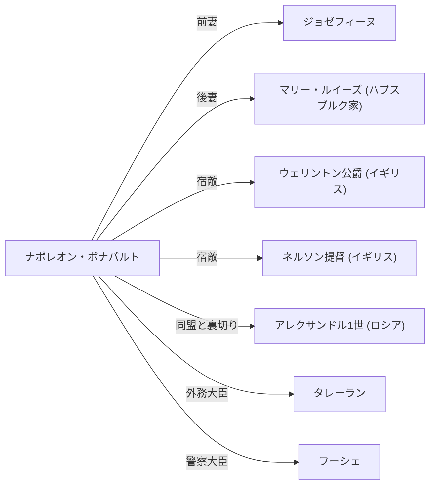

# ナポレオン・ボナパルト：革命の子か、それとも独裁者か

世界史において、ナポレオン・ボナパルトほど毀誉褒貶（きよほうへん）の激しい人物は少ないでしょう。「不可能という文字は余の辞書にはない」という名言で知られる彼は、単なる軍事的天才にとどまらず、現代ヨーロッパの法制や社会基盤の礎を築いた政治家でもありました。本記事では、彼の劇的な生涯と哲学、そして後世に与えた影響を深掘りします。

## コルシカ島からフランス皇帝への道

1769年、地中海に浮かぶコルシカ島の下級貴族の家に生まれたナポレオンは、決して恵まれたスタートを切ったわけではありませんでした。少年時代にフランス本土の士官学校に留学した彼は、コルシカなまりをからかわれ、孤独な青春時代を過ごしました。しかし、彼はその孤独を読書と勉学で埋め合わせ、ルソーなどの啓蒙思想や歴史学に深く傾倒していきました。

彼に転機をもたらしたのは、1789年のフランス革命です。旧体制（アンシャン・レジーム）が崩壊し、実力主義が台頭する中、ナポレオンはその卓越した砲兵戦術で頭角を現します。1793年のトゥーロン攻囲戦での武勲を皮切りに、イタリア遠征やエジプト遠征で連戦連勝を重ね、国民的英雄へと登り詰めました。

そして1799年、「ブリュメール18日のクーデター」によって政権を掌握。第一統領として実権を握り、1804年にはついに自らフランス人民の皇帝として即位します。革命が否定したはずの君主制を復活させたこの出来事は、ベートーヴェンが交響曲第3番『英雄』から彼の名を削り取ったエピソードが示すように、当時の知識人に大きな衝撃を与えました。

## 軍事的功績と内政改革のフロー

ナポレオンの凄みは、戦場での圧倒的な強さと同時に、国家の骨格を作り上げる内政手腕にありました。彼の主な功績と流れを以下の図で確認してみましょう。

特に「ナポレオン法典（フランス民法典）」の制定は、彼の最大の遺産と言えます。「所有権の絶対」「契約の自由」「法の前の平等」という近代市民社会の基本原則を明文化したこの法典について、晩年のナポレオン自身も「私の真の栄光は40回の戦勝ではない。決して忘れられず、永遠に生き続けるもの、それは私の民法典である」と回想しています。

## ナポレオンの哲学：実力主義と理性の信奉

ナポレオンの行動原理の根底には、徹底した「実力主義」と「理性」の信奉がありました。彼は出自や血統ではなく、能力と功績によって地位が与えられるべきだと考えました。彼自身が辺境の島から実力一つで皇帝にまで上り詰めたからこそ、この理念は説得力を持ちました。

また、彼の軍事戦術である「機動力の最大化」や「各個撃破」は、感情や精神論を排し、数学的・合理的な計算に基づいたものでした。一方で、兵士の士気を高めるための演説の才能にも長けており、人間の心理を巧みに操る「ナポレオン的プロパガンダ」の先駆者でもありました。

## 没落と後世への影響

絶頂期にあったナポレオン帝国ですが、イギリスを屈服させるために発令した「大陸封鎖令」が結果的に自国の経済を首を絞め、ロシア遠征（1812年）の壊滅的な敗北によって崩壊の序曲が始まります。ライプツィヒの戦いで敗れ、エルバ島へ流刑。その後、奇跡的な脱出を果たし「百日天下」で返り咲くも、ワーテルローの戦い（1815年）で最終的な敗北を喫し、南大西洋の孤島セントヘレナ島へ流刑となりました。そして1821年、波乱に満ちた51年の生涯を閉じます。

しかし、彼が遺した影響は計り知れません。彼がヨーロッパ中に軍隊を進めた結果、皮肉にもフランス革命の理念（自由・平等・友愛）が各地に輸出され、各国のナショナリズム（民族主義）を目覚めさせることになりました。これは後のドイツ統一やイタリア統一運動へと繋がっていきます。

## 相関図：ナポレオンを取り巻く人々

## 結び

ナポレオン・ボナパルトは、破壊者であったと同時に建設者でした。何百万という命を戦場で散らせた独裁者としての顔と、近代法の基礎を築き、古い封建制度を打ち壊した革命の体現者としての顔。その矛盾に満ちた姿こそが、彼が200年以上経った今でも私たちを魅了し、議論の的となり続ける理由なのです。彼の生涯は、人間の持つ無限の可能性と、権力への過信がもたらす悲劇という、普遍的な教訓を私たちに示しています。
