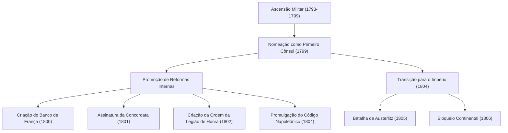
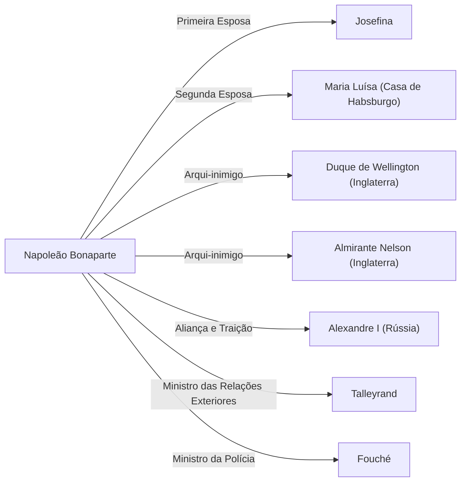

# Napoleão Bonaparte: Filho da Revolução ou Ditador?

Na história mundial, poucas figuras foram alvo de tantos elogios e críticas quanto Napoleão Bonaparte. Conhecido por sua famosa citação "A palavra impossível não está no meu dicionário", ele não foi apenas um gênio militar, mas também um estadista que lançou as bases do sistema jurídico e da infraestrutura social da Europa moderna. Neste artigo, vamos explorar sua vida dramática, sua filosofia e o impacto que ele teve nas gerações futuras.

## O Caminho da Córsega a Imperador dos Franceses

Nascido em 1769 em uma família da pequena nobreza na ilha da Córsega, no Mar Mediterrâneo, Napoleão não teve um começo privilegiado. Durante a sua juventude, quando foi estudar numa academia militar na França continental, foi provocado por causa do seu sotaque corso e passou a juventude na solidão. No entanto, ele compensou essa solidão com a leitura e os estudos, dedicando-se profundamente ao pensamento iluminista de Rousseau e ao estudo da história.

O ponto de virada para ele foi a Revolução Francesa em 1789. Com o colapso do Antigo Regime (Ancien Régime) e a ascensão da meritocracia, Napoleão se destacou graças às suas notáveis táticas de artilharia. Começando por seus feitos militares no Cerco de Toulon em 1793, ele obteve uma série de vitórias contínuas nas campanhas da Itália e do Egito, ascendendo à posição de herói nacional.

E então, em 1799, ele assumiu o poder por meio do "Golpe de 18 de Brumário". No poder como Primeiro Cônsul, ele finalmente se coroou Imperador dos Franceses em 1804. Este acontecimento, que restaurou a monarquia que a Revolução supostamente havia repudiado, foi um grande choque para os intelectuais da época, como evidenciado pelo episódio em que Beethoven riscou o nome dele da sua Sinfonia nº 3 "Eroica".

## Fluxo das Conquistas Militares e Reformas Internas

A grandeza de Napoleão estava na sua esmagadora força no campo de batalha combinada com as suas habilidades em política interna na construção da estrutura do Estado. Vejamos as suas principais conquistas e a sua evolução no diagrama abaixo.

Particularmente, a promulgação do "Código Napoleônico" (Código Civil Francês) pode ser considerada o seu maior legado. A respeito deste código que codificou os princípios básicos da sociedade civil moderna – "propriedade privada absoluta", "liberdade de contrato" e "igualdade perante a lei" –, o próprio Napoleão relembrou nos seus últimos anos: "A minha verdadeira glória não consiste em ter vencido quarenta batalhas; mas o que nada apagará, o que viverá eternamente, é o meu Código Civil."

## A Filosofia de Napoleão: Meritocracia e Crença na Razão

Na base dos princípios de ação de Napoleão estava a sua forte crença na "meritocracia" e na "razão". Ele acreditava que a posição social deveria ser concedida com base na capacidade e nas realizações, e não no nascimento ou na linhagem. Esta ideia era convincente precisamente porque ele próprio ascendeu de uma ilha remota a imperador puramente através dos seus próprios méritos.

Além disso, as suas táticas militares de "maximizar a mobilidade" e "derrotar os inimigos individualmente" excluíam as emoções e a teoria do espírito, baseando-se em cálculos matemáticos e racionais. Por outro lado, ele também tinha um talento notável para a oratória para aumentar o moral dos seus soldados, tornando-se um pioneiro da "propaganda napoleônica" ao manipular habilmente a psicologia humana.

## A Queda e o Impacto nas Gerações Futuras

O Império Napoleônico atingiu o seu apogeu, mas o "Bloqueio Continental" imposto para tentar subjugar a Inglaterra acabou por estrangular a sua própria economia, e a derrota catastrófica na Campanha da Rússia (1812) foi o prelúdio do seu colapso. Ele foi derrotado na Batalha de Leipzig e exilado na ilha de Elba. Mais tarde, ele fez uma fuga milagrosa e retornou ao poder nos "Cem Dias", mas sofreu a sua derrota final na Batalha de Waterloo (1815) e foi exilado para Santa Helena, uma ilha isolada no Atlântico Sul. Em 1821, ele encerrou a sua vida turbulenta de 51 anos.

No entanto, o impacto que ele deixou para trás é imensurável. Como resultado do avanço do seu exército pela Europa, os ideais da Revolução Francesa (liberdade, igualdade, fraternidade) foram ironicamente exportados para várias regiões, despertando o nacionalismo em diferentes países. Isso mais tarde levou aos movimentos de unificação da Alemanha e da Itália.

## Diagrama de Correlação: Pessoas ao Redor de Napoleão

## Conclusão

Napoleão Bonaparte foi simultaneamente um destruidor e um construtor. Ele tinha duas faces: o ditador que causou a morte de milhões no campo de batalha e o símbolo da revolução que lançou as bases do direito moderno e destruiu o antigo sistema feudal. É precisamente esta figura cheia de contradições que explica por que ele continua a fascinar-nos e a ser um tema de debate mais de 200 anos depois. A sua vida mostra-nos uma lição universal sobre o potencial infinito da humanidade e a tragédia causada pela arrogância do poder.
