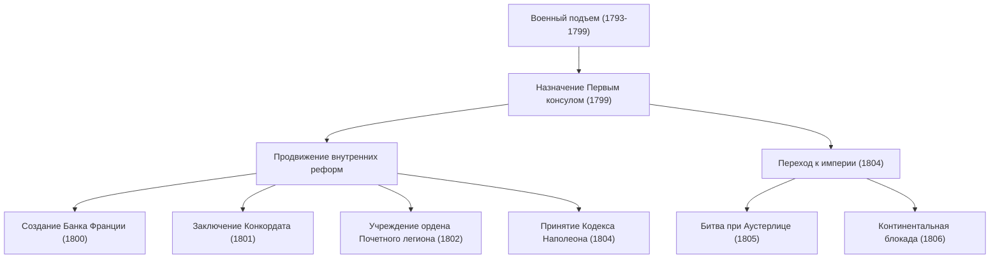
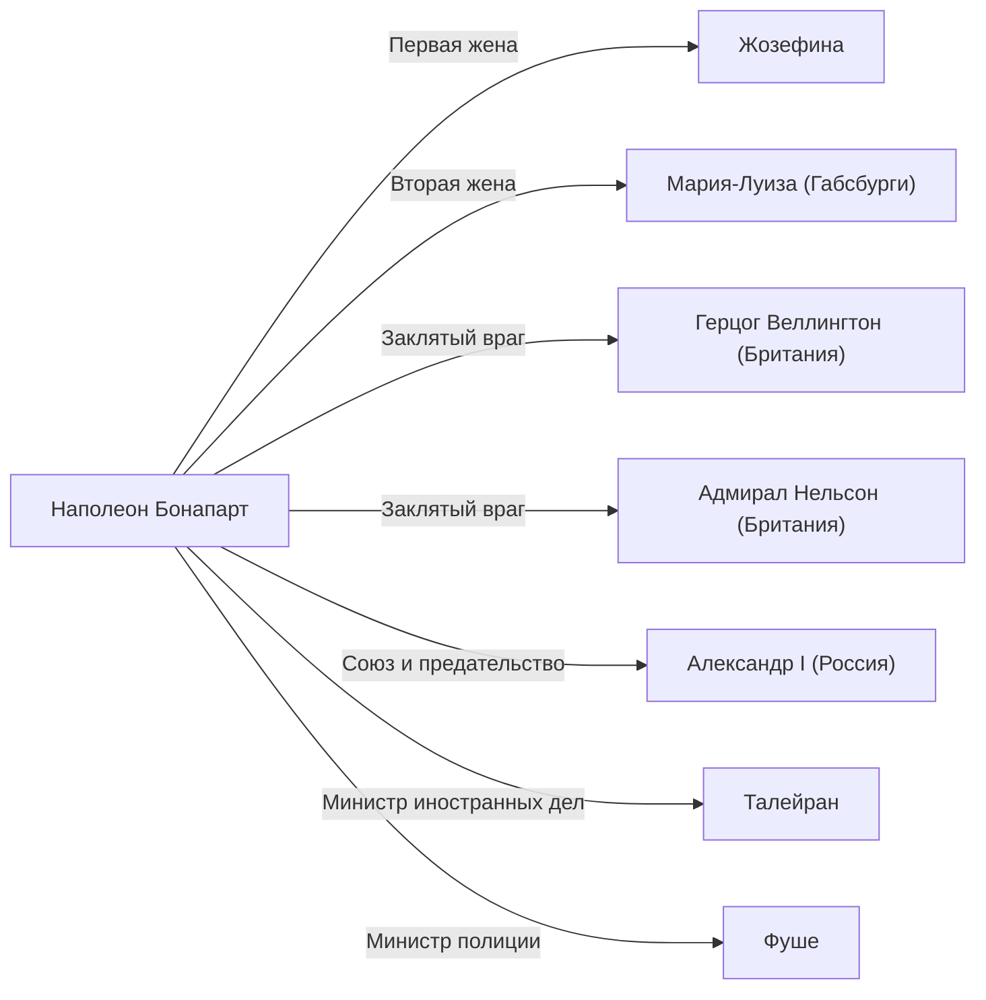

# Наполеон Бонапарт: Дитя революции или диктатор?

В мировой истории найдется немного личностей, вызывающих столь же противоречивые оценки, как Наполеон Бонапарт. Известный своим знаменитым изречением «Слова "невозможно" нет в моем словаре», он был не только военным гением, но и политиком, заложившим основы правовой системы и социальной инфраструктуры современной Европы. В этой статье мы подробно рассмотрим его драматичную жизнь, философию и то влияние, которое он оказал на последующие поколения.

## От Корсики до императора Франции

Родившийся в 1769 году в семье мелкого дворянина на средиземноморском острове Корсика, Наполеон имел далеко не самый блестящий старт. В юности, во время учебы в военном училище в материковой Франции, над его корсиканским акцентом насмехались, и он провел свою юность в одиночестве. Однако он компенсировал это одиночество чтением и учебой, глубоко проникнувшись идеями просветителей, таких как Руссо, а также историей.

Поворотным моментом в его жизни стала Французская революция 1789 года. По мере распада старого порядка (Ancien Régime) и торжества меритократии, Наполеон выделился благодаря своей выдающейся артиллерийской тактике. Начиная с военных подвигов при осаде Тулона в 1793 году, он одерживал одну победу за другой во время Итальянского и Египетского походов, став национальным героем.

Затем, в 1799 году, в результате переворота 18 брюмера, он захватил власть. В качестве Первого консула он взял в свои руки реальное управление страной, а в 1804 году наконец провозгласил себя императором французов. Это событие, возродившее монархию, которую должна была отвергнуть революция, стало огромным шоком для интеллектуалов того времени. Об этом свидетельствует эпизод с Бетховеном, вычеркнувшим имя Наполеона из своей Третьей симфонии «Героическая».

## Военные достижения и внутренние реформы

Величие Наполеона заключалось не только в его подавляющей силе на поле боя, но и в его способностях государственного деятеля, сформировавшего структуру государства. Давайте рассмотрим его основные достижения и их последовательность на следующей схеме.

Особенно важным наследием стало создание «Кодекса Наполеона» (Французского гражданского кодекса). В этом своде законов были закреплены базовые принципы современного гражданского общества: «абсолютность права собственности», «свобода договора» и «равенство перед законом». Сам Наполеон в конце жизни вспоминал: «Моя истинная слава не в сорока выигранных сражениях. То, что никогда не забудется и будет жить вечно — это мой Гражданский кодекс».

## Философия Наполеона: Меритократия и вера в разум

В основе действий Наполеона лежали глубокая вера в «меритократию» и «разум». Он считал, что статус должен определяться способностями и заслугами, а не происхождением или родословной. И поскольку он сам, выходец с далекого острова, смог стать императором исключительно благодаря своим способностям, эта идея была весьма убедительной.

Кроме того, его военные стратегии, направленные на «максимизацию мобильности» и «поэтапное уничтожение сил противника», исключали эмоции и опирались на математические и рациональные расчеты. В то же время он обладал талантом произносить речи, поднимавшие боевой дух солдат, став пионером «наполеоновской пропаганды», которая мастерски манипулировала человеческой психологией.

## Падение и влияние на потомков

Империя Наполеона находилась на пике своего могущества, но «Континентальная блокада», объявленная с целью подчинить Британию, в итоге задушила экономику самой Франции, а катастрофическое поражение в Российской кампании (1812) стало прелюдией к краху. После поражения в Битве народов под Лейпцигом он был сослан на остров Эльба. Совершив чудесный побег и вернувшись к власти на «Сто дней», он потерпел окончательное поражение при Ватерлоо (1815) и был отправлен в изгнание на отдаленный остров Святой Елены в Южной Атлантике. Там, в 1821 году, завершилась его полная потрясений 51-летняя жизнь.

Однако его наследие неизмеримо. В результате того, что он провел свои армии по всей Европе, идеи Французской революции (свобода, равенство, братство) по иронии судьбы были экспортированы в другие страны, пробудив национализм у разных народов. Позже это привело к движениям за объединение Германии и Италии.

## Схема связей: Окружение Наполеона

## Заключение

Наполеон Бонапарт был одновременно разрушителем и созидателем. Лицо диктатора, пожертвовавшего жизнями миллионов на полях сражений, и лицо воплощения революции, заложившего основы современного права и разрушившего старую феодальную систему. Именно этот полный противоречий образ продолжает очаровывать нас и вызывать дискуссии даже спустя более 200 лет. Его жизнь преподносит нам универсальный урок о безграничных возможностях человека и о трагедиях, к которым может привести чрезмерная самоуверенность во власти.
