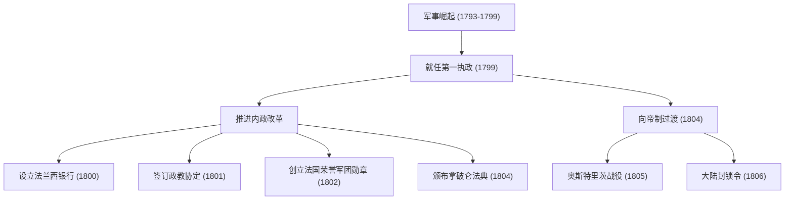
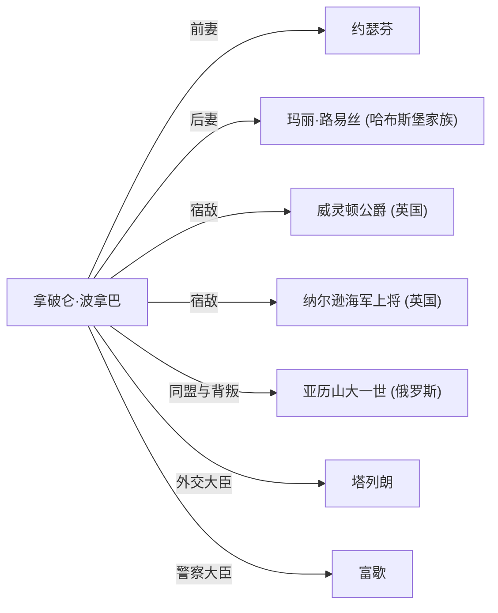

# 拿破仑·波拿巴：革命之子还是独裁者？

在世界历史上，很少有人像拿破仑·波拿巴那样毁誉参半。“我的字典里没有不可能”这句名言为人们所熟知，他不仅是一位军事天才，更是一位奠定了现代欧洲法律和社会基础的政治家。在本文中，我们将深入探讨他充满戏剧性的一生与哲学，以及他对后世产生的影响。

## 从科西嘉岛到法国皇帝之路

1769年，拿破仑出生于地中海科西嘉岛的一个下级贵族家庭，他的起步条件并不优越。少年时代，他前往法国本土的军官学校留学，因带有科西嘉口音而遭到嘲笑，度过了一段孤独的青春期。然而，他用阅读和学习来填补这份孤独，深深沉迷于卢梭等人的启蒙思想与历史学。

为他带来转机的是1789年的法国大革命。随着旧制度的崩溃和实力主义的崛起，拿破仑凭借其卓越的炮兵战术崭露头角。以1793年土伦围城战的战功为开端，他在意大利远征和埃及远征中连战连捷，登上了国民英雄的宝座。

1799年，他通过“雾月十八日政变”掌握政权。作为第一执政掌握实权后，他终于在1804年加冕为法国人民的皇帝。这一恢复了本应被革命否定的君主制的事件，给当时的知识分子带来了巨大的冲击。贝多芬从他的第三交响曲《英雄》中抹去拿破仑的名字这一轶事，便印证了这一点。

## 军事成就与内政改革的发展

拿破仑的过人之处不仅在于战场上压倒性的实力，更在于他构建国家骨架的内政手腕。让我们通过下图来看看他的主要成就和发展历程。

特别是《拿破仑法典》（《法国民法典》）的制定，可以说是他最大的遗产。这部法典明文规定了“所有权绝对”、“契约自由”和“法律面前人人平等”等近代市民社会的基本原则。晚年的拿破仑自己也曾回忆道：“我真正的光荣并非打了40次胜仗。唯有一件东西是不会被人忘却的，它将永垂不朽——那就是我的民法典。”

## 拿破仑的哲学：信奉实力主义与理性

拿破仑行为准则的根基，是彻底信奉“实力主义”和“理性”。他认为地位不应由出身或血统决定，而应由能力和功绩来赋予。正因为他自己凭借一己之力从偏远海岛一步步登上皇位，这一理念才更具说服力。

此外，他主张的“机动力最大化”和“各个击破”等军事战术，排除了情感和唯意志论，是建立在数学和合理计算的基础之上的。另一方面，他也擅长通过发表演讲来鼓舞士兵士气，是巧妙操纵人类心理的“拿破仑式政治宣传”的先驱。

## 没落与对后世的影响

拿破仑帝国曾一度处于鼎盛时期，但为了让英国屈服而颁布的“大陆封锁令”最终扼杀了本国经济，而1812年远征俄罗斯的毁灭性失败更是拉开了帝国崩溃的序幕。他在莱比锡战役中战败，被流放到厄尔巴岛。此后，他奇迹般地逃脱并上演了“百日王朝”的复辟，但在滑铁卢战役（1815年）中遭遇最终的失败，被流放到南大西洋的孤岛圣赫勒拿岛。最终在1821年，他结束了充满波折的51岁人生。

然而，他留下的影响是无法估量的。他将军队推进到欧洲各地的结果，讽刺的是将法国大革命的理念（自由、平等、博爱）输出到了各地，唤醒了各国的民族主义。这为后来的德国统一和意大利统一运动奠定了基础。

## 关系图：围绕拿破仑的人们

## 结语

拿破仑·波拿巴既是破坏者，也是建设者。他既是在战场上让数百万生命牺牲的独裁者，也是奠定近代法律基础、打破旧封建制度的革命化身。正是这种充满矛盾的形象，使得他在200多年后的今天依然吸引着我们，成为争论的焦点。他的一生向我们展示了普遍的教训：人类拥有的无限可能，以及对权力的过度自信所带来的悲剧。
