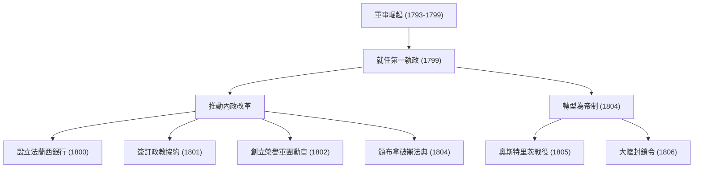
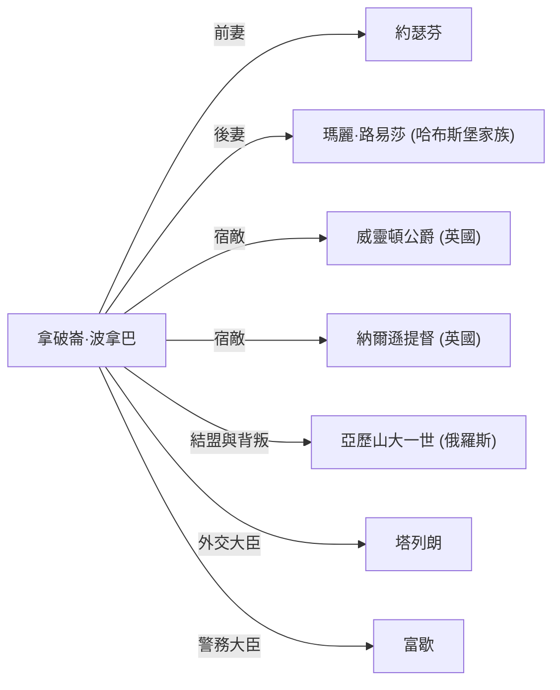

# 拿破崙·波拿巴：革命之子，還是獨裁者？

在世界史中，很少有像拿破崙·波拿巴（Napoleon Bonaparte）這樣毀譽參半的人物。以「在我的字典裡沒有『不可能』這個詞」這句名言而聞名的他，不僅僅是一位軍事天才，更是一位為現代歐洲法制與社會基礎奠定基石的政治家。本篇文章將深入探討他戲劇性的一生與哲學，以及對後世所帶來的影響。

## 從科西嘉島到法國皇帝之路

1769年，拿破崙出生於地中海科西嘉島的一個下級貴族家庭，他的起步絕非得天獨厚。少年時代前往法國本土的軍校留學時，他因科西嘉口音而遭到嘲笑，度過了一段孤獨的青春歲月。然而，他藉由閱讀與學習來填補這份孤獨，並深深傾心於盧梭等人的啟蒙思想以及歷史學。

為他帶來轉機的，是1789年的法國大革命。在舊體制（Ancien Régime）崩潰、實力主義抬頭的背景下，拿破崙憑藉其卓越的砲兵戰術嶄露頭角。以1793年土倫圍城戰的戰功為開端，他在義大利戰役與埃及戰役中連戰連捷，攀升為國民英雄。

隨後在1799年，他透過「霧月十八日政變」掌握政權。以第一執政的身份掌握實權後，終於在1804年親自加冕為法國人民的皇帝。這個恢復了本應被革命所否定的君主制的事件，給當時的知識份子帶來了極大的衝擊，正如貝多芬從第三號交響曲《英雄》中抹去他的名字這段軼事所顯示的那樣。

## 軍事功績與內政改革的流程

拿破崙的厲害之處，在於他在戰場上擁有壓倒性實力的同時，也具備建立國家骨幹的內政手腕。讓我們透過下圖來確認他的主要功績與發展脈絡。

特別是「拿破崙法典（法國民法典）」的制定，可以說是他最大的遺產。將「所有權絕對」、「契約自由」、「法律之前人人平等」這些近代市民社會基本原則明文規定的這部法典，晚年的拿破崙自己也曾回憶道：「我真正的光榮並非40場戰役的勝利。絕不會被遺忘、將永遠流傳下去的，是我的民法典。」

## 拿破崙的哲學：實力主義與對理性的信仰

拿破崙行動原理的根基，在於對「實力主義」與「理性」的徹底信仰。他認為地位應該是根據能力與功績來賦予，而非出身或血統。正因為他自己是憑藉一己實力從邊境之島一路攀升至皇帝，這個理念才具有說服力。

此外，他的軍事戰術「機動力最大化」與「各個擊破」，排除了情感與精神論，是基於數學與理性的計算。另一方面，他也擅長以演說來提升士兵士氣，是巧妙操弄人類心理的「拿破崙式政治宣傳」的先驅。

## 沒落與對後世的影響

雖然拿破崙帝國處於鼎盛時期，但為了屈服英國而發布的「大陸封鎖令」最終卻扼殺了本國經濟，而在俄羅斯戰役（1812年）中的毀滅性敗北更是拉開了崩潰的序幕。在萊比錫戰役中戰敗後，他被流放至厄爾巴島。之後，他奇蹟般地逃脫並以「百日政權」重返舞台，但在滑鐵盧戰役（1815年）中遭遇最終的挫敗，被流放至南大西洋的孤島聖赫勒拿島。最終在1821年，結束了充滿波折的51年生涯。

然而，他所留下的影響是無法估量的。他將軍隊推進至全歐洲的結果，諷刺地將法國大革命的理念（自由、平等、博愛）輸出到各地，並喚醒了各國的民族主義。這也與後來的德國統一及義大利統一運動息息相關。

## 關係圖：拿破崙周遭的人物

## 結語

拿破崙·波拿巴既是破壞者，也是建設者。他有著讓數百萬生命消逝在戰場上的獨裁者面孔，同時也有著奠定近代法律基礎、打破古老封建制度的革命體現者面孔。正是這種充滿矛盾的形象，讓他即使在200多年後的今天，依然讓我們為之著迷，並持續成為討論的焦點。他的一生，向我們展示了人類擁有的無限可能，以及對權力的過度自信所帶來的悲劇，這是一個普遍的教訓。
