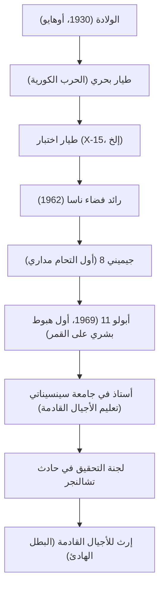

"هذه خطوة صغيرة لرجل، ولكنها قفزة عملاقة للبشرية" (That's one small step for man, one giant leap for mankind).
في 20 يوليو 1969، في اللحظة التي تركت فيها البشرية بصمتها لأول مرة على جرم سماوي غير الأرض، حفرت هذه الكلمات التي نطق بها نيل آرمسترونغ إلى الأبد في التاريخ كواحدة من أشهر المقولات في القرن العشرين. ومع ذلك، لم يكن آرمسترونغ نفسه يحب أن يُطلق عليه لقب "البطل" واعتبر نفسه ببساطة "مهووساً (مهندساً) يرتدي الجوارب البيضاء". في هذا المقال، نتعمق في حياة الرجل الذي قام بأول مشي على سطح القمر، وفلسفته الأساسية، والأثر الذي تركه للأجيال القادمة.

## الشوق للسماء وعصر طيار الاختبار

وُلد آرمسترونغ في عام 1930 في واباكونيتا، أوهايو، الولايات المتحدة الأمريكية، وكان مفتونًا بالطائرات منذ صغره. حصل على رخصة طيار في سن الخامسة عشرة، قبل حصوله على رخصة القيادة. درس هندسة الطيران في جامعة بوردو، ولكن كطالب منحة في البحرية، تم استدعاؤه للخدمة في الحرب الكورية. إن تجربته في إكمال 78 مهمة قتالية كطيار مقاتل وتأرجحه بين الحياة والموت في مناسبات متعددة عززت هدوئه الساحق في المواقف القاسية لاحقًا.

بعد الحرب، عمل كطيار اختبار، وانخرط في العديد من مهام الطيران الخطيرة في طائرات تجريبية تفوق سرعتها سرعة الصوت مثل إكس-15 (X-15). كانت سمعته كطيار اختبار أنه "رجل دائمًا ما يكون هادئًا ومتماسكًا، وقادرًا على حل المشكلات من منظور هندسي". هذا المزيج بين "ذكاء المهندس" و "مهارة الطيار" أصبح أعظم سلاح له والذي قاده لاحقًا إلى القمر.

## نشط في وكالة ناسا: من جيميني إلى أبولو

تم اختياره كجزء من المجموعة الثانية من رواد الفضاء في وكالة ناسا في عام 1962، وعمل آرمسترونغ كطيار قائد لمهمة جيميني 8 في عام 1966. في هذه المهمة، نجح في أول التحام مداري للبشرية، ولكن بعد ذلك مباشرة، وقعت المركبة الفضائية في أزمة يائسة من الدوران العنيف. في ذلك الوقت، تحكم في محركات الدفع بهدوء مذهل وعاد بأمان إلى الأرض. حظيت هذه القوة العقلية لعدم الوقوع في الذعر بتقدير كبير وأصبحت العامل الحاسم في اختياره كقائد لمهمة أبولو 11، أي "أول رجل يخطو على سطح القمر".

## أبولو 11: الهبوط في بحر الهدوء

أُطلق أبولو 11 في 16 يوليو 1969 بواسطة صاروخ ساتورن 5 (Saturn V)، ودخل المدار القمري بعد رحلة استمرت عدة أيام. بدأ آرمسترونغ وبز ألدرين هبوطهما في الوحدة القمرية "النسر"، لكن موقع الهبوط الذي استهدفه الطيار الآلي كان فوهة خطيرة مليئة بالصخور.
مع انخفاض مستوى الوقود، تحول آرمسترونغ إلى التحكم اليدوي وبحث عن بقعة مسطحة متجنبًا المنطقة الصخرية. وتحت الضغط الشديد لتبقي عشرات الثواني فقط حتى نفاد الوقود، هبط بنجاح في "بحر الهدوء". "هيوستن، هنا قاعدة الهدوء. لقد هبط النسر." يُقال إن معدل ضربات قلبه في هذه اللحظة كان قريبًا بشكل استثنائي من المعدل الطبيعي.

## مسار الإنجازات والمخطط

يظهر الارتباط بين نقاط التحول المهمة والإنجازات في حياته في المخطط أدناه.

## الحياة بعد التقاعد وفلسفة "البطل الهادئ"

بعد عودته من سطح القمر، لقي آرمسترونغ ترحيباً حماسياً من جميع أنحاء العالم وأصبح بطلاً تاريخياً. ومع ذلك، لم يستخدم شهرته ليصبح سياسيًا أو يسعى لتحقيق ربح تجاري. بعد تقاعده من وكالة ناسا في عام 1971، اختار مسار التدريس كأستاذ لهندسة الطيران في جامعة سينسيناتي.

تكمن فلسفته في التواضع التام، معتقدًا أنني "لعبت دورًا فقط في مشروع ضخم، وأن الهبوط على سطح القمر هو بلورة لجهود حوالي 400 ألف موظف ومهندس في وكالة ناسا". تجنب الظهور في وسائل الإعلام قدر الإمكان، مفضلاً حياة هادئة كمهندس ومعلم على أن يُوصف بأنه "أول من مشى على القمر". ومع ذلك، خلال حادثة انفجار مكوك الفضاء تشالنجر في عام 1986، شغل منصب نائب رئيس لجنة التحقيق، مساهماً بخبرته في أزمة تطوير الفضاء في البلاد.

## التأثير على الأجيال القادمة

توفي نيل آرمسترونغ في عام 2012 عن عمر يناهز 82 عامًا. لم تظل خطواته على سطح القمر فحسب، بل استمر الحديث عنها حتى اليوم كرمز لـ "شجاعة" البشرية في تحدي المناطق المجهولة، و "العقل العلمي المتسائل" لتحقيق ذلك، و "التواضع" لعدم الغرور أبدًا حتى بعد تحقيق إنجازات عظيمة.

إن الخطوة الصغيرة التي تركها على القمر هي حقًا قفزة أبدية للبشرية، وطريقة حياته بحد ذاتها بمثابة دليل صامت لمهندسي ومستكشفي المستقبل.
