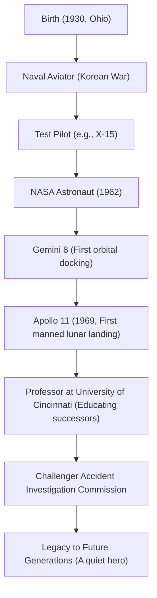

"That's one small step for man, one giant leap for mankind."
On July 20, 1969, at the moment humanity first left footprints on a celestial body other than Earth, these words spoken by Neil Armstrong were forever etched in history as one of the most famous quotes of the 20th century. However, Armstrong himself did not like being called a "hero," identifying himself strictly as a "white-socks nerd (engineer)." This article delves deeply into the life of the first man to walk on the moon, his underlying philosophy, and the legacy he left for future generations.

## Fascination with the Sky and the Test Pilot Era

Born in 1930 in Wapakoneta, Ohio, USA, Armstrong was fascinated by airplanes from an early age. He obtained his pilot's license at 15, before his driver's license, and studied aeronautical engineering at Purdue University. However, as a Navy scholarship student, he was called to serve in the Korean War. His experience as a fighter pilot, flying 78 combat missions and hovering near death multiple times, cultivated his overwhelming composure in extreme situations later in life.

After the war, he worked as a test pilot on various dangerous flight missions, including the X-15 hypersonic experimental aircraft. His reputation as a test pilot was that of "a man who is always calm and collected, able to solve problems from an engineering standpoint." This fusion of "engineering intellect" and "piloting skills" became his greatest weapon, eventually leading him to the moon.

## Achievements at NASA: From Gemini to Apollo

Selected as a second-group astronaut by NASA in 1962, Armstrong served as the command pilot for Gemini 8 in 1966. In this mission, he succeeded in humanity's first orbital docking, but immediately after, the spacecraft fell into a violent spin, facing a desperate crisis. At that time, with astonishing calmness, he controlled the thrusters and safely returned to Earth. This mental strength to avoid panic was highly evaluated, becoming the decisive factor in choosing him as the commander of Apollo 11, the "first man to walk on the moon."

## Apollo 11: Landing on the Sea of Tranquility

Launched on a Saturn V rocket on July 16, 1969, Apollo 11 entered lunar orbit after a journey of several days. Armstrong and Buzz Aldrin began their descent in the lunar module "Eagle," but the landing site targeted by the autopilot was a dangerous crater full of boulders.
With fuel running low, Armstrong switched to manual control, avoiding the rocky terrain and looking for a flat area. Under the extreme pressure of having only tens of seconds left until running out of fuel, he successfully landed in the "Sea of Tranquility." "Houston, Tranquility Base here. The Eagle has landed." It is said that his heart rate at this moment was unusually close to a normal resting rate.

## Trajectory of Achievements and Diagram

The connection between the important turning points and achievements in his life is shown in the diagram below.

## Post-Retirement Life and the "Quiet Hero" Philosophy

Returning from the moon, Armstrong received a frenzied welcome from all over the world and became a historical hero. However, he never used his fame to become a politician or pursue commercial interests. After leaving NASA in 1971, he chose the path of teaching as a professor of aerospace engineering at the University of Cincinnati.

His philosophy lay in complete humility, believing that "I merely played a part in a massive project, and the moon landing is the crystallization of the efforts of approximately 400,000 NASA employees and engineers." He avoided media exposure as much as possible, preferring a quiet life as a single engineer and educator over the label of "the first man to walk on the moon." Nevertheless, during the Space Shuttle Challenger explosion in 1986, he served as the vice-chairman of the investigation commission, contributing his expertise in the crisis of the nation's space development.

## Impact on Future Generations

Neil Armstrong passed away in 2012 at the age of 82. His footprints remain not only on the moon but also continue to be talked about today as a symbol of the "courage" for humanity to challenge unknown territories, the "scientific inquiring mind" to achieve it, and the "humility" to never become arrogant even after accomplishing great deeds.

The small step he left on the moon is truly an eternal leap for mankind, and his way of life itself serves as a silent guidepost for future engineers and explorers.
