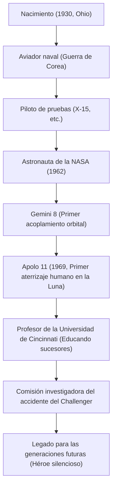

"Es un pequeño paso para un hombre, pero un gran salto para la humanidad" (That's one small step for man, one giant leap for mankind).
El 20 de julio de 1969, en el momento en que la humanidad dejó por primera vez su huella en un cuerpo celeste distinto a la Tierra, estas palabras pronunciadas por Neil Armstrong quedaron grabadas para siempre en la historia como una de las frases más célebres del siglo XX. Sin embargo, al propio Armstrong no le gustaba que lo llamaran "héroe" y se consideraba simplemente un "nerd (ingeniero) de calcetines blancos". En este artículo, profundizamos en la vida del hombre que realizó la primera caminata lunar, la filosofía subyacente y el impacto que dejó para las generaciones futuras.

## Anhelo por el cielo y la era como piloto de pruebas

Nacido en 1930 en Wapakoneta, Ohio, EE. UU., Armstrong se sintió fascinado por los aviones desde una edad temprana. Obtuvo su licencia de piloto a los 15 años, antes que la de conducir. Estudió ingeniería aeronáutica en la Universidad de Purdue, pero como estudiante becado por la Marina, fue llamado a servir en la Guerra de Corea. Su experiencia al completar 78 misiones de combate como piloto de combate y al rozar la muerte en múltiples ocasiones cultivó su abrumadora calma en situaciones extremas más adelante.

Después de la guerra, trabajó como piloto de pruebas, participando en numerosas misiones de vuelo peligrosas en aviones experimentales hipersónicos como el X-15. Su reputación como piloto de pruebas era la de un "hombre que siempre está tranquilo y sereno, capaz de resolver problemas desde una perspectiva de ingeniería". Esta fusión del "intelecto de ingeniero" y la "habilidad de piloto" se convirtió en su mayor arma que luego lo guió a la Luna.

## Activo en la NASA: De Gemini a Apolo

Seleccionado como parte del segundo grupo de astronautas de la NASA en 1962, Armstrong se desempeñó como piloto al mando del Gemini 8 en 1966. En esta misión, logró el primer acoplamiento orbital de la humanidad, pero inmediatamente después, la nave espacial cayó en una crisis desesperada de giros violentos. En ese momento, controló los propulsores con una calma asombrosa y regresó a la Tierra a salvo. Esta fuerza mental para no entrar en pánico fue muy bien valorada y se convirtió en el factor decisivo para que fuera elegido como comandante del Apolo 11, es decir, el "primer hombre en caminar sobre la Luna".

## Apolo 11: Aterrizaje en el Mar de la Tranquilidad

Lanzado el 16 de julio de 1969 por un cohete Saturno V, el Apolo 11 entró en la órbita lunar tras un viaje de varios días. Armstrong y Buzz Aldrin iniciaron su descenso en el módulo lunar "Eagle", pero el lugar de aterrizaje al que apuntaba el piloto automático era un peligroso cráter lleno de rocas.
Con el combustible agotándose, Armstrong cambió al control manual y buscó un lugar plano evitando la zona rocosa. Bajo la extrema presión de solo decenas de segundos restantes hasta que se agotara el combustible, aterrizó con éxito en el "Mar de la Tranquilidad". "Houston, aquí Base Tranquilidad. El Águila ha aterrizado". Se dice que su frecuencia cardíaca en este momento estaba excepcionalmente cerca de lo normal.

## Trayectoria de logros y diagrama

La conexión de los puntos de inflexión y los logros importantes en su vida se muestra en el siguiente diagrama.

## Vida después de la jubilación y la filosofía del "Héroe silencioso"

Al regresar de la superficie lunar, Armstrong recibió una bienvenida tremendamente entusiasta de todo el mundo y se convirtió en un héroe histórico. Sin embargo, no utilizó su fama para convertirse en político ni buscar beneficios comerciales. Tras retirarse de la NASA en 1971, eligió el camino de la enseñanza como profesor de ingeniería aeroespacial en la Universidad de Cincinnati.

Su filosofía residía en una completa humildad, creyendo que "solo jugué un papel en un proyecto masivo, y el aterrizaje en la Luna es la cristalización de los esfuerzos de unos 400.000 empleados e ingenieros de la NASA". Evitó la exposición en los medios de comunicación en la medida de lo posible, deseando una vida tranquila como un simple ingeniero y educador en lugar de la etiqueta de "el primer caminante lunar". Aun así, durante el accidente de la explosión del transbordador espacial Challenger en 1986, se desempeñó como vicepresidente de la comisión de investigación, aportando su experiencia a la crisis del desarrollo espacial del país.

## Impacto en las generaciones futuras

Neil Armstrong falleció en 2012 a la edad de 82 años. Sus pasos no solo permanecen en la Luna, sino que también siguen siendo comentados hoy como un símbolo del "valor" de la humanidad para desafiar territorios desconocidos, de la "mente de investigación científica" para lograrlo, y de la "humildad" para nunca ser arrogante, incluso después de lograr grandes hazañas.

El pequeño paso que dejó en la Luna es verdaderamente un salto eterno para la humanidad, y su forma de vida en sí misma sirve como una guía silenciosa para los futuros ingenieros y exploradores.
