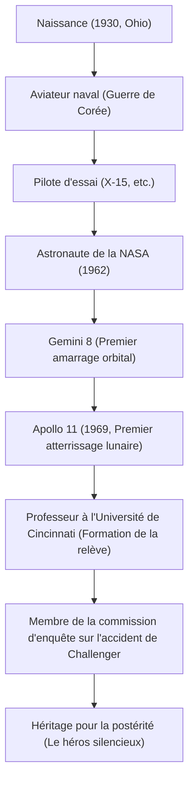

« C'est un petit pas pour un homme, un bond de géant pour l'humanité » (That's one small step for man, one giant leap for mankind).
Le 20 juillet 1969, au moment où l'humanité a laissé pour la première fois ses empreintes sur un corps céleste autre que la Terre, ces mots prononcés par Neil Armstrong ont été gravés à jamais dans l'histoire comme l'une des citations les plus célèbres du 20e siècle. Cependant, Armstrong lui-même n'aimait pas être qualifié de « héros » et se considérait simplement comme un « nerd (ingénieur) portant des chaussettes blanches ». Cet article explore en profondeur la vie du premier homme à marcher sur la Lune, la philosophie sous-jacente et l'impact qu'il a laissé à la postérité.

## Une passion pour le ciel et les années de pilote d'essai

Né en 1930 à Wapakoneta, dans l'Ohio, aux États-Unis, Armstrong a été fasciné par les avions dès son plus jeune âge. Ayant obtenu son brevet de pilote à l'âge de 15 ans avant même son permis de conduire, il a étudié l'ingénierie aéronautique à l'Université Purdue, mais a été appelé pour la guerre de Corée car il bénéficiait d'une bourse de la Marine. Son expérience en tant que pilote de chasse, effectuant 78 missions de combat et frôlant la mort à plusieurs reprises, a cultivé le calme écrasant dont il fera preuve plus tard dans des situations extrêmes.

Après la guerre, il a participé à de nombreuses missions de vol dangereuses en tant que pilote d'essai, notamment sur l'avion expérimental hypersonique X-15. En tant que pilote d'essai, il était réputé pour être « un homme toujours calme et posé, capable de résoudre des problèmes d'un point de vue technique ». C'est cette fusion d'« intelligence d'ingénieur » et de « compétences de pilote » qui deviendra sa plus grande arme pour le mener plus tard sur la Lune.

## Les années de gloire à la NASA : De Gemini à Apollo

Sélectionné dans le deuxième groupe d'astronautes de la NASA en 1962, Armstrong a été le commandant de Gemini 8 en 1966. Bien que la mission ait réussi le premier amarrage orbital de l'histoire, elle a été immédiatement suivie d'une crise désespérée lorsque le vaisseau spatial s'est mis à tourner violemment sur lui-même. À ce moment-là, avec un calme incroyable, il a contrôlé les propulseurs et a réussi à ramener l'équipage sur Terre en toute sécurité. Sa force mentale pour ne pas céder à la panique a été très appréciée et a été le facteur décisif dans sa sélection comme commandant d'Apollo 11, c'est-à-dire le « premier homme à marcher sur la Lune ».

## Apollo 11 : Atterrissage dans la mer de la Tranquillité

Lancé le 16 juillet 1969 par la fusée Saturn V, Apollo 11 s'est mis en orbite lunaire après un voyage de plusieurs jours. Armstrong et Buzz Aldrin ont commencé leur descente dans le module lunaire « Eagle », mais le site d'atterrissage visé par le pilote automatique était un cratère dangereux et rocheux.
Alors que le carburant s'épuisait, Armstrong est passé en contrôle manuel, a évité les rochers et a cherché un endroit plat. Sous la pression extrême d'être à quelques dizaines de secondes de la panne de carburant, il a réussi un atterrissage parfait dans la « mer de la Tranquillité ». « Houston, ici la base de la Tranquillité. L'Aigle a atterri ». On dit que son rythme cardiaque à ce moment précis était anormalement proche de la normale.

## Parcours des réalisations et illustration

Les tournants majeurs et les réalisations de sa vie sont illustrés dans le diagramme ci-dessous.

## La vie après la retraite et la philosophie du « Héros Silencieux »

De retour de la surface lunaire, Armstrong a reçu un accueil enthousiaste du monde entier et est devenu un héros historique. Cependant, il n'a jamais utilisé sa renommée pour devenir politicien ou poursuivre des intérêts commerciaux. Après avoir quitté la NASA en 1971, il a choisi d'enseigner en tant que professeur d'ingénierie aérospatiale à l'Université de Cincinnati.

Sa philosophie reposait sur une humilité absolue : « Je n'ai joué qu'un petit rôle dans un projet gigantesque, et l'atterrissage sur la Lune est l'aboutissement des efforts d'environ 400 000 employés et ingénieurs de la NASA ». Évitant autant que possible l'exposition médiatique, il souhaitait une vie tranquille d'ingénieur et d'éducateur, plutôt que l'étiquette de « premier homme à marcher sur la Lune ». Néanmoins, lors de l'explosion de la navette spatiale Challenger en 1986, il a été vice-président de la commission d'enquête, apportant son expertise lors de la crise du programme spatial national.

## Impact sur la postérité

Neil Armstrong s'est éteint en 2012 à l'âge de 82 ans. Ses empreintes de pas ne sont pas seulement restées sur la Lune ; il continue d'être célébré comme un symbole du « courage » de l'humanité pour s'aventurer dans l'inconnu, de « l'esprit d'investigation scientifique » pour y parvenir, et de « l'humilité » de ne jamais se vanter, même après avoir accompli de grands exploits.

Le petit pas qu'il a laissé sur la Lune est véritablement un bond éternel pour l'humanité, et son mode de vie lui-même est devenu un guide silencieux pour les futurs ingénieurs et explorateurs.
