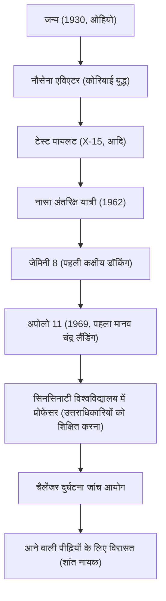

"यह एक इंसान के लिए एक छोटा कदम है, लेकिन मानवता के लिए एक बड़ी छलांग है (That's one small step for man, one giant leap for mankind)।"
20 जुलाई, 1969 को, जिस क्षण मानवता ने पहली बार पृथ्वी के अलावा किसी अन्य खगोलीय पिंड पर अपना पदचिह्न छोड़ा, नील आर्मस्ट्रांग द्वारा कहे गए ये शब्द 20वीं सदी के सबसे प्रसिद्ध उद्धरणों में से एक के रूप में इतिहास में हमेशा के लिए दर्ज हो गए। हालाँकि, आर्मस्ट्रांग स्वयं को "हीरो" कहलाना पसंद नहीं करते थे और वे खुद को केवल एक "सफेद मोज़े पहनने वाला नर्ड (इंजीनियर)" मानते थे। इस लेख में, हम चंद्रमा पर पहली बार चलने वाले व्यक्ति के जीवन, उनके अंतर्निहित दर्शन और आने वाली पीढ़ियों के लिए उनके द्वारा छोड़े गए प्रभाव की गहराई से पड़ताल करेंगे।

## आकाश की चाहत और टेस्ट पायलट का युग

1930 में वापाकोनेटा, ओहियो, अमेरिका में जन्मे आर्मस्ट्रांग को बचपन से ही हवाई जहाजों का शौक था। उन्होंने 15 साल की उम्र में, अपने ड्राइविंग लाइसेंस से पहले अपना पायलट लाइसेंस प्राप्त कर लिया था। उन्होंने पर्ड्यू विश्वविद्यालय में वैमानिकी इंजीनियरिंग की पढ़ाई की, लेकिन नौसेना के छात्रवृत्ति छात्र के रूप में, उन्हें कोरियाई युद्ध में सेवा करने के लिए बुलाया गया। लड़ाकू पायलट के रूप में 78 युद्धक मिशनों को पूरा करने और कई मौकों पर मौत के मुहाने तक पहुँचने के उनके अनुभव ने बाद में चरम स्थितियों में उनकी अत्यधिक शांति को विकसित किया।

युद्ध के बाद, उन्होंने एक परीक्षण पायलट के रूप में काम किया, और एक्स-15 (X-15) जैसे प्रयोगात्मक हाइपरसोनिक विमानों में कई खतरनाक उड़ान मिशनों में भाग लिया। एक टेस्ट पायलट के रूप में उनकी प्रतिष्ठा "एक ऐसे व्यक्ति की थी जो हमेशा शांत और संयमित रहता है, जो इंजीनियरिंग के दृष्टिकोण से समस्याओं को हल करने में सक्षम है।" "इंजीनियर की बुद्धि" और "पायलट के कौशल" का यह संलयन ही उनका सबसे बड़ा हथियार बन गया जिसने बाद में उन्हें चंद्रमा तक पहुँचाया।

## नासा (NASA) में सक्रिय: जेमिनी से अपोलो तक

1962 में नासा के अंतरिक्ष यात्रियों के दूसरे समूह के हिस्से के रूप में चुने गए, आर्मस्ट्रांग ने 1966 में जेमिनी 8 के लिए कमांड पायलट के रूप में काम किया। इस मिशन में, वह मानवता की पहली कक्षीय डॉकिंग (orbital docking) में सफल रहे, लेकिन तुरंत बाद, अंतरिक्ष यान हिंसक रूप से घूमने के एक हताश संकट में पड़ गया। उस समय, उन्होंने आश्चर्यजनक शांति के साथ थ्रस्टर्स को नियंत्रित किया और सुरक्षित रूप से पृथ्वी पर लौट आए। घबराहट में न पड़ने की इस मानसिक शक्ति का अत्यधिक मूल्यांकन किया गया और यही उन्हें अपोलो 11 के कमांडर, यानी "चंद्रमा पर चलने वाले पहले व्यक्ति" के रूप में चुने जाने का निर्णायक कारक बना।

## अपोलो 11: शांति के सागर (Sea of Tranquility) पर उतरना

16 जुलाई, 1969 को सैटर्न वी (Saturn V) रॉकेट द्वारा लॉन्च किया गया, अपोलो 11 कई दिनों की यात्रा के बाद चंद्र कक्षा में प्रवेश कर गया। आर्मस्ट्रांग और बज़ एल्ड्रिन ने चंद्र मॉड्यूल "ईगल" में अपना उतरना शुरू किया, लेकिन ऑटोपायलट द्वारा लक्षित लैंडिंग स्थल चट्टानों से भरा एक खतरनाक क्रेटर था।
ईंधन कम होने के कारण, आर्मस्ट्रांग ने मैन्युअल नियंत्रण पर स्विच किया और चट्टानी क्षेत्र से बचते हुए एक समतल स्थान की तलाश की। ईंधन खत्म होने में केवल दसियों सेकंड शेष रहने के अत्यधिक दबाव में, वह "शांति के सागर (Sea of Tranquility)" में सफलतापूर्वक उतरे। "ह्यूस्टन, यहाँ ट्रैंक्विलिटी बेस है। ईगल उतर चुका है।" कहा जाता है कि इस क्षण उनकी हृदय गति सामान्य के असाधारण रूप से करीब थी।

## उपलब्धियों का प्रक्षेपवक्र और आरेख

उनके जीवन में महत्वपूर्ण मोड़ और उपलब्धियों के संबंध को नीचे दिए गए आरेख में दिखाया गया है।

## सेवानिवृत्ति के बाद का जीवन और "शांत नायक" का दर्शन

चंद्रमा की सतह से लौटकर, आर्मस्ट्रांग का दुनिया भर में बेहद उत्साहपूर्ण स्वागत हुआ और वे एक ऐतिहासिक नायक बन गए। हालाँकि, उन्होंने अपनी प्रसिद्धि का उपयोग राजनेता बनने या व्यावसायिक लाभ प्राप्त करने के लिए नहीं किया। 1971 में नासा से सेवानिवृत्त होने के बाद, उन्होंने सिनसिनाटी विश्वविद्यालय में एयरोस्पेस इंजीनियरिंग के प्रोफेसर के रूप में शिक्षण का मार्ग चुना।

उनका दर्शन पूरी विनम्रता में निहित था, यह मानते हुए कि "मैंने केवल एक विशाल परियोजना में एक भूमिका निभाई है, और चंद्र लैंडिंग लगभग 4,00,000 नासा कर्मचारियों और इंजीनियरों के प्रयासों का परिणाम है।" उन्होंने मीडिया के संपर्क से यथासंभव परहेज किया, "पहले मूनवॉकर" के लेबल के बजाय एक अकेले इंजीनियर और शिक्षक के रूप में शांत जीवन की कामना की। फिर भी, 1986 में स्पेस शटल चैलेंजर विस्फोट दुर्घटना के दौरान, उन्होंने जांच आयोग के उपाध्यक्ष के रूप में कार्य किया, और देश के अंतरिक्ष विकास के संकट में अपनी विशेषज्ञता का योगदान दिया।

## आने वाली पीढ़ियों पर प्रभाव

2012 में 82 वर्ष की आयु में नील आर्मस्ट्रांग का निधन हो गया। उनके पदचिह्न न केवल चंद्रमा पर बने हुए हैं, बल्कि मानवता के लिए अज्ञात क्षेत्रों को चुनौती देने के "साहस", इसे पूरा करने के लिए "वैज्ञानिक जिज्ञासु मन", और महान उपलब्धियां हासिल करने के बाद भी कभी अहंकारी न होने की "विनम्रता" के प्रतीक के रूप में आज भी उनके बारे में बात की जाती है।

उन्होंने चंद्रमा पर जो छोटा कदम छोड़ा वह वास्तव में मानवता के लिए एक शाश्वत छलांग है, और उनके जीने का तरीका ही भविष्य के इंजीनियरों और खोजकर्ताओं के लिए एक मूक मार्गदर्शक के रूप में कार्य करता है।
