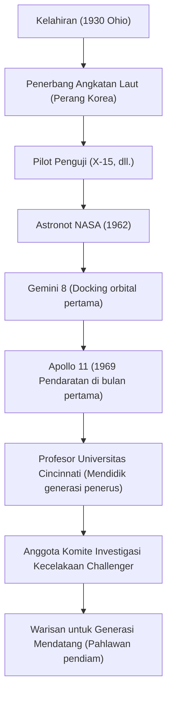

"Itu adalah satu langkah kecil bagi seorang pria, satu lompatan raksasa bagi umat manusia (That's one small step for man, one giant leap for mankind)."
Pada tanggal 20 Juli 1969, momen ketika umat manusia pertama kali menjejakkan kaki di benda langit selain Bumi, kata-kata yang diucapkan oleh Neil Armstrong ini selamanya terukir dalam sejarah sebagai kutipan terkenal yang mewakili abad ke-20. Namun, Armstrong sendiri tidak suka disebut "pahlawan" dan lebih menganggap dirinya sebagai "kutu buku (insinyur) berkaus kaki putih." Artikel ini menggali lebih dalam tentang kehidupan pria yang pertama kali berjalan di bulan, filosofi yang mendasarinya, dan pengaruh yang ia tinggalkan untuk generasi mendatang.

## Kerinduan akan Langit dan Masa Pilot Penguji

Lahir di Wapakoneta, Ohio, Amerika Serikat pada tahun 1930, Armstrong terpesona oleh pesawat terbang sejak usia dini. Ia memperoleh lisensi pilot pada usia 15 tahun, bahkan sebelum memiliki SIM, dan belajar teknik penerbangan di Universitas Purdue, tetapi karena ia adalah penerima beasiswa Angkatan Laut, ia dipanggil untuk Perang Korea. Pengalamannya menerbangkan 78 misi tempur sebagai pilot pesawat tempur, berkali-kali berkeliaran di ambang kematian, kemudian menumbuhkan ketenangan luar biasa dalam situasi ekstrem.

Setelah perang, ia bertugas dalam berbagai misi penerbangan berbahaya sebagai pilot penguji, termasuk pada pesawat eksperimental hipersonik X-15. Reputasinya sebagai pilot penguji adalah "seorang pria yang selalu tenang dan dapat memecahkan masalah dari sudut pandang teknik." Perpaduan antara "kecerdasan sebagai seorang insinyur" dan "keterampilan sebagai pilot" inilah yang kemudian menjadi senjata terbesarnya yang membawanya ke bulan.

## Karier di NASA: Dari Gemini ke Apollo

Terpilih sebagai kelompok astronot NASA kedua pada tahun 1962, Armstrong menjabat sebagai komandan pesawat Gemini 8 pada tahun 1966. Dalam misi ini, ia berhasil melakukan docking orbital pertama umat manusia, tetapi segera setelah itu ia menghadapi krisis yang mengancam jiwa ketika pesawat ruang angkasa itu mengalami putaran yang hebat. Pada saat itu, ia mengendalikan pendorong dengan ketenangan luar biasa dan kembali ke Bumi dengan selamat. Kekuatan mental untuk tidak panik ini sangat dihargai dan menjadi faktor penentu dalam memilihnya sebagai komandan Apollo 11, yaitu, "orang pertama yang berjalan di bulan."

## Apollo 11: Pendaratan di Sea of Tranquility

Diluncurkan pada roket Saturn V pada 16 Juli 1969, Apollo 11 memasuki orbit bulan setelah perjalanan beberapa hari. Armstrong dan Buzz Aldrin memulai penurunan mereka di Modul Bulan "Eagle," tetapi titik pendaratan yang ditargetkan oleh autopilot adalah kawah berbatu dan berbahaya.
Dengan sisa bahan bakar yang menipis, Armstrong beralih ke kontrol manual, menghindari bebatuan, dan mencari tempat yang datar. Di bawah tekanan ekstrem dengan hanya beberapa puluh detik tersisa sebelum bahan bakar habis, ia berhasil mendarat di "Sea of Tranquility" (Laut Ketenangan). "Houston, Tranquility Base here. The Eagle has landed" (Houston, di sini Pangkalan Tranquility. Eagle telah mendarat). Dikatakan bahwa detak jantungnya pada saat itu sangat mendekati normal.

## Lintasan Prestasi dan Diagram

Diagram berikut menunjukkan hubungan antara titik balik penting dan pencapaian dalam hidupnya.

## Kehidupan Setelah Pensiun dan Filosofi "Pahlawan Pendiam"

Setelah kembali dari bulan, Armstrong menerima sambutan antusias dari seluruh dunia dan menjadi pahlawan bersejarah. Namun, ia tidak pernah menggunakan ketenarannya untuk menjadi politisi atau mengejar keuntungan komersial. Setelah pensiun dari NASA pada tahun 1971, ia memilih jalur mengajar sebagai profesor teknik kedirgantaraan di Universitas Cincinnati.

Filosofinya didasarkan pada kerendahan hati yang luar biasa, dengan mengatakan, "Saya hanya memainkan sebagian kecil dalam proyek besar, dan pendaratan di bulan adalah puncak dari upaya sekitar 400.000 karyawan dan insinyur NASA." Ia sebisa mungkin menghindari paparan media dan menginginkan kehidupan yang tenang sebagai seorang insinyur dan pendidik, daripada dicap sebagai "orang pertama yang berjalan di bulan." Namun, selama kecelakaan meledaknya Space Shuttle Challenger pada tahun 1986, ia menjabat sebagai wakil ketua komite investigasi, menyumbangkan keahliannya di saat krisis dalam program luar angkasa negaranya.

## Pengaruh pada Generasi Mendatang

Neil Armstrong meninggal dunia pada tahun 2012 di usia 82 tahun. Jejak kakinya tidak hanya tertinggal di bulan, tetapi ia juga terus dikenang hari ini sebagai simbol "keberanian" umat manusia untuk menantang wilayah yang tidak diketahui, "semangat penyelidikan ilmiah" untuk mencapainya, dan "kerendahan hati" untuk tidak pernah sombong bahkan setelah mencapai prestasi besar.

Langkah kecil yang ia tinggalkan di bulan benar-benar merupakan lompatan abadi bagi umat manusia, dan cara hidupnya sendiri berfungsi sebagai tiang penunjuk jalan tak terucapkan bagi para insinyur dan penjelajah masa depan.
